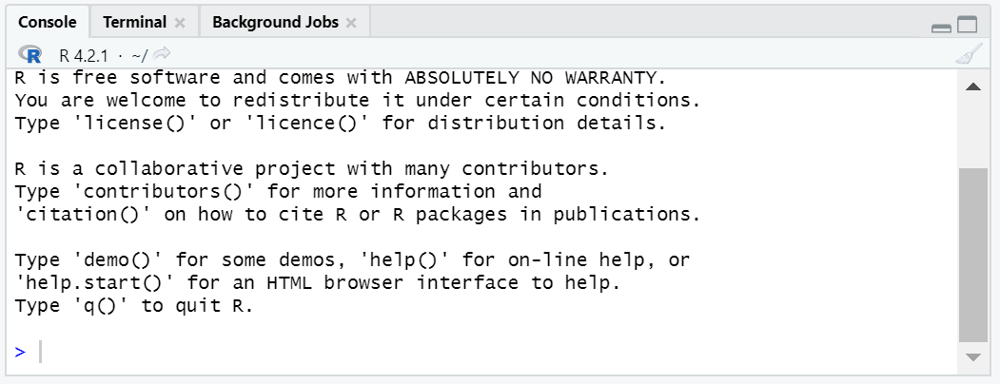
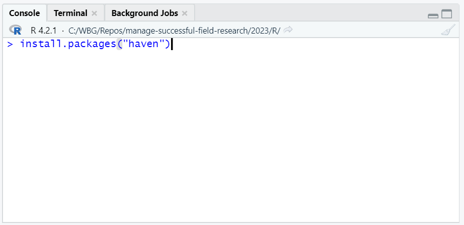

```{r setup, include = FALSE}
# Load packages
library(knitr)
library(xaringanExtra)
library(here)
here::i_am("Presentations/1-intro.Rmd")
options(htmltools.dir.version = FALSE)
opts_chunk$set(
  fig.align = "center",
  fig.height = 4,
  dpi = 300,
  cache = T
  )
xaringanExtra::use_panelset()
xaringanExtra::use_webcam()
xaringanExtra::use_clipboard()
htmltools::tagList(
  xaringanExtra::use_clipboard(
    success_text = "<i class=\"fa fa-check\" style=\"color: #90BE6D\"></i>",
    error_text = "<i class=\"fa fa-times-circle\" style=\"color: #F94144\"></i>"
  ),
  rmarkdown::html_dependency_font_awesome()
)
xaringanExtra::use_logo(
  image_url = here("Presentations",
                   "img",
                   "lightbulb.png"),
  exclude_class = c("inverse", 
                    "hide_logo"),
  width = "40px"
)
```

```{css, echo = F, eval = T}
@media print {
  .has-continuation {
    display: block !important;
  }
}
```

# Table of contents

1. [About the training](#about-this-training)

---

class: inverse, center, middle
name: about-this-training

# About the R lab sessions of MSFR

<html><div style='float:left'></div><hr color='#D38C28' size=1px width=1100px></html>

---

# About the R lab sessions of MSFR

- This is an introduction to statistical programming and reproducible research in R

- Content is focused on usual tasks for field research

---

# About the R lab sessions of MSFR

## Development research

```{r echo = FALSE, out.width="40%"}

```

---

# About the R lab sessions of MSFR

## These labs

```{r echo = FALSE, out.width="65%"}

```

---

# About the R lab sessions of MSFR

## Learning objectives

By the end of the lab sessions, you will know:

- What is statistical programming and reproducibility

- How to apply data work operations commonly used in field research using R code

---

# About the R lab sessions of MSFR

## Prerequisites

- The labs do not require a background in any statistical software or programming language

- The labs require a computer with R, Rstudio, and the library `tidyverse` installed

---

class: inverse, center, middle
name: about-this-training

# Statistical programming

<html><div style='float:left'></div><hr color='#D38C28' size=1px width=1100px></html>

---

# Statistical programming

## Data work in development research

```{r echo = FALSE, out.width="80%"}

```

---

# Statistical programming

## Data work in development research

More generally, for any of the processes in development research, we'll call data work everything that:

1. Starts with a data input
1. Runs some process with the data
1. Produces an output with the result

```{r echo = FALSE, out.width="80%"}

```

---

# Statistical programming

## So what do we mean by statistical programming?

- Programming consists of producing instructions for a computer to do something
- In the context of data work, that "something" is statistical analysis, mathematical operations, or data transformations
- Hence, statistical programming consists of producing instructions so our computers will conduct statistical analysis on data

```{r echo = FALSE, out.width="55%"}

```

---

# Statistical programming

- You can think of statistical programming as writing a recipe

```{r echo = FALSE, out.width="68%"}

```

- From now on, we're going to refer to these instructions for data processes as **code**

---

class: inverse, center, middle
name: about-this-training

# Reproducibility

<html><div style='float:left'></div><hr color='#D38C28' size=1px width=1100px></html>

---

# Reproducibility

What if this happens?

```{r echo = FALSE, out.width="75%"}

```

---

# Reproducibility

```{r echo = FALSE, out.width="70%"}
knitr::include_graphics("img/session1/retracted-study.png")
```

---

# Reproducibility

In science, the formal definition of reproducibility was provided by [Bollen et al. (2015)](https://www.nsf.gov/sbe/AC_Materials/SBE_Robust_and_Reliable_Research_Report.pdf):

*the ability […] to duplicate the results of a prior study using the same materials and procedures as were used by the original investigator*

this translates to data work as:

 **<font size="7">The ability to reproduce outputs using the same code and data inputs.</font>**

This is also usually referred to as *computational reproducibility*.

---

# Reproducibility

This may seem like a low bar, but:

```{r echo = FALSE, out.width="40%"}

```

[from Gertler, Galiani, Romero (2014)](https://www.nature.com/articles/d41586-018-02108-9)

---

# Reproducibility

Reproducibility can fail because of many reasons:

- Lack of inputs or code

- Lack of clarity on how to execute (run) code

- Code mistakes that inherently lead to unstable results (like the sorting example)

- Differences in versions of software, programming languages, or functions

But fear not! one of the learning objectives of these labs is to learn how to write reproducible R code.

---

class: inverse, center, middle
name: about-this-training

# Writing R code

<html><div style='float:left'></div><hr color='#D38C28' size=1px width=1100px></html>

---

# Writing R code

## How to write R code?

The rest of this session focuses on the basics of writing R code...

```{r echo = FALSE, out.width="50%"}

```

---

# Writing R code

## How to write R code?

- We'll use RStudio to write R code in this training

- Now open RStudio in your computer

- Please make sure you're opening RStudio and not R

```{r echo = FALSE, out.width="50%"}

```

---

# Writing R code

## RStudio interface

```{r echo = FALSE, out.width="75%"}

```

---

# Writing R code

## RStudio interface

```{r echo = FALSE, out.width="75%"}

```

---

# Writing R code

## Exercise 1: writing code in the console

1. Write the following code in the console of RStudio

  + `print("hello world")`
  + Make sure to include the quotes: `" "`

1. Press Enter to run the code

```{r echo = FALSE, out.width="50%"}

```

---

# Writing R code

```{r echo = FALSE, out.width="90%"}

```

---

# Writing R code

## Exercise 2: writing a short script

.pull-left[
1. Open a new script with `File` >> `New File` >> `R Script`

1. Write or copy the following text into the script

  + `print("hello")`
  + `print("bonjour")`
  + `print("hola")`
  + `print("bom dia")`
  
  
1. Select the text you introduced with your mouse

1. Press "Run"
]
.pull-right[
```{r echo = FALSE, out.width="90%"}

```
]

---

# Writing R code

## R scripts

.pull-left[
- Writing and running code from the console will execute it immediately

- Writing code in the script panel allow us to write multiple lines of code and execute them later

  + Each line is executed in order
  
  + The line and the results will show in the console
  
- **Important:** for the rest of the training, remember to always introduce your code in the script (and not in the console) so you can keep record of what you did
]

.pull-right[
```{r echo = FALSE, out.width="90%"}

```
]

---

# Writing R code

## R scripts

- In other words: scripts contain the instructions you give to your computer when doing data work

```{r echo = FALSE, out.width="70%"}

```

---

# Writing R code

## Creating objects in R

- Remember we also mentioned the environment panel? that's where R keeps track of objects

- Objects are representations of data that currently exist in R's memory

  + A single number can be an object
  + A word can be an object
  + Even an entire data file can be an object

- We create objects in R with the arrow operator (`<-`)

- Example: creating an object called `x`

```{r eval=FALSE}
x <- 10
```

---

# Writing R code

## Creating objects in R

- After an object is created, we can refer to it using its name

```{r}
x <- 10
print(x)
print(x + 5)
```

---

# Writing R code

## Creating objects in R

- After an object is created, it will show in the environment panel

```{r echo = FALSE, out.width="90%"}

```

---

# Writing R code

## Exercise 3: operations with objects

1. Create an object called `x1` in your script and assign to it the value of 50

2. Create an object called `x2` and make it equal to 15

3. Create an object called `x3` and make it the sum of x1 and x2

4. Print `x3`. It should show the value 65

---

# Writing R code

```{r echo = FALSE, out.width="90%"}

```

---

# Writing R code

- These are the very basics of writing R code. You'll become more familiarized with it in this and the next sessions

- Now we know how to use RStudio to write R code and produce scripts

- However, we haven't still introduced the data to our data work. That comes next

---

class: inverse, center, middle
name: about-this-training

# Data in R

<html><div style='float:left'></div><hr color='#D38C28' size=1px width=1100px></html>

---

# Data in R

## Exercise 4: Loading data into R

.pull-left[
1. Go to this page: https://osf.io/xxxxxxx and download the file *admin_data.csv*

2. In RStudio, go to `File` > `Import Dataset` > `From Text (base)` and select the file `admin_data.csv`
  + If you don't know where the file is, check in the `Downloads` folder
  
3. Make sure to select `Heading` > `Yes` in the next window

4. Select `Import`
]

.pull-right[
```{r echo = FALSE, out.width="90%"}

```
]

---

# Data in R

- If you did this correctly, you will note that a viewer of the data now appears in RStudio
- You can click on the `x` next to `admin_data` to return to the script
- To open the viewer again, use the code: `View(admin_data)` (notice the uppercase "V")

```{r echo = FALSE, out.width="70%"}

```

---

# Data in R

- Additionally, you will now see an object named `admin_data` in your environment

```{r echo = FALSE, out.width="70%"}
knitr::include_graphics("img/session1/environment2.png")
```

---

# Data in R

- Remember we mentioned objects before? For R, `admin_data` is an object just like `x1`, `x2`, or `x3`

- The difference is that `admin_data` is not a single number like `x1`, but a collection of numeric values similar to an Excel spreadsheet. In R, this type of objects are called **dataframes**

- From now, we will refer to data loaded into R as **dataframes**

```{r echo = FALSE, out.width="70%"}
knitr::include_graphics("img/session1/environment2.png")
```

---

# Data in R

- Since dataframes are also objects, we can refer to them with their names (exm: `admin_data`)

- We'll see an example of that in the next exercise

---

# Data in R

## A note about this dataframe

Knowing the data you use is very important. For the lab sessions, `admin_data` is a dataframe that simulates administrative data about villages provided by a government counterpart.

- Variables (columns) from `Province` to `Cell` contain information for the location of the village in the administrative division of the country
- `Village` is the village name
- `HH_Count` is the number of households in the village

```{r echo = FALSE, out.width="50%"}

```

---

# Data in R

## Exercise 5: Understanding data in R

1. Use the following code to subset `admin_data` and leave only the villages from the district named Kayonza: `subset(admin_data, District == "KAYONZA")`

  + Note that `KAYONZA` and the `D` in `District` need to be uppercase because that's how they are in the dataframe
  + Note that there are **two equal signs** in the condition, not one
  
1. Use `View(admin_data)` to visualize the dataframe again and see how it changed (note the uppercase "V")

---

# Data in R

Does anything look out of place?

```{r echo = FALSE, out.width="70%"}

```

---

# Data in R

- Indeed, the dataframe `admin_data` didn't change

- That is because we didn't use the arrow operator (`<-`) to store the result in an object

- Instead, R only printed the result in the console for us (and nothing else)

```{r echo = FALSE, out.width="70%"}

```

---

# Data in R

## Exercise 6: Operating with data and storing the result

1- Subset the dataframe again and save the result into a new dataframe called `admin_data_kayonza`. You can use this code for that:

  ```{r eval=FALSE}
  `admin_data_kayonza <- subset(admin_data, District == "KAYONZA")`
  ```

2- Use `View(admin_data_kayonza)` to visualize the result (notice the uppercase "V")

---

# Data in R

Now the resulting dataframe looks correct!

```{r echo = FALSE, out.width="85%"}

```

---

# Data in R

Note that this time R didn't print the resulting dataframe in the console, it only showed the code we were running. Also, now the new dataframe appears in the environment.

```{r echo = FALSE, out.width="85%"}

```

---

# Data in R

- R can store multiple dataframes in the environment. This is analogous to having different spreadsheets in the same Excel window

- Remember that dataframes are just objects in R. R differentiates which dataframe the code refers to with the dataframe name

```{r echo = FALSE, out.width="75%"}

```

---

class: inverse, center, middle
name: about-this-training

# Functions in R

<html><div style='float:left'></div><hr color='#D38C28' size=1px width=1100px></html>

---

# Functions in R

- Functions are how we apply operations to objects in R

- We have used a few functions in the previous exercises. For example, `subset()` and `View()` are functions

- Everything that has a name plus parentheses is a function in R

```{r echo = FALSE, out.width="95%"}

```

---

# Functions in R

Functions have the following elements:

```{r echo = FALSE, out.width="95%"}

```

- **Function name:** the name we use to call a function. It goes before the parentheses

- **Arguments:** inputs and specifications for the function to be applied.

  + Arguments go inside the parentheses
  + The first argument is the object you apply the function on

---

# Functions in R

- The results of a function can always be stored in an object with the arrow operator (`<-`)

```{r echo = FALSE, out.width="95%"}

```

- As we saw in exercise 5, the results of a function will only be printed in the console if you don't store them

---

# Functions in R

## Exercise 7: Using the function `summary()`

1. Compute the summary statistics of the variables of `admin_data` and save the result with `admin_summary <- summary(admin_data)`

2. Print the stored result with `print(admin_sumary)`

---

# Functions in R

Note that this code is both creating a new object with `admin_summary <- summary(admin_data)` and printing the result in the console with `print(admin_summary)`.

```{r echo = FALSE, out.width="75%"}

```

---

class: inverse, center, middle
name: about-this-training

# R libraries

<html><div style='float:left'></div><hr color='#D38C28' size=1px width=1100px></html>

---

# R libraries

- Installing R in your computer gives you access to its basic functions

- Additionally, you can also install libraries. Libraries are packages of additional R functions that allow you to do:

  + Operations that basic R functions don't do (example: work with geographic data)
  
  + Operations that basic R functions do, but easier (example: data cleaning)

---

# R libraries

In a nutshell:

```{r echo = FALSE, out.width="90%"}
knitr::include_graphics("img/session1/r-libraries.png")
```

---

# R libraries

We'll install two libraries that we'll use extensively in the labs: `haven` and `here`

## Exercise 8: Installing libraries

1. Install the libraries by using `install.packages()`

 + `install.packages("haven")`
 + `install.packages("here")`
 + Note the quotes (`" "`) in the package names
 + **Introduce this code in the console**, not the script panel

```{r echo = FALSE, out.width="40%"}

```

---

# R libraries

## Installing libraries

```{r echo = FALSE, out.width="90%"}

```

Remember to do this for the installation of `here` as well.

---

# R libraries

Now that `haven` and `here` are installed, we only need to load them to start using the functions they have.

## Exercise 9: Loading libraries

.pull-left[
1. Load `haven` with: `library(haven)`

1. Load `here` with `library(here)`

  + Run this code from the new script you just opened
  + Notice that we don't use quotes in the library names this time
]
.pull-right[
```{r echo = FALSE, out.width="95%"}

```
]

---

# R libraries

- Library installation:

```{r echo = FALSE, out.width="37%"}
knitr::include_graphics("img/session1/installation.png")
```

- Library loading:

```{r echo = FALSE, out.width="37%"}
knitr::include_graphics("img/session1/loading.png")
```

- You install R libraries only once in your computer

- You load libraries every time you open a new RStudio window (only load the libraries you will use)

---

class: inverse, center, middle
name: about-this-training

# File paths

<html><div style='float:left'></div><hr color='#D38C28' size=1px width=1100px></html>

---

# File paths

File paths are the location of a file or folder in your computer. For example:

```{r eval=FALSE}
C:/WBG/Repos/manage-successful-field-research/2023/R/Presentations/1-intro.Rmd
```

is the location of this presentation file in my computer.

```{r echo = FALSE, out.width="40%"}

```

---

# File paths

- File paths are important because they define the route from which your computer reads input data or exports outputs

- Remember when you manually loaded `admin_data.csv`? you were using a file path implicitly. This is how the command for loading the data was applied in my computer:

```{r eval=FALSE}
admin_data <- read.csv("C:/Users/wb532468/Downloads/admin_data.csv")
```

- This will look different for your computer because the path to your `Downloads` folder is not going to be the same

---

# File paths

## Relative and absolute file paths

- Absolute file paths define a location starting from a disk in Windows (`C:/`) or the folder `/Users/` in Mac.

  + For example: `C:/Users/wb532468/Downloads/admin_data.csv`

- Relative file paths define the location of a file relative to an "anchor" location.

  + For example: `wb532468/Downloads/admin_data.csv` is the relative path of `admin_data.csv` with respect of `C:/Users`

---

# File paths

## Relative and absolute file paths

- You can use both in R

- Relative file paths will work with respect of the current working directory where R is located. You can check it with the function `getwd()`

```{r}
getwd()
```

- In Windows, the default working directory when starting R is the Documents folder

---

# File paths

## Relative and absolute file paths

- The current working directory will always be the "anchor" for relative paths in R

- You can change it with the function `setwd()`, as in:

```{r eval=FALSE}
setwd("C:/path/that/only/exists/in/my/computer")
```

- However, we absolutely recommend not to do it

- Why? **Because having code that sets a working directory with a path that only exists in your computer will break reproducibility**

---

# File paths

## RStudio projects and `here`

- Instead, you should use RStudio projects and the library `here`

- RStudio projects automatically sets the working directory to a "project" folder, so you can use it as anchor to work with relative paths that will work for everyone else that uses the same folder structure

- This is crucial because it allows smooth interoperability between different computers where the exact path to the project root directory differs

- This will become clearer with next two exercises

---

# File paths

Save your current script by clicking in the floppy disk icon **before starting this exercise**.

## Exercise 10

1. Create a folder named `msfr-r-labs` in your preferred location in your computer

1. Go to https://osf.io/XXXXX and download the file in: `DataWork.zip`

1. Unzip `DataWork.zip` in the folder `msfr-r-labs`

1. On RStudio, select `File` > `New Project...`

1. Select `Existing Directory`

1. Browse to the location of `msfr-r-labs` and select `Create Project`

1. RStudio will restart after this

---

# File paths

## RStudio projects

```{r echo = FALSE, out.width="90%"}

```

---

# File paths

## RStudio projects

```{r echo = FALSE, out.width="70%"}

```

---

# File paths

## Using `here`

- `here` locates files relative to your project root

- It uses the root project directory to build paths to files easily

- It allows for interoperability between different computers where the absolute path to the same file is not the same

---

# File paths

## Using `here`

- Now you'll be able to use `here()` to point the location of every file relative to your project root

  + For example, to load a `csv` file located in: `C:/WBG/project-root-name/data/raw/data-file.csv`, you should use:
  
```{r, eval=FALSE}
path <- here("data", "raw", "data-file.csv")
df <- read.csv(path)
```

- __Notes:__

  + Your project root is the directory that contains the `.Rproj` file
  + The result of `here()` is an absolute path that points to a file or folder location in your computer

---

# File paths

## Exercise 11

1. Start a new script with `File` > `New File` > `R Script` 

1. Create an object called `path` that will be a file path to `DataWork/data/raw/admin_data.dta`. Use here for this, as in `here("DataWork", "data", "raw", "admin_data.dta)`

1. Use `read_stata()` to load the file and assign it to an object with `<-`. The argument of `read_stata()` should be the object `path`.

Some notes:

+ `read_stata()` is a function from the library `haven`. You can only use it after loading `haven` with `library(haven)` (we did this already in exercise 9)
  
+ The same happens with `here()`, which is a function from the library `here`. You can only use `here()` after having run `library(here)` (exercise 9)

+ Remember to assign the dataframe you're reading to an object. You can call it `admin_data` as we did before

---

# File paths

```{r, eval=FALSE}
path <- here("DataWork", "data", "raw", "admin_data.dta")
admin_data <- read_stata(path)
```

or you could have used:

```{r, eval=FALSE}
admin_data <- read_stata(here("DataWork", "data", "raw", "admin_data.dta"))
```

---

# File paths

If you did the exercise correctly, you should see `admin_data` listed in the environment panel

```{r echo = FALSE, out.width="70%"}

```

---

class: inverse, center, middle

# Thanks! // ¡Gracias!

<html><div style='float:left'></div><hr color='#D38C28' size=1px width=1100px></html>

---

exclude: true

```{R, include = FALSE, eval = FALSE}
pagedown::chrome_print("1-intro.html", output = "1-intro.pdf")
```
