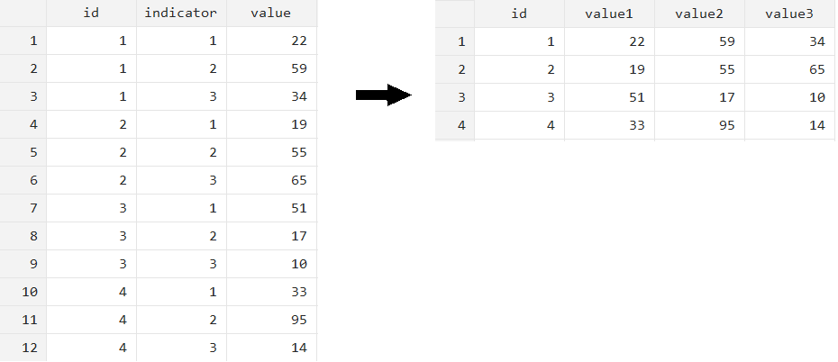

```{r setup, include = FALSE}
# Load packages
library(knitr)
library(xaringanExtra)
library(here)
library(dplyr)
here::i_am("Presentations/1-intro.Rmd")
options(htmltools.dir.version = FALSE)
opts_chunk$set(
  fig.align = "center",
  fig.height = 4,
  dpi = 300,
  cache = T
  )
xaringanExtra::use_panelset()
xaringanExtra::use_webcam()
xaringanExtra::use_clipboard()
htmltools::tagList(
  xaringanExtra::use_clipboard(
    success_text = "<i class=\"fa fa-check\" style=\"color: #90BE6D\"></i>",
    error_text = "<i class=\"fa fa-times-circle\" style=\"color: #F94144\"></i>"
  ),
  rmarkdown::html_dependency_font_awesome()
)
xaringanExtra::use_logo(
  image_url = here("Presentations",
                   "img",
                   "lightbulb.png"),
  exclude_class = c("inverse", 
                    "hide_logo"),
  width = "40px"
)
```

```{css, echo = F, eval = T}
@media print {
  .has-continuation {
    display: block !important;
  }
}
```

# Table of contents

1. [About the session](#about-this-session)

---

class: inverse, center, middle
name: about-this-session

# About this session

<html><div style='float:left'></div><hr color='#D38C28' size=1px width=1100px></html>

---

# About this session

.pull-left[
```{r echo = FALSE, out.width="99%"}
knitr::include_graphics("img/session2/intro2.png")
```
]
.pull-right[
We'll also cover piping, part of the basics of R that we couldn't do in the first session.
]

---

# About this session

## Questions we will answer today

1. What is the ideal format to handle data in statistical programming?

1. How can I get data into this format?

1. Why is this format ideal?

---

class: inverse, center, middle
name: about-this-session

# Piping

<html><div style='float:left'></div><hr color='#D38C28' size=1px width=1100px></html>

---

# Piping

Before diving into the concept of tidy data, there is one more aspect of the basics of R data work that you need to learn

## Functions inside functions

- R allows you to use functions inside functions. For example, this will show the summary of the logarithm of the dataframe `admin_data`

```{r eval=FALSE}
summary(log(admin_data))
```

- In this case, R is taking the *output* (result) of `log(admin_data)` as the *input* of `summary()`

- The name of this programming technique is **function inception** or **metaprogramming**

---

# Piping

## Functions inside functions

- This is convenient because it saves us from having to store intermediate results into objects frequently, keeping our R environment cleaner

- However, it also has the big downside of making code convoluted and unclear, as in the example below

```{r eval=FALSE}
round(mean(log(admin_data)), 2)
```

- Piping helps keeping code clear in cases like this

---

# Piping

- The pipe operator is this: `%>%`

- Pipes are used between objects or the results of functions, as in: `log(admin_data) %>% summary()`

- The meaning of the operator is:

<font size="6">Take the object or output of the function at the left and pass it as the first argument of the function at the right</font>

In short:

- `x %>% f()` is the same as `f(x)`

- `x %>% f() %>% g()` is the same as `g(f(x))`

---

# Piping

- Hence, these are equivalent:

```{r eval=FALSE}
# The long way, with intermediate objects:
log_admin <- log(admin_data)
summary(log_admin)

# Shorter, but code is less clear:
summary(log(admin_data))

# With pipes, clearer and with no intermediate objects:
log(admin_data) %>% summary()

# Note that you can also concatenate pipes and include line breaks:
admin_data %>%
  log() %>%
  summary()
```

- Note that pipes are part of the libraries included in the tidyverse. When you load `dplyr`, the pipes become available for use

---

# Piping

## Exercise 1: Load data with pipes

We'll now load the data we'll use in the next exercise. Make sure to have finished the RStudio project exercise of session 1 and have the package  `here` loaded before trying this.

- Use the functions `here()` and `read.csv()` with pipes between them (`%>%`) to read the file `DataWork/data/raw/admin_data_long.csv`. Name the dataframe `admin_data_long`. Some hints:

  + **Very important:** remember to save the data read into a dataframe object with `<-`, otherwise R will only print the dataframe and it will not be stored in the environment
  
  + Remember that the arguments of here are the names of the folders in the path to the file, with quotes (`" "`). The last argument is the file name with the file extension, as in: `here("DataWork", "data", "raw", "admin_data_long.csv")`

---

# Piping

```{r, eval=FALSE}
# Adding line breaks for code clarity:
admin_data_long <- 
  here("DataWork", "data", "raw", "admin_data_long.csv") %>%
  read.csv()
```

```{r eval=TRUE, echo=FALSE}
# Adding line breaks for code clarity:
admin_data_long <- 
  here("Data", "DataWork", "data", "raw", "admin_data_long.csv") %>%
  read.csv()
```

```{r echo = FALSE, out.width="70%"}
knitr::include_graphics("img/session2/env-admin-data-long.png")
```

---

# Piping

- This was the last of R basics!

- Now we'll continue the session with tidy data

---

class: inverse, center, middle
name: about-this-session

# Data formats

<html><div style='float:left'></div><hr color='#D38C28' size=1px width=1100px></html>

---

# Data formats

- Data can be acquired in multiple formats, bit in development research it is most commonly acquired as one or more **data tables**

<font size="7"><b>Data table:</b> A format where data is organized into rows and columns</font>

- It's also called *tabular data* or *rectangular data*

---

# Data formats

```{r echo = FALSE, out.width="90%"}
knitr::include_graphics("img/session2/tabular-data.png")
```

---

# Data formats

## Non-tabular data

.pull-left[

- Some examples of non-tabular data are images, text, and geospatial data

- Everything we cover today doesn't apply to these other formats

]
.pull-right[
```{r echo = FALSE, out.width="70%"}
knitr::include_graphics("img/session2/non-tabular-data.png")
```
]

---

# Data formats

## Tabular data

.pull-left[
- Data tables can be organized in multiple ways

- Not all of them result in easy to handle datasets
]
.pull-right[

```{r echo = FALSE, out.width="95%"}
knitr::include_graphics("img/session2/admin-data-long.png")
```

<p style="text-align: center;">Example: Data stacked by rows</p>
]

---

# Data formats

## Tabular data

- Data tables can be organized in multiple ways

- Not all of them result in easy to handle datasets

```{r echo = FALSE, out.width="70%"}
knitr::include_graphics("img/session2/hh-data-wide.png")
```

<p style="text-align: center;">Example: Data spread over columns</p>

---

# Data formats

## Tabular data

.pull-left[
- Fortunately, a vast literature of database management has identified the format that makes interacting with the data as easy as it can be

- In database management this is called **normalization**

- When applied to statistics, we call data in this ideal format **tidy**
]
.pull-right[
```{r echo = FALSE, out.width="95%"}
knitr::include_graphics("img/session2/tidydata.png")
```
]

---

class: inverse, center, middle
name: about-this-session

# Tidy data

<html><div style='float:left'></div><hr color='#D38C28' size=1px width=1100px></html>

---

# Tidy data

- A data table is **tidy** when:

.exercise[

1. Each column corresponds to **one variable**

2. Each row corresponds to **one observation**

3. All variables in the data table have the **same unit** of observation

]

- Every other format is untidy

- Data you might obtain from field work or a government counterpart is rarely tidy

---

# Tidy data

## Some definitions

In some statistical software, columns are usually called *variables* and rows are called *observations*. However, these are not necessarily the same. From now on:

- A **variable** is a collection of values that measure the same attribute across different units

- An **observation** is a collection of all values measured on the same unit across attributes

- A **data point** represents one variable for one observation. Data points are also called *values*

- A **dataset** is a collection of data points

---

# Tidy data

## Definitions in practice

.pull-left[
- What is the unit of observation represented in this table?

- What are the attributes measured in this table?

- At what level are these attributes observed?


]
.pull-right[
```{r echo = FALSE, out.width="95%"}
knitr::include_graphics("img/session2/admin-data-long.png")
```
]

---

# Tidy data

## Is this dataset tidy?

.pull-left[
- <span style="color: Green;">All variables have the **same unit of observation** (village)</span>
]
.pull-right[
```{r echo = FALSE, out.width="95%"}
knitr::include_graphics("img/session2/admin-data-long.png")
```
]

---

# Tidy data

## Is this dataset tidy?

.pull-left[
- <span style="color: green;">All variables have the **same unit of observation** (country)</span>

- <span style="color: red;">There are **multiple variables** represented in a **single column**</span>
]
.pull-right[
```{r echo = FALSE, out.width="97%"}
knitr::include_graphics("img/session2/admin-data-long-value-highlight.png")
```
]

---

# Tidy data

## Is this dataset tidy?

.pull-left[
- <span style="color: green;">All variables have the **same unit of observation** (country)</span>

- <span style="color: red;">There are **multiple variables** represented in a **single column**</span>

- <span style="color: red;">Each observation is **separated into multiple rows**</span>
]
.pull-right[
```{r echo = FALSE, out.width="97%"}
knitr::include_graphics("img/session2/admin-data-long-unit-highlight.png")
```
]

---

class: inverse, center, middle
name: about-this-session

# Tidying a long dataset

<html><div style='float:left'></div><hr color='#D38C28' size=1px width=1100px></html>

---

# Tidying a long dataset

## How would this table look in a tidy format?

```{r echo = FALSE, out.width="95%"}
knitr::include_graphics("img/session2/tidying-admin-data.png")
```

---

# Tidying a long dataset

- When all variables in a data table have the same unit of observation,
**reshaping** is enough to make untidy data tidy

```{r echo = FALSE, out.width="70%"}

```

---

# Tidying a long dataset

- When all variables in a data table have the same unit of observation,
reshaping is enough to make untidy data tidy

```{r echo = FALSE, out.width="70%"}

```

- Reshaping **does not change the content of the data points** in the table

---

# Tidying a long dataset

- When all variables in a data table have the same unit of observation,
reshaping is enough to make untidy data tidy

```{r echo = FALSE, out.width="70%"}

```

.exercise[
<font size="6"><b>Reshaping:</b> A transformation of rows and columns in a data table that changes the unit of observation of the rows</font>
]

---

# Tidying a long dataset

## `tidyr`

.pull-left[
- There are multiple options to reshape in R. We'll use the package `tidyr`

- `tidyr` is part of the suite of packages included in the tidyverse. You don't have to install it if you installed the tidyverse

- `tidyr` allows us to use functions to reshape R dataframes
]
.pull-right[
```{r echo = FALSE, out.width="60%"}
knitr::include_graphics("img/session2/tidyr.png")
```
]

---

# Tidying a long dataset

## `tidyr`

- `tidyr` has multiple functions to make dataframes tidy

- When dataframes have data stacked by rows, you use the function `pivot_wider()` to make it tidy

- `pivot_wider()` takes the following arguments:

```{r eval=FALSE}
tidy_df <- pivot_wider(
  untidy_df,
  names_from = column_with_names,
  values_from = column_with_values
)
```

- the first argument is the input dataframe
  
- `names_from` is the column that contains the variable names for the units
  
- `values_from` is the column that contains the data points

---

# Tidying a long dataset

- Tidying any dataframe requires inspecting it to know which columns will be the used for the arguments `names_from` and `values_from`

- Use `View(admin_data_long)` to inspect `admin_data_long` and see how it should be reshaped

```{r echo = FALSE, out.width="45%"}
knitr::include_graphics("img/session2/admin-data-long.png")
```

---

# Tidying a long dataset

## Exercise 2: Reshape a long dataframe to make it tidy

1. Load the library `tidyr` with `library(tidyr)`

2. Use `pivot_wider()` to reshape the dataframe `admin_data_long`. Recall the syntax of `pivot_wider()`:

```{r eval=FALSE}
tidy_df <- pivot_wider(
  untidy_df,
  names_from = column_with_names,
  values_from = column_with_values
)
```

Hints:

- `names_from` is the column that contains the variable names
- `values_from` is the column that contains the data points
- Remember to save the result in a new dataframe object with `<-`
- Try using pipes: `%>%`

---

# Tidying a long dataset

```{r eval=FALSE}
admin_data_tidy <- admin_data_long %>%
  pivot_wider(names_from = group, values_from = count)
View(admin_data_tidy)
```

```{r echo = FALSE, out.width="48%"}
knitr::include_graphics("img/session2/admin-data-tidy.png")
```

---

# Tidying a long dataset

- This, however is one of the simplest cases

- One of the most common cases of untidy data encountered in development research are datasets consisting of multiple units of observation stored in the same table.

---

class: inverse, center, middle
name: about-this-session

# Tidying datasets with multiple units

<html><div style='float:left'></div><hr color='#D38C28' size=1px width=1100px></html>

---

# Tidying datasets with multiple units

## Is this dataset tidy?

```{r echo = FALSE, out.width="85%"}
knitr::include_graphics("img/session2/hh-data-wide.png")
```

---

# Tidying datasets with multiple units

## Is this dataset tidy?

.pull-left2[
- <span style="color: red;">The variables have two units: household, and household food level</span>
]
.pull-right2[
```{r echo = FALSE, out.width="95%"}
knitr::include_graphics("img/session2/data-wide-units.png")
```
]

---

# Tidying datasets with multiple units

## Is this dataset tidy?

.pull-left2[
- <span style="color: red;">The variables have two units: household, and household food level</span>

- <span style="color: red;">The variables *days* and *source* at the food level are split into multiple columns</span>
]
.pull-right2[
```{r echo = FALSE, out.width="95%"}
knitr::include_graphics("img/session2/data-wide-variables.png")
```
]

---

# Tidying datasets with multiple units

## Is this dataset tidy?

.pull-left2[
- <span style="color: red;">The variables have two units: household, and household food level</span>

- <span style="color: red;">The variables *days* and *source* at the food level are split into multiple columns</span>

- <span style="color: red;">Each row contains multiple observations</span>
]
.pull-right2[
```{r echo = FALSE, out.width="95%"}
knitr::include_graphics("img/session2/data-wide-observations.png")
```
]

---

# Tidying datasets with multiple units

## Why does this dataset have this format?

```{r echo = FALSE, out.width="95%"}
knitr::include_graphics("img/session2/module-income.PNG")
```

---

# Tidying datasets with multiple units

## Why does this dataset have this format?

```{r echo = FALSE, out.width="95%"}
knitr::include_graphics("img/session2/food-security-module.PNG")
```

---

# Tidying datasets with multiple units

## So how would this table look in a tidy format?

```{r echo = FALSE, out.width="95%"}
knitr::include_graphics("img/session2/hh-data-wide.PNG")
```

---

# Tidying datasets with multiple units

## So how would this table look in a tidy format?

```{r echo = FALSE, out.width="95%"}
knitr::include_graphics("img/session2/data-wide-tidy.PNG")
```

---

# Tidying datasets with multiple units

When there are multiple units of observation in the same dataset, the process
requires additional steps:

- Identify all the variables that were measured at the same level of observation
- Create separate tables for each level of observation
- Reshape the data

---

# Tidying datasets with multiple units

At the end of this process, your dataset will consist of **multiple data tables**, one
for each **unit of observation**.

```{r echo = FALSE, out.width="95%"}
knitr::include_graphics("img/session2/tidy-files.PNG")
```

---

# Tidying datasets with multiple units

There are three additional components that are crucial to successfully managing a
set of tidy tables:

1.- You should remove duplicates before tidying the dataset
  + We'll see how to do this in the next exercise

---

# Tidying datasets with multiple units

There are three additional components that are crucial to successfully managing a
set of tidy tables:

2.- Each observation of each data table must be uniquely and fully identified by
one or a set of ID variables
  + Unfortunately, neither `tidyr` nor `dplyr` have a function to check if one or more variables uniquely identify observations in a dataframe. However, this can be checked with a combination of the functions `nrow()` (counts rows in a dataframe) and `dplyr`'s `n_distinct()` (counts the number of unique observations in a dataframe or a set of columns)

---

# Tidying datasets with multiple units

There are three additional components that are crucial to successfully managing a
set of tidy tables:

3.- You must be able to use these ID variables to link all data tables to each other if needed
  + We will not cover dataframe linkage in the labs with an exercise, but this can be done with `dplyr`'s functions `left_join()`, `right_join()`, `inner_join()`, and `full_join()`

---

# Tidying datasets with multiple units

## Exercise 3: Load the HH wide dataset and check for duplicates

1. Load the HH wide dataset into R with:  `lwh_wide <- here("DataWork", "data", "raw", "LWH_baseline_wide.csv") %>% read.csv()`

1. Inspect it with `View(lwh_wide)` (note the uppercase "V") and note which are the identifying variables

1. Use the function `nrow()` on `lwh_wide` to check its number of rows. Remember this number

1. Now use `lwh_wide %>% n_distinct(....)` and replace the dots with the names of identifying variables, separated by commas and inside quotes (`" "`)
  + `n_distinct()` returns the number of unique combinations over a set of variables
  + its arguments are the set of variables it counts distinct combinations over

1. If the supposedly identifying variables are indeed identifying, the result of `n_distinct()` should be the same as the one in `nrow()`. Is it the same?

---

# Tidying datasets with multiple units

```{r, eval=TRUE, echo=FALSE}
lwh_wide <- here("Data", "DataWork", "data", "raw", "LWH_baseline_wide.csv") %>% read.csv()
```

```{r}
nrow(lwh_wide)
```

```{r}
lwh_wide %>% n_distinct("district", "sector", "cell", "village", "HHID")
```

---

class: inverse, center, middle

# Thanks! // ¡Gracias!

<html><div style='float:left'></div><hr color='#D38C28' size=1px width=1100px></html>

---

exclude: true

```{R, include = FALSE, eval = FALSE}
pagedown::chrome_print("2-tidy.html", output = "2-tidy.pdf")
```