```{r setup, include = FALSE}
# Load packages
library(knitr)
library(xaringanExtra)
library(here)
library(dplyr)
here::i_am("Presentations/1-intro.Rmd")
options(htmltools.dir.version = FALSE)
opts_chunk$set(
  fig.align = "center",
  fig.height = 4,
  dpi = 300,
  cache = T
  )
xaringanExtra::use_panelset()
xaringanExtra::use_webcam()
xaringanExtra::use_clipboard()
htmltools::tagList(
  xaringanExtra::use_clipboard(
    success_text = "<i class=\"fa fa-check\" style=\"color: #90BE6D\"></i>",
    error_text = "<i class=\"fa fa-times-circle\" style=\"color: #F94144\"></i>"
  ),
  rmarkdown::html_dependency_font_awesome()
)
xaringanExtra::use_logo(
  image_url = here("Presentations",
                   "img",
                   "lightbulb.png"),
  exclude_class = c("inverse", 
                    "hide_logo"),
  width = "40px"
)
```

```{css, echo = F, eval = T}
@media print {
  .has-continuation {
    display: block !important;
  }
}
```

# Table of contents

1. [About the session](#about-this-session)

---

class: inverse, center, middle
name: about-this-session

# About this session

<html><div style='float:left'></div><hr color='#D38C28' size=1px width=1100px></html>

---

# About this session

```{r echo = FALSE, out.width="45%"}
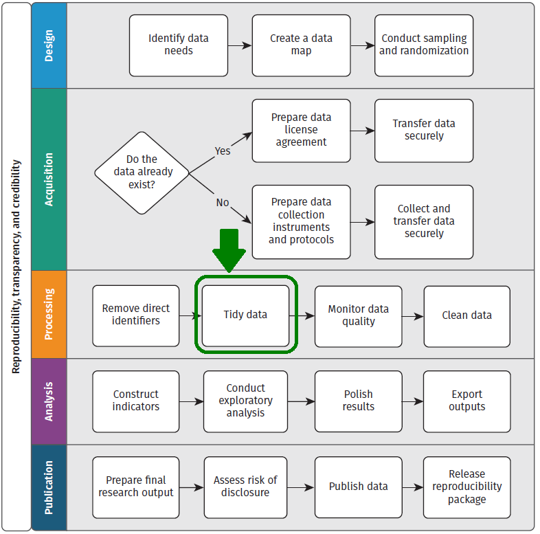
```

---

# About this session

## Questions we will answer today

1. What is the ideal format to handle data in statistical programming?

1. How can I get data into this format using R?

---

class: inverse, center, middle
name: about-this-session

# Tidy data

<html><div style='float:left'></div><hr color='#D38C28' size=1px width=1100px></html>

---

# Tidy data

## Data tables

- Data can be acquired in multiple formats, bit in development research it is most commonly acquired as one or more **data tables**

.exercise[
<font size="6"><b>Data table:</b><br>A data format where data is organized into rows and columns</br></font>
]

- It's also called *tabular data* or *rectangular data*

---

# Tidy data

## Data tables

```{r echo = FALSE, out.width="90%"}
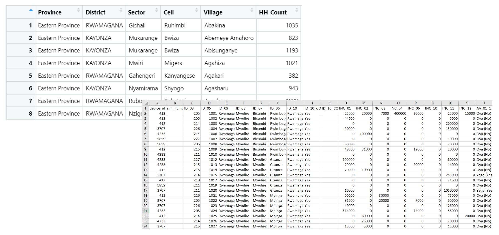
```

---

# Tidy data

- A data table is **tidy** when:

.exercise[

1. Each column corresponds to **one variable**

2. Each row corresponds to **one observation**

3. All variables in the data table have the **same unit** of observation

]

- Every other format is untidy

- Data you might obtain from field work or a government counterpart is rarely tidy

---

# Tidy data

## Some definitions

In some statistical software, columns are usually called *variables* and rows are called *observations*. However, these are not necessarily the same. From now on:

- A **variable** is a collection of values that measure the same attribute across different units

- An **observation** is a collection of all values measured on the same unit across attributes

- A **data point** represents one variable for one observation. Data points are also called *values*

- A **dataset** is a collection of data points

---

# Tidy data

## Definitions in practice

.pull-left[
- Unit of observation: **village**

- Attributes measured (variables):
  + Province
  + District
  + Number of households
  + Population

- Level of the attributes: **village**

]
.pull-right[
```{r echo = FALSE, out.width="95%"}
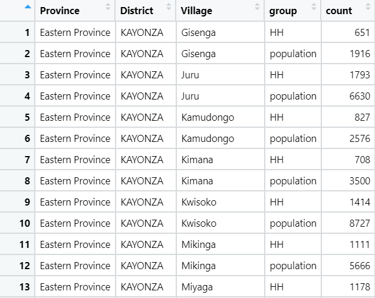
```
]

---

# Tidy data

## Is this dataset tidy?

.pull-left[
- <span style="color: Green;">All variables have the **same unit of observation** (village)</span>
]
.pull-right[
```{r echo = FALSE, out.width="95%"}

```
]

---

# Tidy data

## Is this dataset tidy?

.pull-left[
- <span style="color: green;">All variables have the **same unit of observation** (country)</span>

- <span style="color: red;">There are **multiple variables** represented in a **single column** (number of households and population</span>
]
.pull-right[
```{r echo = FALSE, out.width="97%"}
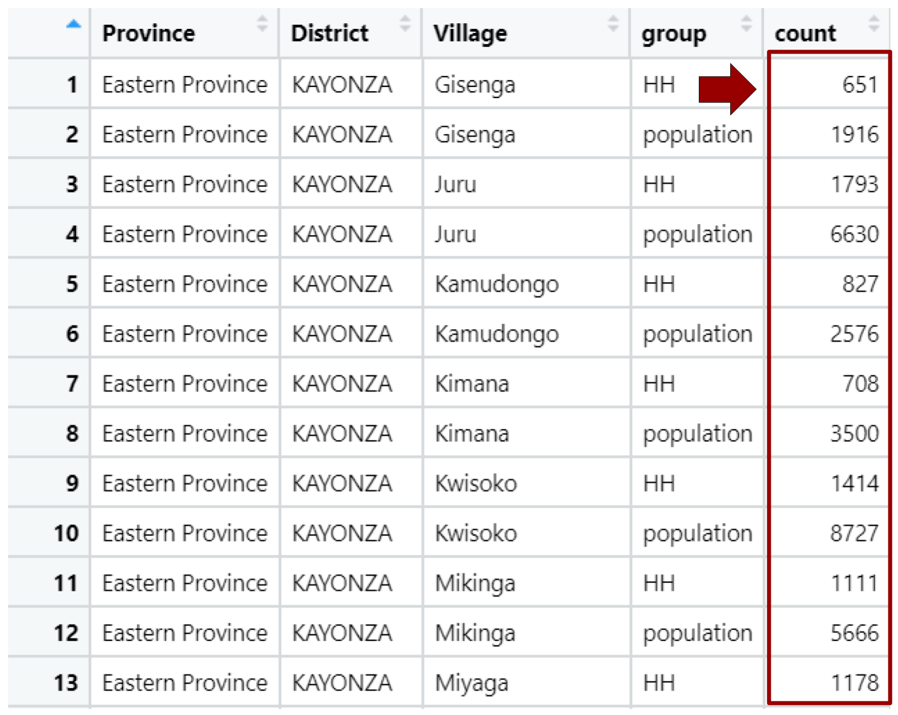
```
]

---

# Tidy data

## Is this dataset tidy?

.pull-left[
- <span style="color: green;">All variables have the **same unit of observation** (country)</span>

- <span style="color: red;">There are **multiple variables** represented in a **single column**</span>

- <span style="color: red;">Each observation (village) is **separated into multiple rows**</span>
]
.pull-right[
```{r echo = FALSE, out.width="97%"}
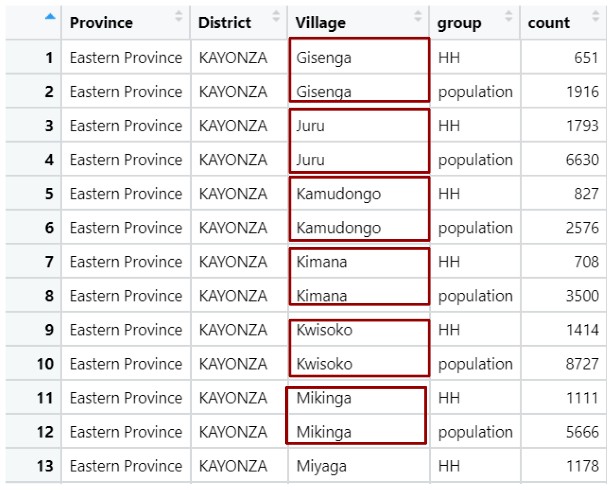
```
]

---

class: inverse, center, middle
name: about-this-session

# Tidying a long dataset

<html><div style='float:left'></div><hr color='#D38C28' size=1px width=1100px></html>

---

# Tidying a long dataset

## How would this table look in a tidy format?

```{r echo = FALSE, out.width="95%"}
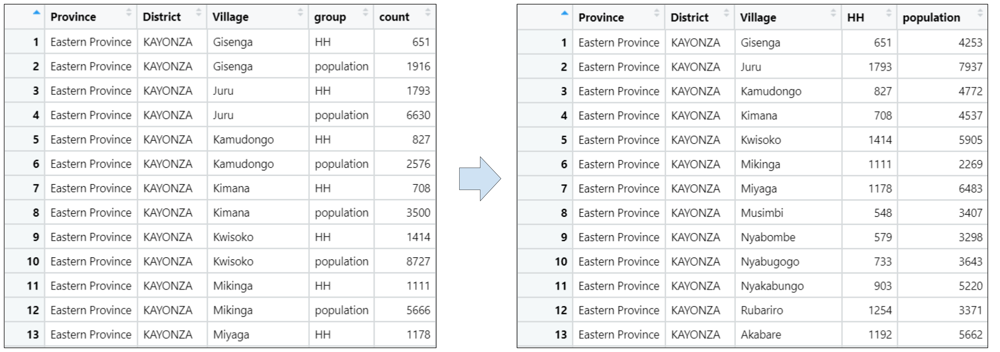
```

---

# Tidying a long dataset

- When all variables in a data table have the same unit of observation,
**reshaping** is enough to make untidy data tidy

- Reshaping **does not change the content of the data points** in the table

```{r echo = FALSE, out.width="75%"}

```

.exercise[
<font size="6"><b>Reshaping:</b> A transformation of rows and columns in a data table that changes the unit of observation of the rows</font>
]

---

# Tidying a long dataset

## `tidyr`

.pull-left[
- There are multiple options to reshape in R. We'll use the package `tidyr`

- `tidyr` is part of the suite of packages included in the tidyverse. You don't have to install it if you installed the tidyverse

- `tidyr` allows us to use functions to reshape R dataframes
]
.pull-right[
```{r echo = FALSE, out.width="60%"}
knitr::include_graphics("img/session2/tidyr.png")
```
]

---

# Tidying a long dataset

## `tidyr`

.pull-left[
- `tidyr` has multiple functions to make dataframes tidy

- When dataframes have data stacked by rows (long data), we use the function `pivot_wider()` to make it tidy
]
.pull-right[
```{r echo = FALSE, out.width="60%"}
knitr::include_graphics("img/session2/tidyr.png")
```
]

---

# Tidying a long dataset

## Exercise 1: Reshape a long dataframe to make it tidy

.pull-left[
- Load the dataframe with:

```{r eval=FALSE}
admin_data_long <- here("DataWork",
                        "data",
                        "raw",
                        "admin_data_long.csv") %>%
  read.csv()
```

- Load the library `tidyr` with `library(tidyr)`

- Use `pivot_wider()` to reshape the dataframe `admin_data_long` and inspect the result, as in:

```{r eval=FALSE}
admin_data_tidy <- admin_data_long %>%
  pivot_wider(names_from = group,
              values_from = count)
View(admin_data_tidy)
```
]
.pull-right[
```{r echo = FALSE, out.width="99%"}

```
<p style="text-align: center;">Dataframe: admin_data_long</p>
]

---

# Tidying a long dataset

Notice the use and arguments of `pivot_wider()`:

```{r eval=FALSE}
admin_data_tidy <- admin_data_long %>%
  pivot_wider(names_from = group,
              values_from = count)
```

- We're storing the result with `<-` into a new object named `admin_data_tidy`

- `admin_data_long` is the input dataframe of `pivot_wider()`, passed with pipes

- `names_from =` is the column that contains the variable names (group)

- `values_from =` is the column that contains the data points (count)

---

# Tidying a long dataset

The result is a tidy dataframe:

```{r echo = FALSE, out.width="48%"}
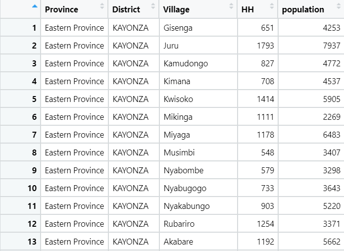
```

---

# Tidying a long dataset

- This, however is one of the simplest cases

- One of the most common cases of untidy data encountered in development research are datasets consisting of multiple units of observation stored in the same table.

---

class: inverse, center, middle
name: about-this-session

# Tidying datasets with multiple units

<html><div style='float:left'></div><hr color='#D38C28' size=1px width=1100px></html>

---

# Tidying datasets with multiple units

## Is this dataset tidy?

```{r echo = FALSE, out.width="75%"}
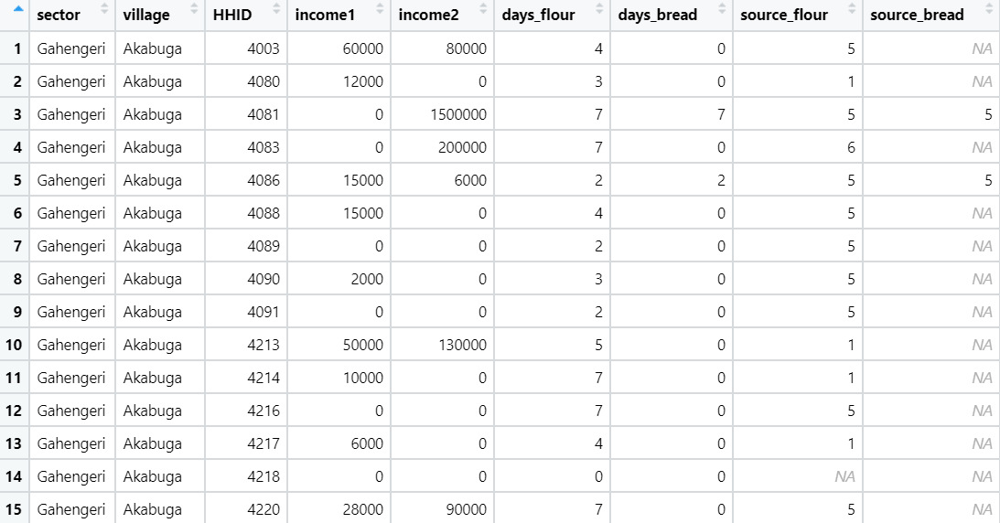
```

---

# Tidying datasets with multiple units

## Is this dataset tidy?

.pull-left2[
- <span style="color: red;">The variables have two units: household, and household food level</span>
]
.pull-right2[
```{r echo = FALSE, out.width="95%"}
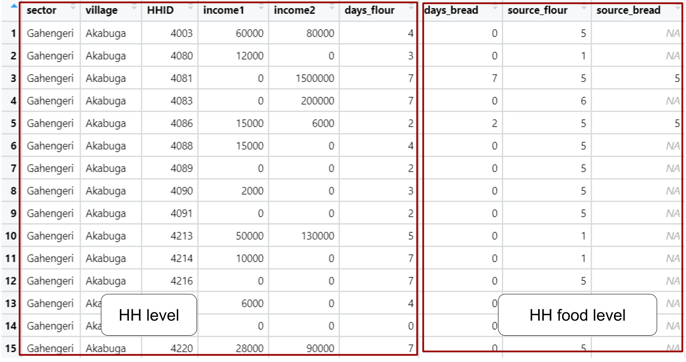
```
]

---

# Tidying datasets with multiple units

## Is this dataset tidy?

.pull-left2[
- <span style="color: red;">The variables have two units: household, and household food level</span>

- <span style="color: red;">The variables *days* and *source* at the food level are split into multiple columns</span>
]
.pull-right2[
```{r echo = FALSE, out.width="95%"}
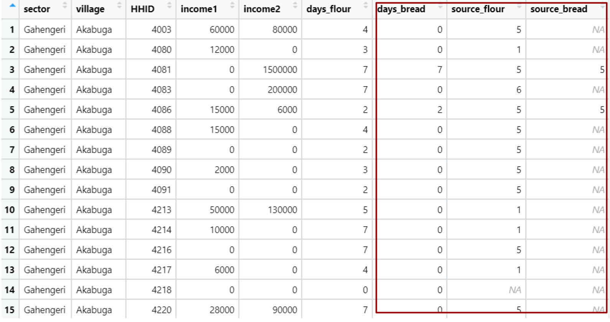
```
]

---

# Tidying datasets with multiple units

## Is this dataset tidy?

.pull-left2[
- <span style="color: red;">The variables have two units: household, and household food level</span>

- <span style="color: red;">The variables *days* and *source* at the food level are split into multiple columns</span>

- <span style="color: red;">Each row contains multiple observations</span>
]
.pull-right2[
```{r echo = FALSE, out.width="95%"}
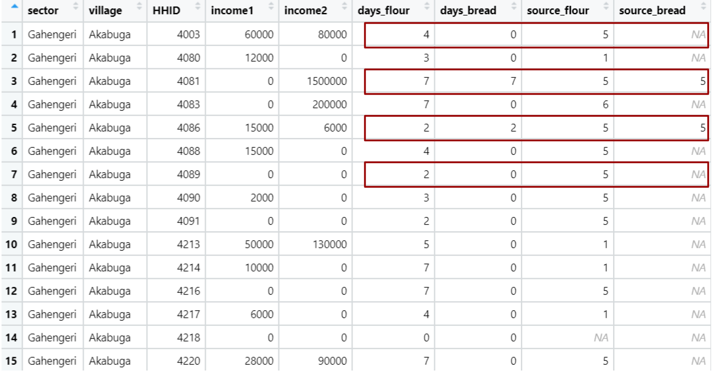
```
]

---

# Tidying datasets with multiple units

## Why does this dataset have this format?

```{r echo = FALSE, out.width="95%"}
knitr::include_graphics("img/session2/module-income.PNG")
```

---

# Tidying datasets with multiple units

## Why does this dataset have this format?

```{r echo = FALSE, out.width="95%"}
knitr::include_graphics("img/session2/food-security-module.PNG")
```

---

# Tidying datasets with multiple units

## So how would this table look in a tidy format?

```{r echo = FALSE, out.width="75%"}
knitr::include_graphics("img/session2/hh-data-wide.PNG")
```

---

# Tidying datasets with multiple units

## So how would this table look in a tidy format?

```{r echo = FALSE, out.width="85%"}
knitr::include_graphics("img/session2/data-wide-tidy.PNG")
```

---

# Tidying datasets with multiple units

When there are multiple units of observation in the same dataset, the process
requires additional steps:

- Identify all the variables that were measured at the same level of observation
- Create separate tables for each level of observation
- Reshape the data

---

# Tidying datasets with multiple units

At the end of this process, your dataset will consist of **multiple data tables**, one
for each **unit of observation**.

```{r echo = FALSE, out.width="95%"}
knitr::include_graphics("img/session2/tidy-files.PNG")
```

---

# Tidying datasets with multiple units

There are three additional components that are crucial to successfully managing a
set of tidy tables:

1. You should remove duplicates before tidying the dataset

1. Each observation of each data table must be uniquely and fully identified by
one or a set of ID variables

1. You must be able to use these ID variables to link all data tables to each other if needed

We'll do this in the next exercises.

---

# Tidying datasets with multiple units

## Exercise 2: Load the HH wide dataset and check for duplicates

1. Load the HH wide dataset into R with:  `lwh_wide <- here("DataWork", "data", "raw", "LWH_baseline_wide.csv") %>% read.csv()`
  + Recommended: inspect it with `View(lwh_wide)`
  
1. Count the number of rows in the dataframe with `nrow(lwh_wide)`. Remember this number

1. Count the number of distinct observation in the dataframe with `n_distinct(lwh_wide)`. Are the two numbers the same?

---

# Tidying datasets with multiple units

```{r, eval=TRUE, echo=FALSE}
lwh_wide <- here("Data", "DataWork", "data", "raw", "LWH_baseline_wide.csv") %>% read.csv()
```

```{r}
nrow(lwh_wide)
```

This means that there are `r nrow(lwh_wide)` observations in `lwh_wide`.

```{r}
lwh_wide %>% n_distinct()
```

This means that there are `r lwh_wide %>% n_distinct()` unique observations in `lwh_wide`.

**Since these numbers are not the same, this means that we have duplicates.** We'll remove them in the next exercise

---

# Tidying datasets with multiple units

## Exercise 3: Remove duplicates

- Remove the duplicates and save the result in a new dataframe with:

```{r eval=FALSE}
lwh_wide_dedup <- distinct(lwh_wide)
```

```{r echo=FALSE}
lwh_wide_dedup <- distinct(lwh_wide)
```

- Now run this condition to check that the number of observations is equal to the number of unique observations in `lwh_wide`

```{r eval=FALSE}
nrow(lwh_wide_dedup) == n_distinct(lwh_wide_dedup) #note the double equal
```

If the condition returns `TRUE`, then you removed the duplicates successfully.

The next step before tidying is to check if the ID variables uniquely identify the observations.

---

# Tidying datasets with multiple units

## Exercise 4: Check the identifying variables

1. Inspect the deduplicated dataframe with `View(lwh_wide_dedup)` and take note of the identifying variables.

1. Count the number of rows with `nrow(lwh_wide_dedup)` and the **number of distinct combinations in the identifying variables** with :

```{r eval=FALSE}
lwh_wide_dedup %>% select(sector, village, HHID) %>% n_distinct()
```

Are the two numbers the same? if so, then the identifying variables uniquely identify the observations.

Also, note the following in this code:

- `select()` is a function from `dplyr`, it subsets columns from a dataframe

- `n_distinct()` is now counting the number of unique combinations in the subset dataframe resulting from `select()` (as opposed to counting the unique observations in `lwh_wide_dedup`, which is what we did in exercise 3)

---

# Tidying datasets with multiple units

- The conclusion of the previous exercise is that the identifying variables uniquely identify the observations

- By the way, this could have also been checked with the following code:

```{r}
nrow(lwh_wide_dedup) == lwh_wide_dedup %>% select(sector, village, HHID) %>% n_distinct()
```

- Now our dataframe is deduplicated and we have verified that the ID variables uniquely identify the observations

- We can now proceed with making the dataframe tidy

---

# Tidying datasets with multiple units

## Exercise 5: Create a tidy household level dataframe

.pull-left[
- Create a new dataframe at the household level with `select()`

  + `select()` subsets columns from a dataframe
  + The first argument is the dataframe and all the following arguments are the column names **without quotes**
  + Remember to save the resulting dataframe in a new object (dataframe) with `<-`
  
```{r eval=FALSE}
lwh_hh <-
  lwh_wide_dedup %>%
  select(sector, village, HHID, income1, income2)
```

- Inspect the result with `View(lwh_hh)`

]
.pull-right[
```{r echo = FALSE, out.width="95%"}
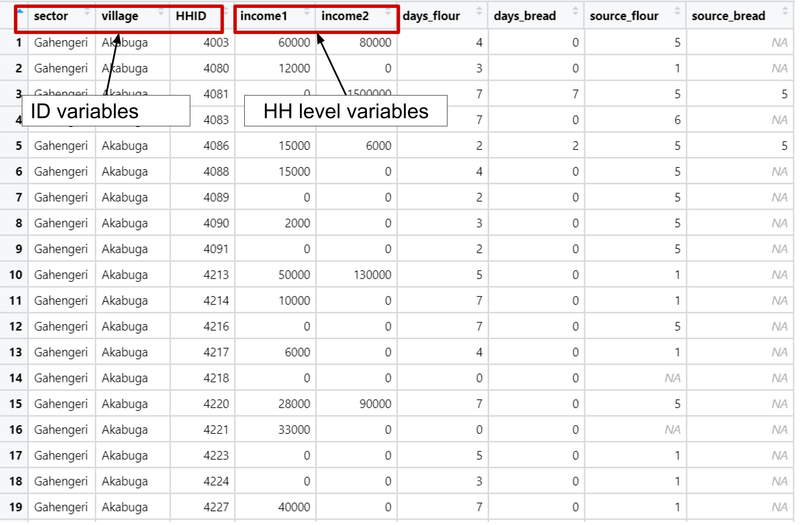
```
]

---

# Tidying datasets with multiple units

.pull-left[
- `lwh_hh` is now the HH level dataframe

- Note that **this dataframe is tidy at the HH level**

- There is no further need to reshape in this case

]
.pull-right[
```{r echo = FALSE, out.width="70%"}
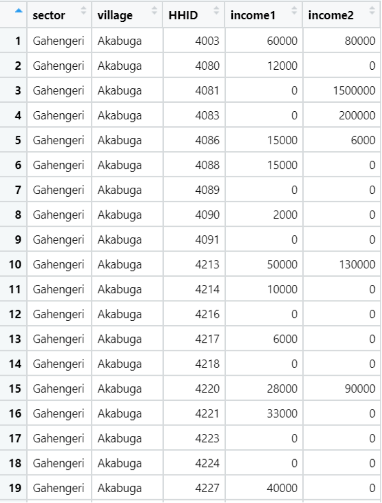
```
]

---

# Tidying datasets with multiple units

.pull-left2[
- Tidying the food source level dataframe requires a more careful analysis

- We will not only have to select the ID and food-level columns, but also reshape the result from wide to long with `pivot_longer()`, from the package `tidyr`
]
.pull-right2[
```{r echo = FALSE, out.width="95%"}
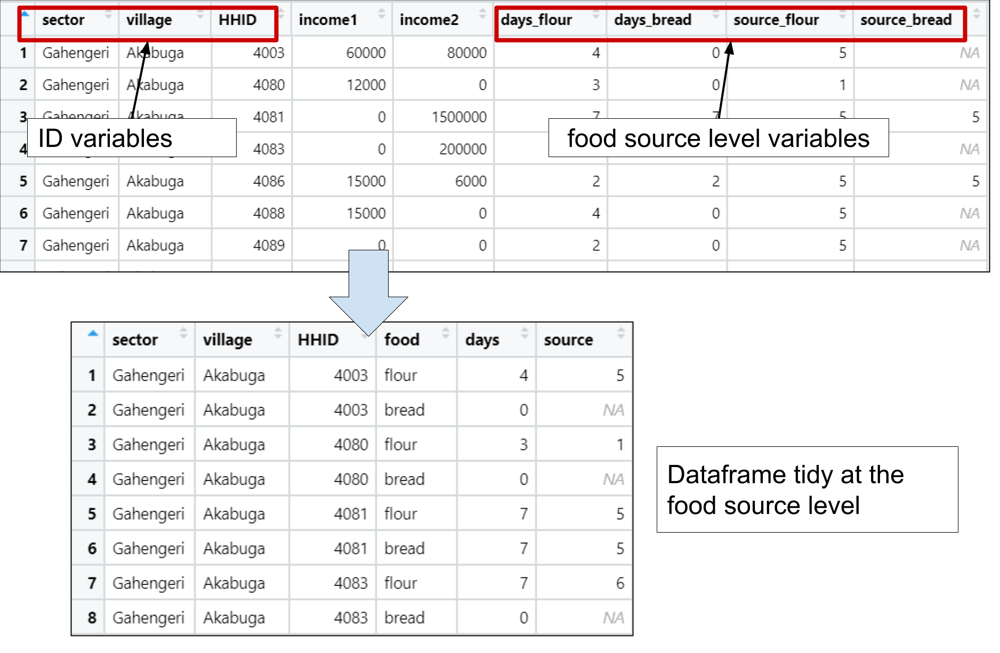
```
]

---

# Tidying datasets with multiple units

## Exercise 6: Create a tidy food source level dataframe

.pull-left[
Apply the following operations in concatenated pipes:

- Select the ID and food source level columns

- Reshape the result

```{r eval=FALSE}
lwh_food <-
  lwh_wide_dedup %>%
  select(sector, village, HHID,
         days_flour, days_bread,
         source_flour, source_bread) %>%
  pivot_longer(cols = c(days_flour, days_bread,
                        source_flour, source_bread),
               names_sep = "_",
               names_to = c(".value", "food"))
```

- Inspect the result with `View(lwh_food)`

]

.pull-right[
```{r echo = FALSE, out.width="95%"}

```
]

---

# Tidying datasets with multiple units

Notice the meaning of the different arguments used in `pivot_longer()`

```{r, eval=FALSE}
pivot_longer(cols = c(days_flour, days_bread,
                      source_flour, source_bread),
             names_sep = "_",
             names_to = c(".value", "food"))
```

- `cols = `: the columns to reshape from the input dataframe
  + We only include the variables at the food source level
  + We don't include the ID variables because they're not reshaped
- `names_sep =`: the separator to distinguish variables and observations in the names of the columns to reshape
- `names_to =`: the names of the new columns to generate after the reshaping
  + `"food"` indicates that a new column named "food" should be generated
  + `".value"` indicates that the corresponding component of the column name (the part before "_") defines the name of the output column containing the values

---

# Tidying datasets with multiple units

Now the entire dataset is tidy with the two resulting dataframes.

```{r echo = FALSE, out.width="95%"}
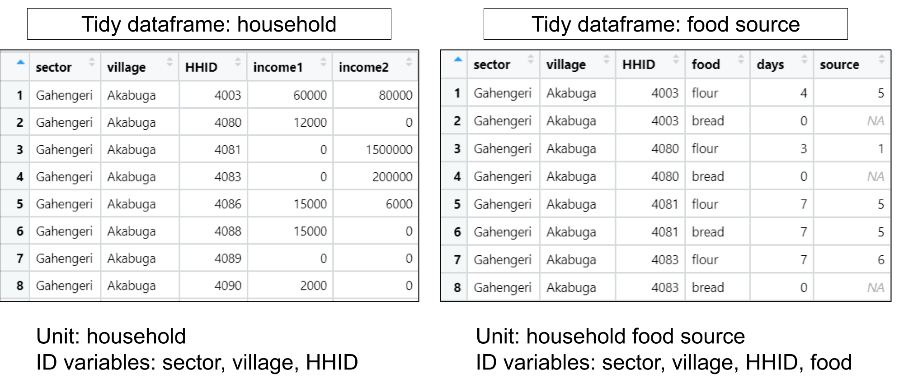
```

---

class: inverse, center, middle
name: about-this-session

# Collapsing

<html><div style='float:left'></div><hr color='#D38C28' size=1px width=1100px></html>

---

# Collapsing

- Tidying a dataframe sometimes involves operations different than reshaping

- One if such cases is **collapsing**

- Imagine you are approached with the following request:

*We would like to know how many households we surveyed in each sector to have a sense of how many we might have missed in the data collection. Can you estimate these numbers?*

---

# Collapsing

.pull-left2[
*We would like to know how many households we surveyed in each village...*

- We can use the tidy dataframe `lwh_hh` for this

- We would have to:

  1. Change the units of observations from household to village
  
  2. Count the observations for each village that are currently in `lwh_hh`
]
.pull-right2[
```{r echo = FALSE, out.width="95%"}
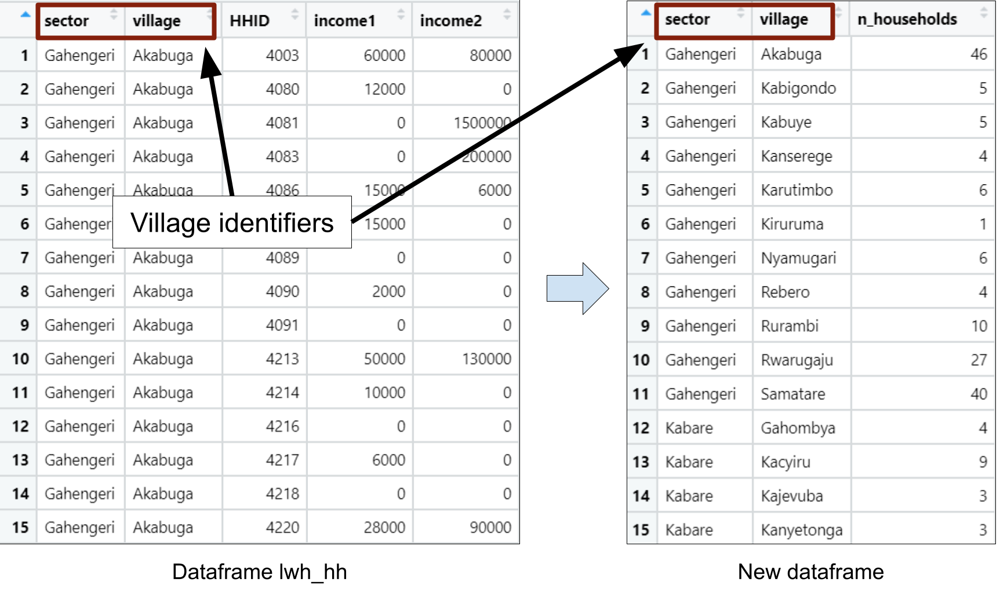
```
]

---

# Collapsing

.pull-left2[
This will require **collapsing**.

.exercise[
**Collapsing:** Transformation of data table in which the unit of observation changes from a lower-level unit (household) to an aggregated unit (village)
]

]
.pull-right2[
```{r echo = FALSE, out.width="95%"}

```
]

---

# Collapsing

## Exercise 7: Collapse `lwh_hh` to the village level

.pull-left2[
- Use the functions `group_by()` and `summarize()` to collapse as in the code below.

```{r eval=FALSE}
lwh_village <- lwh_hh %>%
  group_by(sector, village) %>%
  summarize(n_households = n())
```
]
.pull-right2[
```{r echo = FALSE, out.width="95%"}

```
]

---

# Collapsing

Notice the functions and arguments we used to collapse:

```{r eval=FALSE}
lwh_village <- lwh_hh %>%
  group_by(sector, village) %>%
  summarize(n_households = n())
```

- Both `group_by()` and `summarize()` are functions from `dplyr`

- `group_by()` takes as arguments the columns you collapse by (village identifiers)

- `summarize()` creates aggregated indicators for the collapsed dataframe

  + `n_households = n()` means that we'll create a new column named `n_households` that counts the number of observations for each value we group by (villages)
  
  + Other possible aggregations are `mean()`, `max()`, `min()`, `sum()`

---

# Collapsing

.pull-left[
- The dataframe `lwh_village` is tidy at the village level

- The ID variables are `sector` and `village`
]
.pull-right[
```{r echo = FALSE, out.width="65%"}
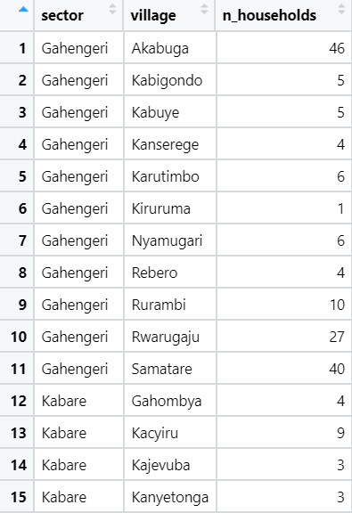
```
]

---

class: inverse, center, middle
name: about-this-session

# Merging

<html><div style='float:left'></div><hr color='#D38C28' size=1px width=1100px></html>

---

# Merging

- Lastly, we're going to see how to link tidy data tables between themselves into a single data table

- This operation is called **merging**

.exercise[
**Merging**: Linking two data tables by one or more common variables into a single data table
]

---

# Merging

```{r echo = FALSE, out.width="65%"}
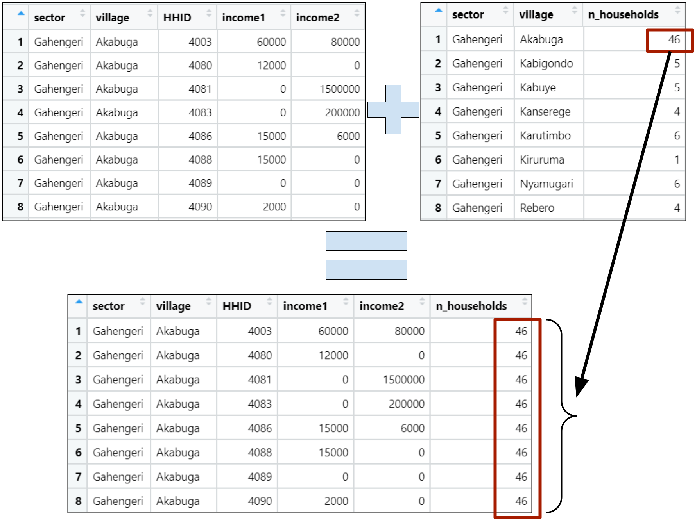
```

---

# Merging

## Exercise 8: Merge two dataframes

1. Inspect `lwh_hh` and `lwh_village` with `View(lwh_hh)` and `View(lwh_village)` and identify the columns they have in common

2. Use these columns with the function `left_join()` to merge the two dataframes, as in the code below:

```{r eval=FALSE}
lwh_hh2 <- lwh_hh %>%
  left_join(lwh_village,
            by = c("sector", "village"))
```

---

# Merging

When two tidy data tables with different units of observations merge (villages and households), the resulting data table will have the most disagregated unit (households)

```{r echo = FALSE, out.width="45%"}
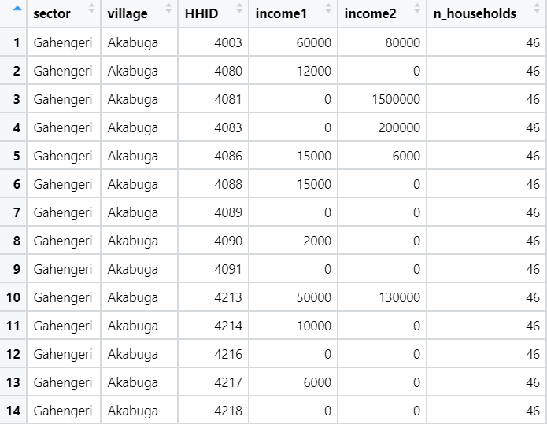
```


---

class: inverse, center, middle
name: about-this-session

# Saving the results

<html><div style='float:left'></div><hr color='#D38C28' size=1px width=1100px></html>

---

# Saving the results

## Exercise 9: Save the tidy data tables

- Use the function `saveRDS()` to save all your tidy dataframes into `.Rds` files in the folder `DataWork/data/intermediate`

```{r eval=FALSE}
# Output folder
output_folder <- here("DataWork", "data", "intermediate")

# Saving
saveRDS(admin_data_tidy,
        here(output_folder, "admin-data.Rds"))
saveRDS(lwh_hh,
        here(output_folder, "LWH-households.Rds"))
saveRDS(lwh_food,
        here(output_folder, "LWH-food-source.Rds"))
saveRDS(lwh_village,
        here(output_folder, "LWH-villages.Rds"))
```

- `.Rds` is the native file extension of R for dataframes, similar to Excel's `.xlsx`

---

class: inverse, center, middle

# Thanks! // ¡Gracias!

<html><div style='float:left'></div><hr color='#D38C28' size=1px width=1100px></html>

---

exclude: true

```{R, include = FALSE, eval = FALSE}
pagedown::chrome_print("Presentations/2-tidy.html", output = "Presentations/2-tidy.pdf")
```