```{r setup, include = FALSE}
# Load packages
library(knitr)
library(xaringanExtra)
library(here)
library(dplyr)
library(janitor)
library(labelled)
here::i_am("Presentations/3-clean.Rmd")
options(htmltools.dir.version = FALSE)
opts_chunk$set(
  fig.align = "center",
  fig.height = 4,
  dpi = 300,
  cache = T
  )
xaringanExtra::use_panelset()
xaringanExtra::use_webcam()
xaringanExtra::use_clipboard()
htmltools::tagList(
  xaringanExtra::use_clipboard(
    success_text = "<i class=\"fa fa-check\" style=\"color: #90BE6D\"></i>",
    error_text = "<i class=\"fa fa-times-circle\" style=\"color: #F94144\"></i>"
  ),
  rmarkdown::html_dependency_font_awesome()
)
xaringanExtra::use_logo(
  image_url = here(
    "Presentations",
    "img",
    "lightbulb.png"
  ),
  exclude_class = c(
    "inverse", 
    "hide_logo"
  ),
  width = "40px"
)
```

```{css, echo = F, eval = T}
@media print {
  .has-continuation {
    display: block !important;
  }
}
```

# Table of contents

1. [About the session](#about-this-session)

1. [Data cleaning](#data-cleaning)

1. [Correcting information from the field](#correcting-from-field)

1. [Getting data ready for analysis and construction](#getting-data-ready)

---

class: inverse, center, middle
name: about-this-session

# About this session

<html><div style='float:left'></div><hr color='#D38C28' size=1px width=1100px></html>

---

# About this session

```{r echo = FALSE, out.width="45%"}
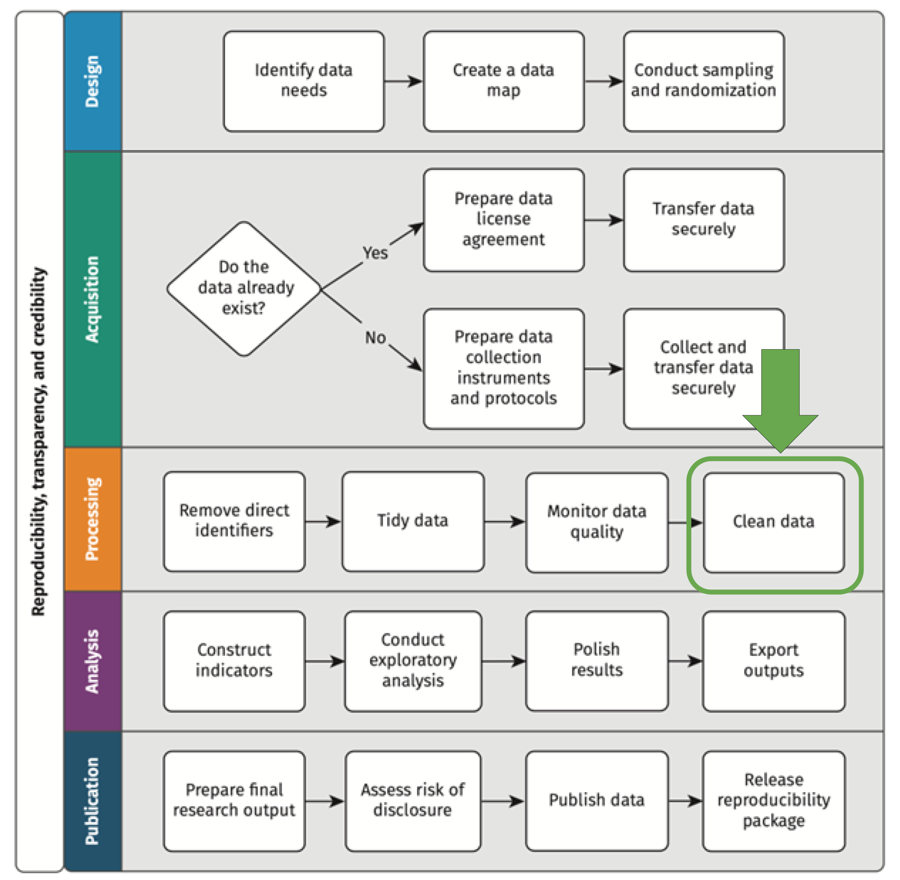
```


---

class: inverse, center, middle
name: data-cleaning

# Data cleaning

<html><div style='float:left'></div><hr color='#D38C28' size=1px width=1100px></html>

---

# Data cleaning

- Data cleaning is the process of fixing or removing incorrect, incomplete or incorrectly formatted data in a dataset

- It has two main purposes:

  1. To correct incorrect data points obtained from field activities
  
  2. To get data ready for indicator construction and data analysis
  
---

# Data cleaning

## In R

R has multiple packages and tools for data cleaning. Today we'll work with three:

1. `dplyr`: a package from the tidyverse for dataframe manipulation (data wrangling)

2. `janitor`: a package for data cleaning operations, arguably best known for its function `clean_names()`

3. `labelled`: a package to handle and generate dataframe metadata

```{r echo = FALSE, out.width="60%"}

```

---

# Data cleaning

## Exercise 1: Install and load packages for data cleaning

1. Install the necessary data cleaning packages for this session:

  + `install.packages("janitor")`
  + `install.packages("labelled")`

2. Load all the packages we'll use:

  + `library(here)`
  + `library(dplyr)`
  + `library(janitor)`
  + `library(labelled)`

---

# Data cleaning

## The first thing: clean variable names

- Uncommon characters in variable names (blankspaces; accents; `&`; `ñ`; `,`; and others) can make it unnecessary difficult to operate with variables

- Conveniently, the library `janitor` makes available the function `clean_names()` to solve this problem

- `clean_names()` takes a dataframe as argument and returns another dataframe with the names completely clean, without any problematic character

- When working with data in R, it's a good practice to use the function `clean_names()` right after loading data to ensure the names are always clean

---

# Data cleaning

## Exercise 2: Read the dataset and clean column names

- We'll load three tidy dataframes for the rest of the exercises:

  1. Data at the household level about household income
  
  2. Data at the food source level about food consumption
  
  3. Administrative data about villages at the village level
  
- Use the following code to load the data

```{r, eval=FALSE}
df_village <- readRDS(here("DataWork", "data", "intermediate", "tidy", "tidy-village.Rds")) %>% 
  clean_names()
df_hh      <- readRDS(here("DataWork", "data", "intermediate", "tidy", "tidy-HH.Rds")) %>% 
  clean_names()
df_food    <- readRDS(here("DataWork", "data", "intermediate", "tidy", "tidy-food-consumption.Rds")) %>% 
  clean_names()
```

```{r, echo=FALSE}
path       <- here("Data", "DataWork", "data", "intermediate", "tidy")
df_village <- readRDS(here(path, "tidy-village.Rds")) %>% clean_names()
df_hh      <- readRDS(here(path, "tidy-HH.Rds")) %>% clean_names()
df_food    <- readRDS(here(path, "tidy-food-consumption.Rds")) %>% clean_names()
```

---

# Data cleaning

## The first thing: clean variable names

- `clean_names()` also transforms all variable names to lowercase

- Remember to use the function `View()` to inspect the resulting dataframes

- You can also use `colnames()` to return a vector with the column names of a dataframe

```{r}
colnames(df_village)
```

---

class: inverse, center, middle
name: #correcting-from-field

# Correcting information from the field

<html><div style='float:left'></div><hr color='#D38C28' size=1px width=1100px></html>

---

# Correcting information from the field

## Dropping incorrect observations

Imagine that your government counterpart, from whom you received the administrative data of `df_village`, approaches you with the following message:

*We received word from our data and statistics department that data for two villages in the file we shared with you actually correspond to an area whose administrative boundaries changed between the last two national censuses and they're not part of the area of your study. We recommend that you drop them from your analysis.*

*These are the villages Rukore in district Kayonza and Karuyenzi in district Rwamagana.*

---

# Correcting information from the field

## Dropping incorrect observations

*(...) These are the villages Rukore in district Kayonza and Karuyenzi in district Rwamagana.*

- When doing data cleaning, you would have to remove these two observations from the data

**<font size="6">Do not remove observations or overwrite the original data</font>**

- The data you receive from a counterpart or collect from the field should always be preserved as is
  
- Changes such as this one should be applied when cleaning data and saved into a new data file
  
---

# Correcting information from the field

## Dropping incorrect observations

- The process of keeping or deleting some rows from a dataframe is called **filtering**

- We can use the function `filter()` from `dplyr` for this

  + The first argument of `filter()`, usually provided by pipes (`%>%`), is the input dataframe
  
  + The second argument is the condition to filter on
  
  + `filter()` will return a dataframe with all the rows that meet the condition provided

- However, we should also make sure that the function will work as expected before applying it

- In this case that means making sure that the filtering condition will indeed remove only two villages

---

# Correcting information from the field

## Exercise 3: Filter observations

*(...) These are the villages Rukore in district Kayonza and Karuyenzi in district Rwamagana.*

- Use this code to filter the dataframe and exclude these rows

```{r}
df_village_subset <- df_village %>%
  filter(
    !(district == "KAYONZA" & village == "Rukore") &
    !(district == "RWAMAGANA" & village == "Karuyenzi")
  )
```

- Note that we're using a negation operator (`!`) and an "and" (`&`) operator

---

# Correcting information from the field

```{r echo = FALSE, out.width="60%"}
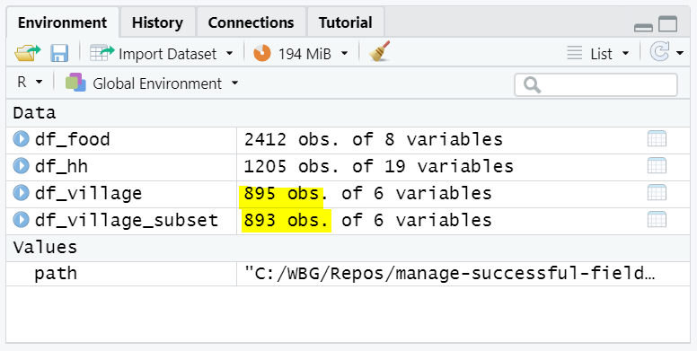
```

---

# Correcting information from the field

## Replacing data points

- `filtering()` is useful when you have to delete entire observations you received from field work

- More frequently, however, you'll have to correct single data points instead of deleting an observation

- Imagine, for example, that you receive a message from the team in the field saying this:

*Our team in charge of data verification re-surveyed one household and discovered that food consumption information had been registered incorrectly. The household has ID 3233 and the correct value is 3 for how many days flour was consumed in the last week, instead of the 43 that was registered*

---

# Correcting information from the field

## Replacing data points

*(...) The household has ID 3233 and the correct value is 3 for how many days flour was consumed in the last week, instead of the 43 that was registered*

- We'll use the functions `mutate()` and `case_when()` for this, both from `dplyr`

- Also, remember that here again this correction should not be done directly in the original data file generated from the field work

- Instead, it should be fixed using code and the result be saved in a new file

---

# Correcting information from the field

## Exercise 4: Replacing data points

*(...) The household has ID 3233 and the correct value is 3 for how many days flour was consumed in the last week, instead of the 43 that was registered*

- Use the following code to replace the data point correctly:

```{r}
df_food_corrected <- df_food %>%
  mutate(
    exp25 = case_when(
      id_05 == 3233 & food == "Flour" ~ 3,
      TRUE ~ exp25
    )
  )

```

---

# Correcting information from the field

```{r eval=FALSE}
df_food_corrected <- df_food %>%
  mutate(
    exp25 = case_when(
      id_05 == 3233 & food == "Flour" ~ 3,
      TRUE ~ exp25
    )
  )
```

Notice the following in this code:

- `mutate()` is a function from dplyr that changes (mutates) dataframe columns

  + it's used to add new columns or replace values in columns
  
  + the result of mutate is another dataframe

---

# Correcting information from the field

```{r eval=FALSE}
df_food_corrected <- df_food %>%
  mutate(
    exp25 = case_when(
      id_05 == 3233 & food == "Flour" ~ 3,
      TRUE ~ exp25
    )
  )
```

Notice the following in this code:

- `case_when()` is an auxiliary function that is normally used inside `mutate()` to replace column values based on conditions

  + each argument of `case_when()` is a condition followed by a tilde (`~`) that represents the value for cases when the condition is true
  
  + the conditions have an order hierarchy, meaning that subsequent conditions are only applied for cases where all previous conditions were false

---

# Correcting information from the field

The resulting dataframe has the correct data point but also deleted the column label! we'll see how to fix this in another exercise later

```{r echo = FALSE, out.width="99%"}
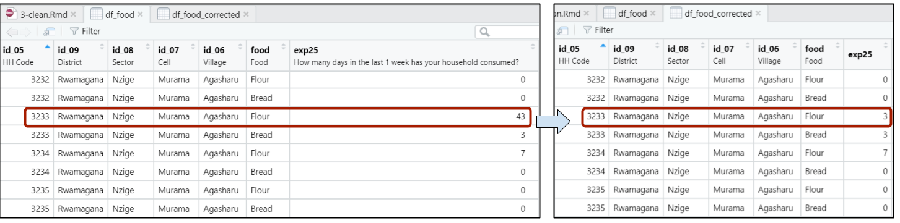
```

---

class: inverse, center, middle
name: getting-data-ready

# Getting data ready for analysis and construction

<html><div style='float:left'></div><hr color='#D38C28' size=1px width=1100px></html>

---

# Getting data ready for analysis and construction

Other than fixing information collected or received, data cleaning also gets data ready for indicator construction and analysis. This part of the cleaning includes:

- Drop columns with unnecessary information

- Add or correct variables labels

- Add columns that don't require indicator construction

- Change column data types so that they can be handled more easily

---

# Getting data ready for analysis and construction

## Dropping columns

Not all the information in your data will be meaningful for development research. Some examples include:

- Field work metadata (enumerator ID, tablet ID)

- Columns with information to be displayed in electronic data collection, for example to corroborate a participant's name

---

# Getting data ready for analysis and construction

## Dropping columns

- We can use the function `select()` from `dplyr` for this

- `select()` is usually used by specifying the column names you want to keep from an input dataframe

- It can also be used in the opposite way (negative selection) to define which columns you want to remove by enclosing column names in a "negative vector" with `-c()`

---

# Getting data ready for analysis and construction

## Exercise 5: Drop columns in a dataframe

1. Inspect the household dataframe with `View(df_hh)` and notice if any column contains information unlikely to be needed for data analysis

  + Look variables for field work metadata or field work confirmations

2. Drop these unnecessary columns with the following code:

```{r}
df_hh_less_cols <- df_hh %>%
  select(
    -c(                
      device_id,
      sim_number,
      id_10_confirm,
      id_10_corrected
    )
  )
```

---

# Getting data ready for analysis and construction

```{r eval=FALSE}
# Another option using a function for easier selection
df_hh_less_cols <- df_hh %>%
  select(
    -c(
      device_id,
      sim_number,
      starts_with("id_10_")
    )
# note that the starts_with() here selects id_10_confirm and id_10_corrected
```

```{r echo = FALSE, out.width="50%"}
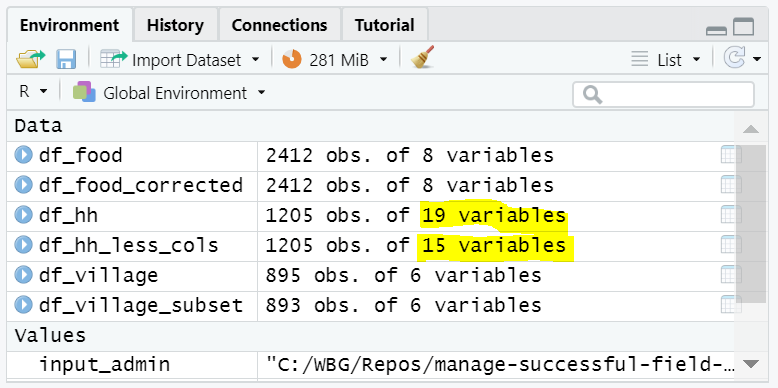
```

---

# Getting data ready for analysis and construction

## Creating new columns

- Data cleaning also involves generating new columns that don't involve indicator construction

- For example:

  + Adding a year column
  
  + Adding a data collection stage column
  
- We also use `mutate()` for these cases:

```{r eval=FALSE}
# General example:
new_df <- old_df %>%
  mutate(
    new_col1 = value1,
    new_col2 = value2,
    ...
  )
```

---

# Getting data ready for analysis and construction

## Exercise 6: Create new columns

- Use `mutate()` to generate two new columns in `df_hh_less_cols`

  + One column for `year`, equal to 2017
  
  + One column for `collection_stage`, equal to "baseline"

- Name your result `df_hh_new_cols`

- Recall the general use of `mutate()` to know how to implement this function:

```{r eval=FALSE}
# General example:
new_df <- old_df %>%
  mutate(
    new_col1 = value1,
    new_col2 = value2,
    ...
  )
```

---

# Getting data ready for analysis and construction

```{r}
df_hh_new_cols <- df_hh_less_cols %>%
  mutate(
    year = 2017,
    collection_stage = "baseline"
  )
```

```{r echo = FALSE, out.width="50%"}
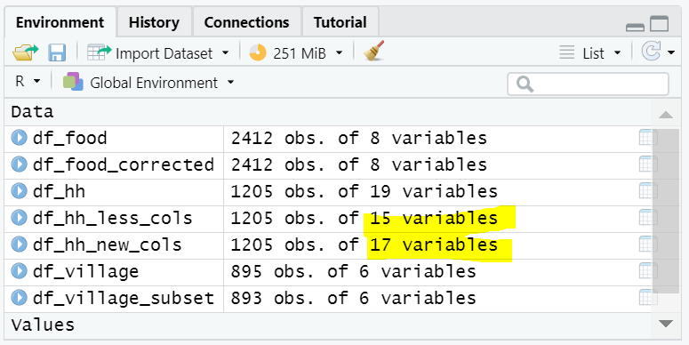
```

---

# Getting data ready for analysis and construction

## Variable labels

- Variable labels provide additional information that describes the attribute contained in the variable

- They allow to have more context about a variable other than what normally fits in the variable name

- In data collected from the field through questionnaires, it's a good practice to leave variable names equal to a question code or number in the original questionnaire

- Labels give more information about the variable, for example by using the actual question that was asked for collecting the data

---

# Getting data ready for analysis and construction

## Variable labels

```{r echo = FALSE, out.width="80%"}
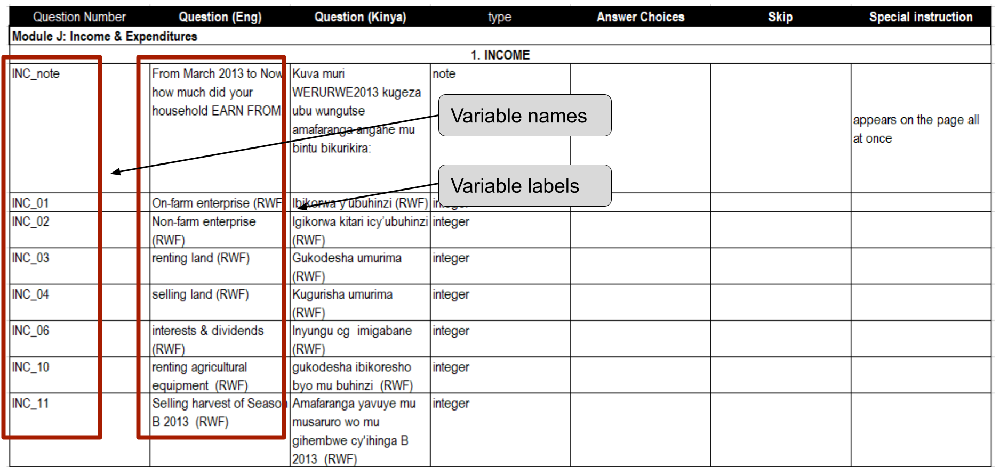
```

---

# Getting data ready for analysis and construction

## Variable labels

- Using R through RStudio allows us to visualize variable labels when inspecting dataframes with `View()`

- Try `View(df_hh_new_cols)` to visualize the labels of that dataframe

```{r echo = FALSE, out.width="65%"}
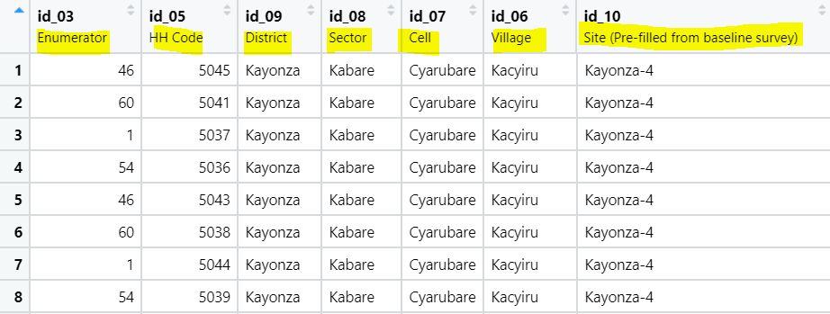
```

---

# Getting data ready for analysis and construction

## Variable labels

- R offer several options to create and work with variable labels, one of the simplest is through the package `labelled`

- The package contains the function `set_variable_labels()` to create or modify variable labels

  + The first argument (usually given through pipes) is the input dataframe
  
  + All the following arguments set the labels for each value, as in the example below
  
  + The result is a new dataframe with the variable labels
  
```{r eval=FALSE}
new_df <- old_df %>%
  set_variable_labels(
    var1 = "label for var 1",
    var2 = "label for var 2",
    ...
  )
```

---

# Getting data ready for analysis and construction

## Exercise 7: Assign variable labels

1. Use `View()` to inspect `df_village_subset`, `df_food_corrected`, `df_hh_new_cols` and take note of which variables are missing labels

1. If needed, check the questionnaire file in `DataWork/documentation` to know which missing labels to assign. For variables not included in the questionnaire (for example in `df_village_subset`), decide by yourself which labels to assign

1. Assign all missing labels to these three dataframes and store the result in three new objects: `df_village_labelled`, `df_food_labelled`, `df_hh_labelled`

```{r eval=FALSE}
# Remember the general use of set_variable_labels()
new_df <- old_df %>%
  set_variable_labels(
    var1 = "label for var 1",
    var2 = "label for var 2",
    ...
  )
```

---

# Getting data ready for analysis and construction

```{r, echo = FALSE}
# Village dataframe
df_village_labelled <- df_village_subset %>%
  set_variable_labels(
    province = "Province",
    district = "District",
    sector   = "Sector",
    cell     = "Cell",
    village  = "Village",
    hh_count = "Number of households"
  )
```

.pull-left4[
```{r, eval = FALSE}
# Village dataframe
df_village_labelled  <- df_village_subset %>%
  set_variable_labels(
    province = "Province",
    district = "District",
    sector   = "Sector",
    cell     = "Cell",
    village  = "Village",
    hh_count = "Number of households"
  )

View(df_village_labelled)
```
]
.pull-right4[
```{r echo = FALSE, out.width="99%"}
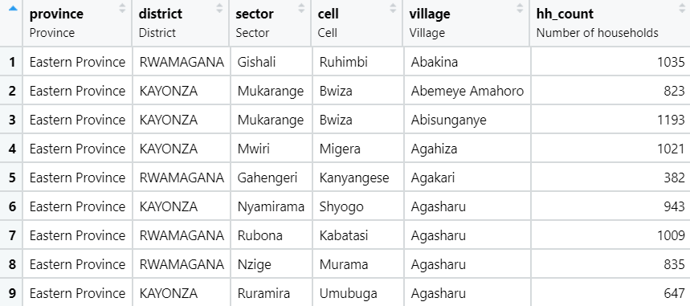
```
]
---

# Getting data ready for analysis and construction

```{r}
# Village dataframe
df_food_labelled <- df_food_corrected %>%
  set_variable_labels(
    exp25 = "How many days in the last 1 week has your household consumed?"
  )

# Household dataframe
df_hh_labelled <- df_hh_new_cols %>%
  set_variable_labels(
    year = "Year",
    collection_stage = "Stage of data collection"
  )
```

---

# Getting data ready for analysis and construction

## Variable types

- Columns in dataframes can have different types, each representing different kinds of attributes

- For example:

  + **Numeric columns** represent quantitative attributes such as age, income, or number of families. They have two sub-types: *integer* for columns with integer values and *double* for columns with decimal values
  
  + **Character columns** usually represent open-ended responses, such as questions to clarify "other" categories in questionnaires
  
  + **Factor columns** represent categorical attributes where each possible answer is associated to pre-defined category, for example crops, provinces, or income source
  
---

# Getting data ready for analysis and construction

## Variable types

- Using the correct column types for each attribute is a condition for data analysis

- For example, if the data points of a column are only integers but the type is character, R will not be able to perform mathematical operations such as estimating the mean or standard deviation of the column

---

# Getting data ready for analysis and construction

## Variable types

- R has several options to check a column's type

- One of the easiest is the function `class()`

```{r}
class(df_village_labelled$hh_count)
```

---

# Getting data ready for analysis and construction

## Variable types

- You can change column types with three basic functions

  + `as.numeric()` to convert a column to a numeric (double) type
  
  + `as.character()` to convert to character
  
  + `factor()` to convert to factor

- The input of these functions are columns and the outputs are also columns

- They can be used inside the function `mutate()` to change columns in a dataframe

---

# Getting data ready for analysis and construction

## Variable types

```{r eval=FALSE}
# General use of mutate with column type functions
new_df <- old_df %>%
  mutate(
    col1 = as.numeric(col1),    # double type
    col2 = as.character(col2),  # character type
    col3 = factor(col3),        # factor type
    ...
  )
```

---

# Getting data ready for analysis and construction

## Variable types: factors

.pull-left2[
- Factors sometimes require more arguments to convert column types

- Check for example `df_food_labeled` with `View(food_labelled)`
]
.pull-right2[
```{r echo = FALSE, out.width="99%"}
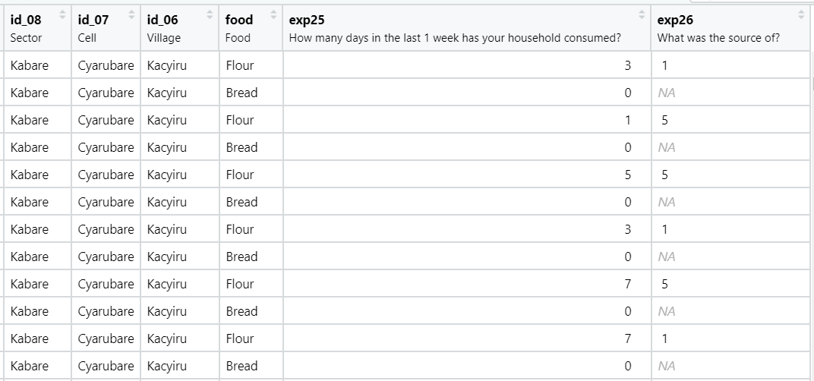
```
]

---

# Getting data ready for analysis and construction

## Variable types: factors

.pull-left2[
- Columns `food` and `exp26` represent categorical atrributes

- `food` is a character type and can be converted to a factor right away with `as.factor()`

- Column `exp25`, however, shows numeric values but it doesn't show information on the categories each number represents
]
.pull-right2[
```{r echo = FALSE, out.width="99%"}

```
]

---

# Getting data ready for analysis and construction

## Variable types: factors

.pull-left2[
- This information is in the questionnaire file in `DataWork/documentation`

- We can use it to assign the correct factor values to each number

- **Note:** factor values are also called *value labels* in other statistical software
]
.pull-right2[
```{r echo = FALSE, out.width="99%"}
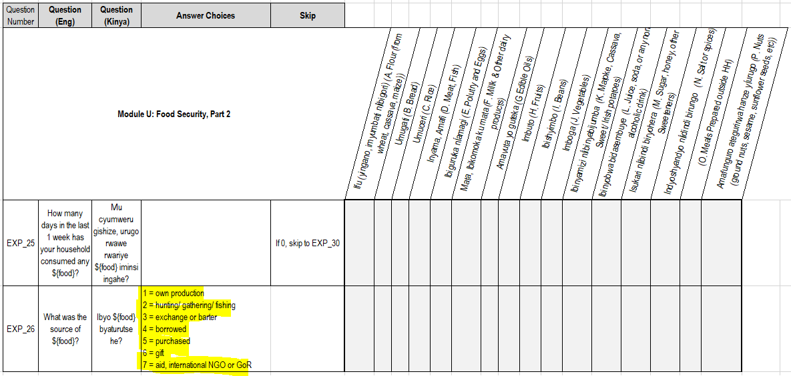
```
]

---

# Getting data ready for analysis and construction

## Variable types: factors

.pull-left2[
- In this case `factor()` takes a few more arguments

```{r eval=FALSE}
factor(
  column,
  levels = vector_of_values,
  labels = vector_of_labels
)
```

- `levels =` takes a vector with the current numeric values

- `labels =` takes a vector of characters with the labels to map for values
]
.pull-right2[
```{r echo = FALSE, out.width="99%"}

```
]

---

# Getting data ready for analysis and construction

## Exercise 8: Use factors for categorical data

- Convert `food` and `exp26` to factors with the following code:

.smaller-r-code[
```{r}
values_exp26 <- c(1, 2, 3, 4, 5, 6, 7)
labels_exp26 <- c(
  "own production",
  "hunting/gathering/fishing",
  "exchange or barter",
  "borrowed",
  "purchased",
  "gift",
  "aid, international NGO, or GoR"
)

df_food_factors <- df_food_labelled %>%
  mutate(
    food = factor(food),
    exp26 = factor(
      exp26,
      levels = values_exp26,
      labels = labels_exp26
    )
  )
```
]

---

# Getting data ready for analysis and construction

Note that `exp26` lost its label. You can assign it again later  with `set_variable_labels()`

```{r echo = FALSE, out.width="85%"}
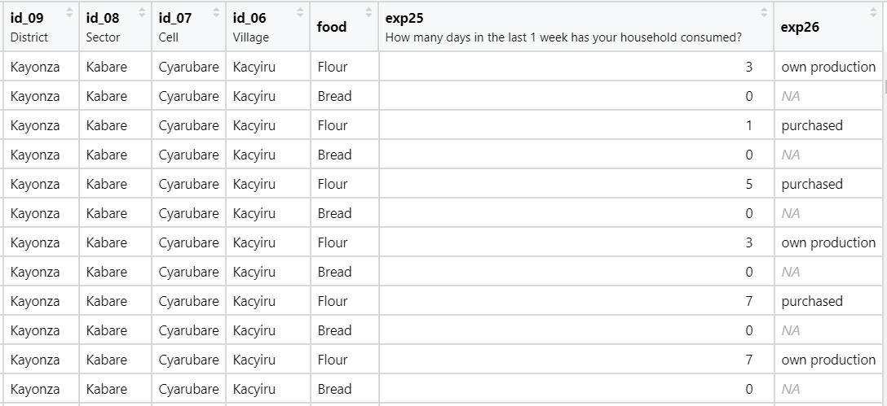
```

---

class: inverse, center, middle
name: about-this-session

# Saving the results

<html><div style='float:left'></div><hr color='#D38C28' size=1px width=1100px></html>

---

# Saving the results

## A note on storing objects

- Throughout the session, we saved each new result in an additional dataframe

- That's a good practice for beginners because it allows you to keep record of what you do, but it might eventually overflow your computer memory

- In real projects, consider overwriting dataframes with `<-`

```{r eval=FALSE}
# Example for mutate. Note that the input
# and the stored dataframes are the same
old_df <- old_df %>%
  mutate(
    col1 = ...,
    col2 = ...,
    col3 = ...
  )
```

---

# Saving the results

- You now have three resulting clean dataframes:

  + Village level: `df_village_labelled`
  + Food source level: `df_food_factors`
  + Household level: `df_hh_labelled`

---

# Saving the results

## Exercise 9: Save your work

1. Save your script in `DataWork/code` by clicking in the floppy disk icon of the script panel
1. Save your clean dataframes with `saveRDS()` in `DataWork/data/intermediate/clean`

```{r eval=FALSE}
# Output folder
output_folder <- here("DataWork", "data", "intermediate", "clean")

# Saving
saveRDS(
  df_village_labelled,
  here(output_folder, "LWH-villages-clean-YOUR_INITIALS.Rds")
)
saveRDS(
  df_food_factors,
  here(output_folder, "LWH-food-clean-YOUR_INITIALS.Rds")
)
saveRDS(
  df_hh_labelled,
  here(output_folder, "LWH-households-clean-YOUR_INITIALS.Rds")
)
```

---

class: inverse, center, middle

# Thanks! // ¡Gracias! //  감사합니다

<html><div style='float:left'></div><hr color='#D38C28' size=1px width=1100px></html>

---

exclude: true

```{R, include = FALSE, eval = FALSE}
pagedown::chrome_print("Presentations/3-clean.html", output = "Presentations/3-clean.pdf")
```