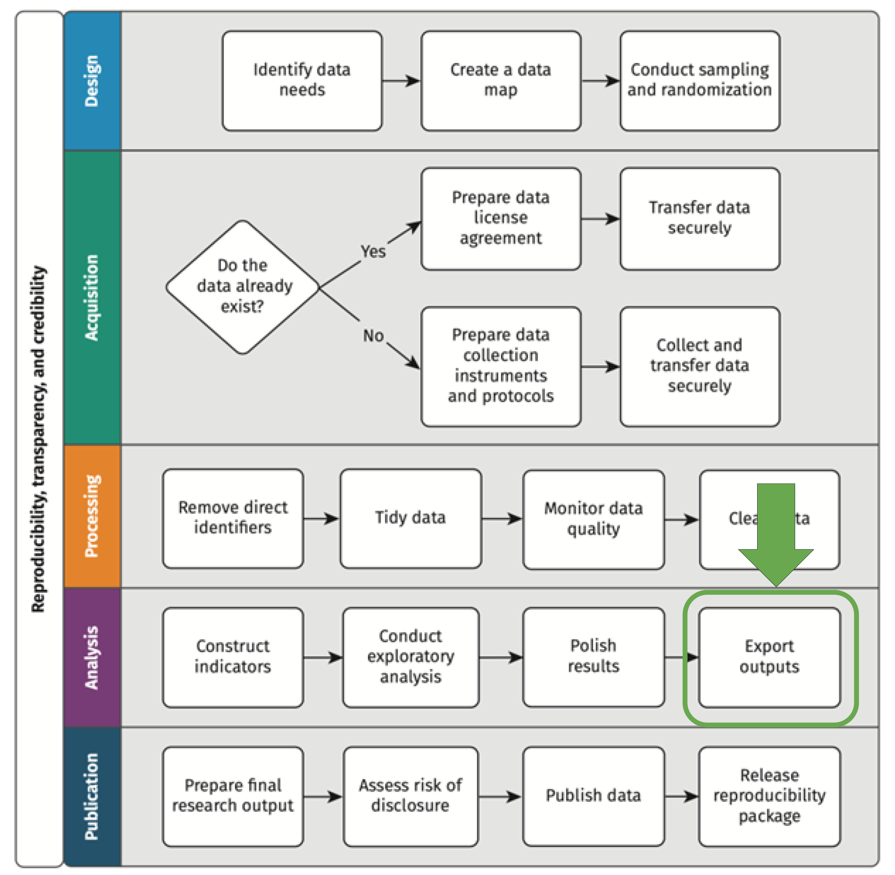
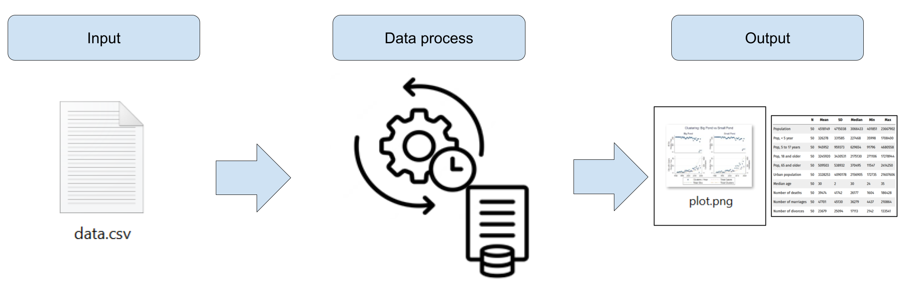
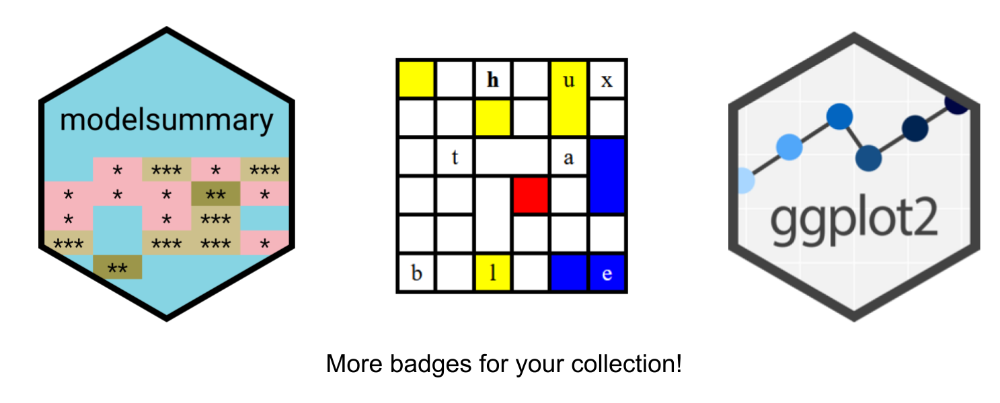
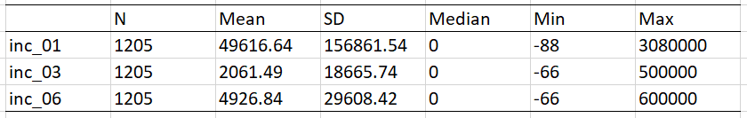

```{r setup, include = FALSE}
# Load packages
library(knitr)
library(xaringanExtra)
library(here)
library(dplyr)
library(janitor)
library(modelsummary)
library(huxtable)
library(ggplot2)
library(fontawesome)
library(hrbrthemes)
library(flair)
here::i_am("Presentations/4-outputs.Rmd")
options(htmltools.dir.version = FALSE)
opts_chunk$set(
  fig.align = "center",
  fig.height = 4,
  dpi = 300,
  cache = T
  )
xaringanExtra::use_panelset()
xaringanExtra::use_webcam()
xaringanExtra::use_clipboard()
xaringanExtra::use_editable(expires = 1)
htmltools::tagList(
  xaringanExtra::use_clipboard(
    success_text = "<i class=\"fa fa-check\" style=\"color: #90BE6D\"></i>",
    error_text = "<i class=\"fa fa-times-circle\" style=\"color: #F94144\"></i>"
  ),
  rmarkdown::html_dependency_font_awesome()
)
xaringanExtra::use_logo(
  image_url = here("Presentations",
                   "img",
                   "lightbulb.png"),
  exclude_class = c("inverse", 
                    "hide_logo"),
  width = "40px"
)
```

```{css, echo = F, eval = T}
@media print {
  .has-continuation {
    display: block !important;
  }
}
```

# Table of contents

1. [About the session](#about-this-session)

---

class: inverse, center, middle
name: about-this-session

# About this session

<html><div style='float:left'></div><hr color='#D38C28' size=1px width=1100px></html>

---

# About this session

```{r echo = FALSE, out.width="45%"}

```

---

class: inverse, center, middle
name: about-this-session

# Creating outputs

<html><div style='float:left'></div><hr color='#D38C28' size=1px width=1100px></html>

---

# Creating outputs

- Until now, we've seen how to produce dataframes or data table file outputs (`.Rds` and `.csv` files)

- Today we'll see how to produce file outputs with more finalized results, namely descriptive statistics table and data visualizations

- The objective of this is that the concept of reproducibility can also be also be applied not only in your data work but in your reports as well <font size="3">(though that's something we're not covering in this course)</font>

```{r echo = FALSE, out.width="90%"}

```

---

# Creating outputs

## .red[Not reproducible]

Anything that requires
`r fa("paste", fill = "#ac142a")` Copy-pasting
`r fa("paintbrush", fill = "#ac142a")` Manual formatting after exported

--

## .green[Reproducible]

`r fa("r-project", fill = "#046307")` R Markdown: dynamic document containing code and text that is exported directly from R into PDF, HTML, Word, Power Point and other formats 
`r fa("file-lines", fill= "#046307")` LaTeX: typesetting system used for scientific publications that automatically reloads tables and figures every time the document is rendered 

---

# Creating outputs

## In R

- As usual, there are several options for producing descriptive tables and data visualization in R. Today we'll use:

- **modelsummary:** a package for creating descriptive statistics and regression tables

- **huxtable:** a package for creating HTML, Latex, and Excel tables from R

- **ggplot2:** the absolute benchmarkfor data visualization in R, based on a grammar of graphics syntax

```{r echo = FALSE, out.width="60%"}

```

---

# Creating outputs

## Exercise 1: Install and load packages for generating outputs

- Install `modelsummary` and `huxtable` with:

```{r eval=FALSE}
install.packages("modelsummary")
install.packages("huxtable")
```

- Load all the libraries we'll use with:

```{r eval=FALSE}
library(here)
library(dplyr)
library(janitor)
library(modelsummary)
library(huxtable)
library(ggplot2)
```

---

# Creating outputs

## Exercise 2: Read the data

- Use `here()` and `readRDS()` to read the file in `DataWork/data/intermediate/clean/LWH-households-clean.Rds`

```{r eval=FALSE}
path  <- here("Data", "DataWork", "data", "intermediate", "clean")
df_hh <- readRDS(here(path, "LWH-households-clean.Rds"))
```

- Inspect the dataframe with `View()`

```{r echo=FALSE}
path  <- here("Data", "DataWork", "data", "intermediate", "clean")
df_hh <- readRDS(here(path, "LWH-households-clean.Rds"))
```

---

class: inverse, center, middle
name: about-this-session

# Data exploration

<html><div style='float:left'></div><hr color='#D38C28' size=1px width=1100px></html>

---

# Data exploration

## Knowing your data better

- Before starting to produce outputs, it's useful to explore your data so you will know what to export

- You already know `View()`, `nrow()`, and `colnames()`. Some other functions are:

  + `glimpse()`: prints a dataframe in the console (from `dplyr`)
  
  + `head()`: prints the first six observations of a dataframe
  
  + `tail()`: prints the last six observations of a datafrma
  
  + `dim()`: returns a size-two vector with the number of rows and columns in a dataframe

---

# Data exploration

## Exercise 3: Exploration with dataframe and column summaries

1. Print the summary of `df_hh`

2. Print the summary of the column `inc_01` of `df_hh` (use the `$` operator)

---

# Data exploration

```{r}
# Summary of a dataframe
summary(df_hh)
```

---

# Data exploration

```{r}
# Summary of a dataframe column
summary(df_hh$inc_01)
```

---

# Data exploration

## Tabulations

- `summary()` is useful to explore quantitative variables

- However, it's not great for character or factor variables

- We'll use `tabyl()` in these cases, from the package `janitor`

- `tabyl()` generates frequency tables from dataframe columns

---

# Data exploration

## Exercise 4: Exploration with tabulations

- Tabulate the variable `id_09` (district) of `df_hh` with:

```{r eval=FALSE}
df_hh %>% tabyl(id_09)
```

- Tabulate the variables `id_08` (sector) and `id_09` (district) with:
```{r eval=FALSE}
df_hh %>% tabyl(id_08, id_09)
```

---

# Data exploration

```{r eval=FALSE}
# Tabulating district
df_hh %>% tabyl(id_09)
```

```{r warning=FALSE, message=FALSE, echo=FALSE}
# Tabulating district
df_hh %>% tabyl(id_09) %>% knitr::kable()
```

---

# Data exploration

```{r}
# Cross-tabulating sector and district
df_hh %>% tabyl(id_08, id_09) %>% knitr::kable()
```

---

class: inverse, center, middle
name: about-this-session

# Descriptive tables

<html><div style='float:left'></div><hr color='#D38C28' size=1px width=1100px></html>

---

# Descriptive tables

## What if you want to...

- ...export the summary statistics to another software?

- ...customize which statistics to display?

--

## Well, then you will need a few more packages

- There are many packages that can be used both for displaying and exporting summary statistics

- Today we will show you a combination of two packages: `modelsummary` and `huxtable`

- We chose this combination because together, they can perform all the tasks we are interested in

- In fact, `modelsummary` can perform most of them by itself -- with the exception of exporting formatted tables to Excel

---

# Descriptive tables

`modelsummary` contains a family of functions called *datasummary* which can be used to create different types of summary statistics tables. These include:

- `datasummary_skim()`, to create descriptive statistics tables

- `datasummary_balance()`, to create balance tables

- `datasummary_correlation()`, to create a correlation table

- `datasummary_crosstab()`, to create a twoway tabulation

- `datasummary()`, to create customized descriptive statistics tables

---

# Descriptive tables

- `datasummary_skim()` produces a quick summary table of numerical or categorical variables

```{r, eval = F}
datasummary_skim(
  data,
  type = "numeric",
  output = "default",
  ...
)
```

- It uses the following arguments:

  + `data`: the data set to be summarized, the only required argument
  + `type =`: type of variables in the dataframe to be described
  + `output =`: the type of output desired
  + `...`: additional options allow for formatting customization, such as including notes and titles

- Its most basic use is `datasummary_skim(df_name)` to describe numeric variables

---

# Descriptive tables

## Exercise 5: Producing a basic descriptive table

- Use `datasummary_skim()` to create a descriptive statistics table for `df_hh`

---

# Descriptive tables

```{r eval=FALSE}
df_hh %>% datasummary_skim()
```

```{r echo=FALSE}
df_hh %>% datasummary_skim()
```

---

# Descriptive tables

- `datasummary_skim()` summarizes only numeric variables by default

- To summarize categorical variables, use the argument `type`

```{r warning=FALSE}
# Selecting only one variables so table fits
df_hh %>% select(id_09) %>% datasummary_skim(type = "categorical")
```

---

# Descriptive tables

- Other than `datasummary_skim()`, we can use `datasummary()` to customize the variables and statistics to include using a formula

```{r eval = F}
datasummary(
  var1 + var2 + var3 ~ stat1 + stat2 + stat3 + stat4,
  data = data
)
```

- The arguments of `datasummary()` are:

  + `formula`: a two-sided formula to describe the table: rows ~ columns
  
  + `data=`: the data set to be summarized
  
  + *...:* additional options allow for formatting customization

---

# Descriptive tables

## Exercise 6: Producing a table with more information

- Create a table showing the number of observations, mean, standard deviation, minimum, maximum, and median value for the variables `inc_01`-`inc_04` in `df_hh` with the code below

```{r eval=FALSE}
datasummary(
  inc_01 + inc_03 + inc_06 ~ N + Mean + SD + Median + Min + Max,
  data = df_hh
)
```

---

# Descriptive tables

```{r warning=FALSE}
datasummary(
  inc_01 + inc_03 + inc_06 ~ N + Mean + SD + Median + Min + Max,
  data = df_hh
)
```

---

# Descriptive tables

- The package `modelsummary` doesn't offer an option to export tables to Excel

- To do that, we will first store the result of `datasummary()` into an object of type "huxtable"

- This will allow us to use the function `quick_xlsx()` from the package `huxtable` to export the table

---

# Descriptive tables

## Exercise 7: Exporting descriptive tables to Excel

1. Save the last table you created to and object called `descriptives_income` and add the argument `output = "huxtable"`

2. Export this object to Excel with `quick_xlsx()`

```{r eval=FALSE}
# Storing summary table into a huxtable object
descriptives_income <-
  datasummary(
    inc_01 + inc_03 + inc_06 ~ N + Mean + SD + Median + Min + Max,
    data = df_hh,
    output = "huxtable"
  )

# Exporting
quick_xlsx(
  descriptives_income,
  file = here("DataWork", "outputs", "tables", "descriptives_income.xlsx")
)
```

```{r echo=FALSE}
# Storing summary table into a huxtable object
desc_income <-
  datasummary(
    inc_01 + inc_03 + inc_06 ~ N + Mean + SD + Median + Min + Max,
    data = df_hh,
    output = "huxtable"
  )

# Exporting
quick_xlsx(
  desc_income,
  file = here("Data", "DataWork", "outputs", "tables", "descriptives_income.xlsx")
)
```

---

# Descriptive tables

The result in Excel will look like this:

```{r echo = FALSE, out.width="95%"}

```

---

class: inverse, center, middle
name: about-this-session

# Data visualization

<html><div style='float:left'></div><hr color='#D38C28' size=1px width=1100px></html>

---

# Data visualization

## The beauty of `ggplot2`

1. Consistency with the [**Grammar of Graphics**](https://www.springer.com/gp/book/9780387245447)

  * This book is the foundation of several other data visualization applications: `ggplot2`, `polaris-tableau`, `vega-lite`

2. Flexibility

3. Layering and theme customization

4. Community

It is a powerful and easy to use tool (once you understand its logic) that produces complex and multifaceted plots.

---

# Data visualization

## Basic structure

The basic ggplot structure is:

```{r ggplot-template, eval=FALSE}
ggplot(data = DATA) +
  GEOM_FUNCTION(mapping = aes(AESTHETIC MAPPINGS))
```

Mapping data to aesthetics

.box-7.medium[Mapping data to aesthetics: think about colors, sizes, x and y references]

--

We'll see how we connect our data to the components of a ggplot

---

# Data visualization

.pull-left[
```
ggplot(data = <DATA>) +
  <GEOM_FUNCTION>(
     mapping = aes(<MAPPINGS>),
     stat = <STAT>,
     position = <POSITION>
  ) +z
  <COORDINATE_FUNCTION> +
  <FACET_FUNCTION> +
  <SCALE_FUNTION> +
  <THEME_FUNCTION>
```
]

.pull-right[

1. `Data`: The data that you want to visualize
2. `Layers`: geom\_ and stat\_ → The geometric shapes and statistical summaries representing the data
3. `Aesthetics`: aes() → Aesthetic mappings of the geometric and statistical objects
4. `Scales`: scale_ → Maps between the data and the aesthetic dimensions
5. `Coordinate system`: coord_ → Maps data into the plane of the data rectangle
6. `Facets`: facet_ → The arrangement of the data into a grid of plots
7. `Visual themes`: theme() and theme_ → The overall visual defaults of a plot
]

---

# Data visualization

## Exercise 9: Produce a basic scatterplot

Create a scatterplot with the x-axis set to `inc_01` and the y-axis equal to `inc_02`.

```{r eval=FALSE}
ggplot(
  data = df_hh,
  aes(
    x = inc_01,
    y = inc_02
  )
) +
  geom_point()
```

---

# Data visualization


.pull-left[
```{r eval = FALSE}
# With pipes:
df_hh %>%
  ggplot(
    aes(
      x = inc_01,
      y = inc_02)
  ) +
  geom_point()
```
]


.pull-rigth[
```{r out.width = "50%", echo = FALSE}
# With pipes:
df_hh %>% #<<
  ggplot(
    aes(
      x = inc_01,
      y = inc_02)
  ) +
  geom_point()
```
]

---

# Data visualization

The most common `geoms` are:

* `geom_bar()`, `geom_col()`: bar charts.

* `geom_boxplot()`: box and whiskers plots.

* `geom_density()`: density estimates.

* `geom_jitter()`: jittered points.

* `geom_line()`: line plots.

* `geom_point()`: scatter plots.

If you want to know more about layers, you can refer to [this source](https://ggplot2.tidyverse.org/reference/).

---

# Data visualization

In summary, our basic plots should have the following:

.pull-left[

```{r eval = FALSE}
whr_panel %>% #<<
  ggplot(
    aes(
      x = happiness_score,
      y = economy_gdp_per_capita
    )
  ) +
  geom_point()
```

]

.pull-right[

The data we want to plot.
]

---

# Data visualization

In summary, our basic plots should have the following:

.pull-left[

```{r eval = FALSE}
whr_panel %>%
  ggplot(
    aes( #<<
      x = happiness_score, #<<
      y = economy_gdp_per_capita #<<
    ) #<<
  ) +
  geom_point()
```

]

.pull-right[

Columns (variables) to use for `x` and `y`
]

---

# Data visualization

In summary, our basic plots should have the following:

.pull-left[

```{r eval = FALSE}
whr_panel %>%
  ggplot(
    aes(
      x = happiness_score,
      y = economy_gdp_per_capita
    )
  ) +
  geom_point() #<<
```

]

.pull-right[

How the plot is going to be drawn.
]

---

# Data visualization

We can also **map** colors.

.pull-left[

```{r eval = FALSE}
df_hh %>%
ggplot(
  aes(
    x = inc_01,       
    y = inc_02,
    color = id_09 # district #<<
  )
) + 
  geom_point() 
```

]

.pull-right[

```{r, out.width = "100%", echo = FALSE}
df_hh %>%
ggplot(
  aes(
    x = inc_01,       
    y = inc_02,
    color = id_09
  )
) + 
  geom_point() 
```

]

---

# Data visualization

In `ggplot2`, these settings are called **aesthetics**.

> "Aesthetics of the geometric and statistical objects".
We can set up:

* `position`:  x, y, xmin, xmax, ymin, ymax, etc.
* `colors`: color and fill.
* `transparency`: alpha.
* `sizes`: size and width.
* `shapes`: shape and linetype.


Notice that it is important to know where we are setting our aesthetics. For example:

* `geom_point(aes(color = region))` to color points based on the variable `region`
* `geom_point(color = "red")` to color all points in the same color.

---

# Data visualization

Let's modify our last plot. Let's add `color = "blue"` inside `geom_point()`.

.pull-left[

```{r, eval = FALSE}
df_hh %>%
  ggplot(
    aes(
      x = inc_01,
      y = inc_02
    )
  ) +
  geom_point(color = "blue") #<<
```

]

.pull-right[

```{r, out.width = "100%", echo = FALSE}
df_hh %>%
  ggplot(
    aes(
      x = inc_01,
      y = inc_02
    )
  ) +
  geom_point(color = "blue")
```

]

---

# Data visualization

## Settings

Now, let's try to modify our plots. In the following slides, we are going to:

1. Change shapes.

1. Include more geoms.

1. Separate by regions.

1. Pipe and mutate before plotting.

1. Change scales.

1. Modify our theme.

---

# Data visualization

## Shapes

```{r out.width = "52%"}
df_hh %>%
  ggplot(aes(x = inc_01,
             y = inc_02)) +
  geom_point(shape = 5) #<<
```

---

# Data visualization

## Shapes

```{r echo = FALSE, eval = TRUE, out.width = "75%", message = FALSE, warning = FALSE}
library(ggpubr)
show_point_shapes()+
 theme_minimal()
```

---

# Data visualization

## Including more geometries

```{r out.width = "52%", message=FALSE, warning=FALSE}
df_hh %>%
  ggplot(aes(x = inc_01,
             y = inc_02)) +
  geom_point() +
  geom_smooth() #<<
```

---

# Data visualization

## Facets

```{r out.width = "52%", message=FALSE, warning=FALSE}
df_hh %>%
  ggplot(aes(x = inc_01,
             y = inc_02)) +
  geom_point() +
  facet_wrap(~ id_09) #<<
```

---

# Data visualization

## Exercise 10: Produce a plot with a color by facet

Use your last plot and add a color aesthetic per district (`id_09`). Remember that this needs to be specified in the aesthetics arguments.

---

# Data visualization

```{r out.width = "52%", message=FALSE, warning=FALSE}
df_hh %>%
  ggplot(aes(x = inc_01,
             y = inc_02,
             color = id_09)) + #<<
  geom_point() +
  facet_wrap(~ id_09) #<<
```

---

# Data visualization

We can also specify the size of a geom, either by a variable or just a number.

```{r out.width = "52%", message=FALSE, warning=FALSE}
df_hh %>%
  ggplot(aes(x = inc_01,
             y = inc_02)) +
  geom_point(aes(size = inc_01)) #<<
```

---

# Data visualization

## Customizing a plot

We are going to do the following to this plot:

1. Add correct labels.

1. Change our theme.

1. Modify our legends.

---

# Data visualization

## Labels

.pull-left[

```{r, eval = FALSE}
df_hh %>%
  ggplot(
    aes(
      x = inc_01,
      y = inc_02,
      color = id_09
    )
  ) +
  geom_point() +
  labs(                                     #<<
    x = "On-farm enterprise income (RWF)",  #<<
    y = "Non-farm enterprise income (RWF)", #<<
    title = "Farm vs Non-Farm Income"       #<<
  )                                         #<<
```

]

.pull-right[

```{r, echo = FALSE}
df_hh %>%
  ggplot(
    aes(
      x = inc_01,
      y = inc_02,
      color = id_09
    )
  ) +
  geom_point() +
  labs(
    x = "On-farm enterprise income (RWF)",
    y = "Non-farm enterprise income (RWF)",
    title = "Farm vs Non-Farm Income",
  )
```

]

---

# Data visualization

## Legends

.pull-left[

```{r, eval = FALSE}
df_hh %>%
  ggplot(
    aes(
      x = inc_01,
      y = inc_02,
      color = id_09
    )
  ) +
  geom_point() +
  labs(
    x = "On-farm enterprise income (RWF)",
    y = "Non-farm enterprise income (RWF)",
    title = "Farm vs Non-Farm Income",
    color = "District"                      #<<
  )
```

]

.pull-right[

```{r, echo = FALSE}
df_hh %>%
  ggplot(
    aes(
      x = inc_01,
      y = inc_02,
      color = id_09
    )
  ) +
  geom_point() +
  labs(
    x = "On-farm enterprise income (RWF)",
    y = "Non-farm enterprise income (RWF)",
    title = "Farm vs Non-Farm Income",
    color = "District"
  )
```

]

---

# Data visualization

## Themes

.pull-left[

```{r, eval = FALSE}
df_hh %>%
  ggplot(
    aes(
      x = inc_01,
      y = inc_02,
      color = id_09
    )
  ) +
  geom_point() +
  labs(
    x = "On-farm enterprise income (RWF)",
    y = "Non-farm enterprise income (RWF)",
    title = "Farm vs Non-Farm Income",
    color = "District"
  ) +
  theme_minimal() #<<
```

]

.pull-right[

```{r, echo = FALSE}
df_hh %>%
  ggplot(
    aes(
      x = inc_01,
      y = inc_02,
      color = id_09
    )
  ) +
  geom_point() +
  labs(
    x = "On-farm enterprise income (RWF)",
    y = "Non-farm enterprise income (RWF)",
    title = "Farm vs Non-Farm Income",
    color = "District"
  ) +
  theme_minimal()
```

]

---

# Data visualization

## Themes

The `theme()` function allows you to modify each aspect of your plot. Some arguments are:

```{r eval = FALSE}
theme(
    # Title and text labels
    plot.title = element_text(color, size, face),
    # Title font color size and face
    legend.title = element_text(color, size, face),
    # Title alignment. Number from 0 (left) to 1 (right)
    legend.title.align = NULL,
    # Text label font color size and face
    legend.text = element_text(color, size, face),
    # Text label alignment. Number from 0 (left) to 1 (right)
    legend.text.align = NULL,
)
```

More about these modification can be found [here](https://ggplot2.tidyverse.org/reference/theme.html)

---

# Data visualization

## Saving your plot

Remember that in R we can always assign our functions to an object. In this case, we can assign our `ggplot2` code to an object called fig as follows.

.smaller-r-code[
```{r eval=FALSE}
fig <- df_hh %>%
  ggplot(
    aes(
      x = inc_01,
      y = inc_02,
      color = id_09
    )
  ) +
  geom_point() +
  labs(
    x = "On-farm enterprise income (RWF)",
    y = "Non-farm enterprise income (RWF)",
    title = "Farm vs Non-Farm Income",
    color = "District"
  ) +
  theme_minimal()
```
]

Therefore, if you want to plot it again, you can just type `fig` in the console.

---

# Data visualization

## Exercise 11: Export your plot

- Save your plot in `DataWork/outputs/plots/income-plot-*YOUR INITIALS*.png`

- Use the `ggsave()` function. You can either include the function after your plot or save the ggplot first as an object and then save the plot.

- The syntax of `ggsave()` is `ggsave(PLOT_OBJECT, filename = FILEPATH, height = ..., width = ..., dpi = ...)`

- Solution:

```{r eval=FALSE}
ggsave(
  fig,
  filename = here("DataWork", "outputs", "plots", "income-plot-*YOUR INITIALS*.png"),
  dpi = 750,
  scale = 0.8,
  width = 12
)
```

---

class: inverse, center, middle

# Thanks! // ¡Gracias! // 고맙습니다

<html><div style='float:left'></div><hr color='#D38C28' size=1px width=1100px></html>

---

exclude: true

```{R, include = FALSE, eval = FALSE}
pagedown::chrome_print("Presentations/4-outputs.html", output = "Presentations/4-outputs.pdf")
```