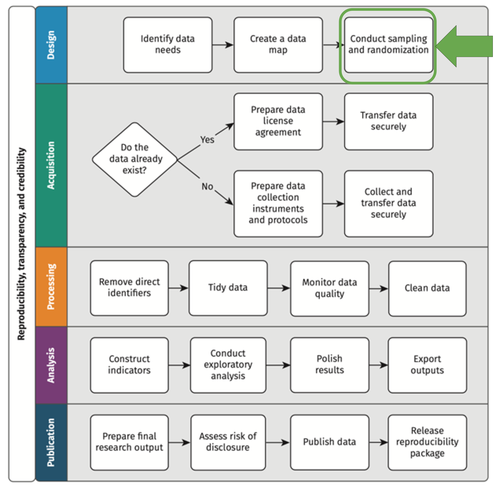
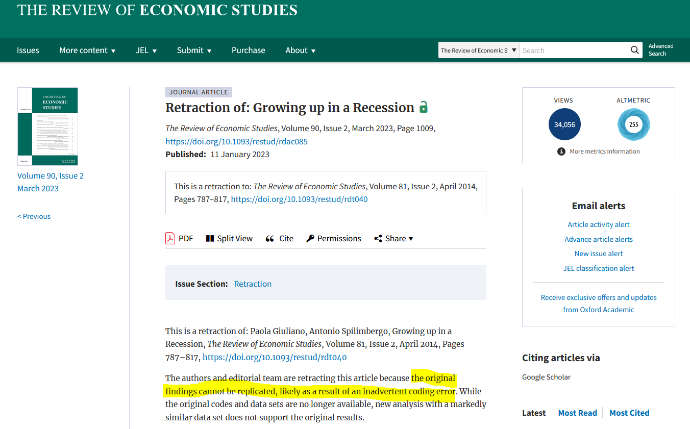
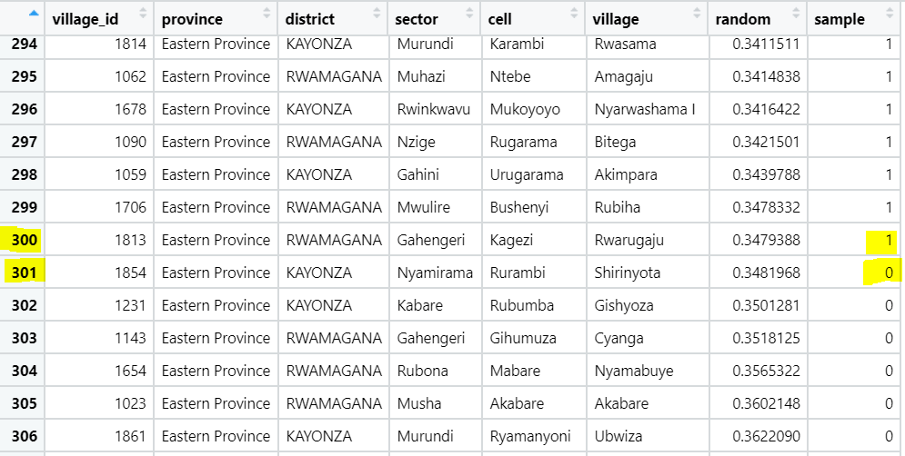
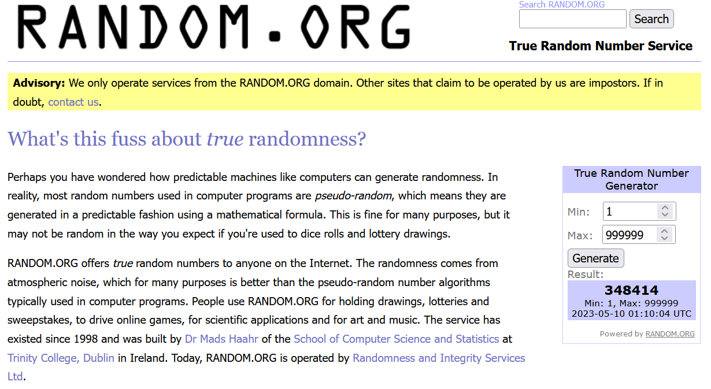
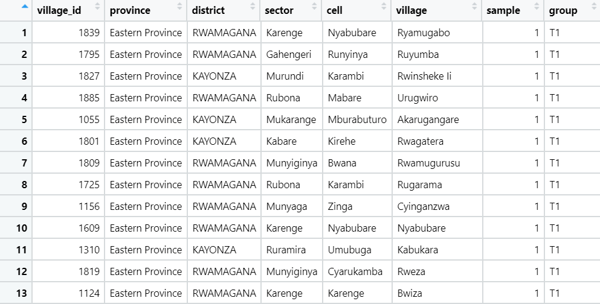
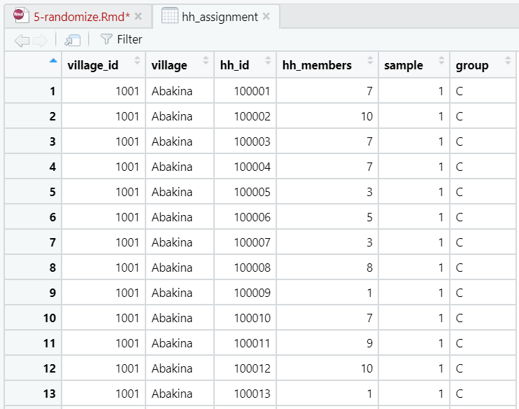
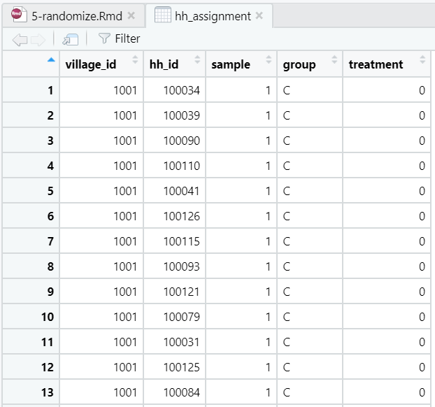

```{r setup, include = FALSE}
# Load packages
library(knitr)
library(xaringanExtra)
library(here)
library(dplyr)
here::i_am("Presentations/1-intro.Rmd")
options(htmltools.dir.version = FALSE)
opts_chunk$set(
  fig.align = "center",
  fig.height = 4,
  dpi = 300,
  cache = T
  )
xaringanExtra::use_panelset()
xaringanExtra::use_webcam()
xaringanExtra::use_clipboard()
htmltools::tagList(
  xaringanExtra::use_clipboard(
    success_text = "<i class=\"fa fa-check\" style=\"color: #90BE6D\"></i>",
    error_text = "<i class=\"fa fa-times-circle\" style=\"color: #F94144\"></i>"
  ),
  rmarkdown::html_dependency_font_awesome()
)
xaringanExtra::use_logo(
  image_url = here("Presentations",
                   "img",
                   "lightbulb.png"),
  exclude_class = c("inverse", 
                    "hide_logo"),
  width = "40px"
)
```

```{css, echo = F, eval = T}
@media print {
  .has-continuation {
    display: block !important;
  }
}
```

# Table of contents

1. [About the session](#about-this-session)
1. [Randomness and pseudorandomness](#randomness)
1. [Sampling](#sampling)
1. [Random seeds](#random-seeds)
1. [Randomization](#randomization)
1. [Stratified randomization](#stratified-randomization)
1. [Wrapping up](#wrapping-up)

---

class: inverse, center, middle
name: about-this-session

# About this session

<html><div style='float:left'></div><hr color='#D38C28' size=1px width=1100px></html>

---

# About this session

```{r echo = FALSE, out.width="50%"}

```

---

# About this session

## Questions we will answer today

1. What is randomness and how it's implemented in statistical programming?

1. How to sample reproducibly

1. How to randomize treatment and control groups reproducibly

---

class: inverse, center, middle
name: randomness

# Randomness and pseudorandomness

<html><div style='float:left'></div><hr color='#D38C28' size=1px width=1100px></html>

---

# Randomness and pseudorandomness

## What is randomness?

**<font size="6">Randomness is the quality or state of <i>something</i> for lacking a predefined pattern</font>**

- In statistical programming, this is usually implemented through the generation of **random numbers**

  + Random numbers in statistical programming range *usually* between 0 and 1 and have a long decimal trail, as in: `r runif(1)`
  
  + From all the possible numbers with that amount of decimal digits between 0 and 1, each of them has **the same possibility of being drawn** (uniform probability distribution)

---

# Randomness and pseudorandomness

## What is randomness?

- In R, you can generate a vector with random numbers with `runif(n)`, where `n` is the amount of numbers you want to generate

```{r}
runif(3)
```

---

# Randomness and pseudorandomness

## True randomness vs reproducibility

.pull-left2[
- We usually use of randomness in development field research to select random samples or assign treatment and control groups randomly

- And we already know that development research should be reproducible to avoid problems such as -->
]
.pull-right2[
```{r echo = FALSE, out.width="95%"}

```
]

---

# Randomness and pseudorandomness

## True randomness vs reproducibility

.pull-left2[
- True randomness, however, lacks patterns completely

- This implies that it's also impossible to reproduce: if *something* can be predicted, then it loses completely its quality of being random

- This poses a problem for conducting reproducible field research
]
.pull-right2[
```{r echo = FALSE, out.width="95%"}

```
]

---

# Randomness and pseudorandomness

## Pseudorandomness

- The solution to this philosophical problem is **pseudorandomness**

- Pseudorandomness consists of *imitating* randomness in a way that is completely reproducible

- In development and policy research, the concept of randomness **usually actually means pseudorandomness**

---

# Randomness and pseudorandomness

## Our scenario

For the rest of this session, we'll simulate to be in the evaluation of a program through an RCT

- **Intervention:** A conditional cash transfer

- **Population of interest:** 895 villages from selected regions of Rwanda

- **Sample:** The evaluation has budget limitations that prevent to select all 895 villages as part of the study, so we need to randomly only select 300 of them

- **Treatment groups:** From the random sample of 300, 100 villages will be assigned to full treatment (T1), 100 will be assigned to a group where half of the households receive a treatment and half doesn't (T2), and 100 villages will be a full control group (C)

- **Stratified randomization for T2:** For the 100 villages in T2, half of the households by village will be assigned to receive the treatment and the other half will not

---

# Randomness and pseudorandomness

## Exercise 1: Load the libraries and data

- No library installation is needed

- We'll start by loading the library and data we'll use today:

```{r eval=FALSE}
# Library
library(here)
library(dplyr)

# Data
data_path <- here("DataWork", "data", "intermediate", "clean")
villages  <- readRDS(here(data_path, "LWH-villages-clean.Rds"))
hh        <- readRDS(here(data_path, "LWH-households-clean.Rds"))
```

```{r echo=FALSE}
data_path <- here("data", "DataWork", "data", "raw")
villages  <- read.csv(here(data_path, "village_census.csv"))
hh        <- read.csv(here(data_path, "household_census.csv"))
```

---

class: inverse, center, middle
name: sampling

# Sampling

<html><div style='float:left'></div><hr color='#D38C28' size=1px width=1100px></html>

---

# Sampling

- Sampling consists of selecting a subset of elements from a set of total elements

- Random samples are subsets generated randomly

---

# Sampling

## In R

This is implemented in statistical programming in three steps:

1. Generate a vector of n random numbers with `runif(n)`, where n is the number of elements from your total set

1. Sort the observations by the vector of random numbers using `arrange()` from `dplyr`

1. Assign the first n to your sample using `case_when()` and `mutate()`

---

# Sampling

## Exercise 2: Select a sample of villages

- Create a vector of random numbers in `hh`

```{r}
villages_sample <-
  villages %>%
  mutate(random = runif(nrow(villages)))
```

- Sort by the variable `random`

```{r}
villages_sample <-
  villages_sample %>%
  arrange(random)
```

---

# Sampling

## Exercise 2: Select a sample of villages (continued)

- Create a dummy column with the sample assignment

```{r}
villages_sample <-
  villages_sample %>%
  mutate(
    sample = case_when(row_number() <= 300 ~ 1,
                       row_number() > 300  ~ 0)
  )
```

---

# Sampling

Note that the "break" between 1/0 in `sample` is in the observation 301

```{r echo = FALSE, out.width="70%"}

```

---

# Sampling

- This works for now, but you should know that if you or someone else runs this code again, **the result will be different each time**

- We need to take one more step to make it reproducible

---

class: inverse, center, middle
name: random-seeds

# Random seeds

<html><div style='float:left'></div><hr color='#D38C28' size=1px width=1100px></html>

---

# Random seeds

- Random numbers in R are drawn using a random number generator from a **pool of predefined random numbers** that exist somewhere in your computer's processor

- Random seeds are integer numeric values that "set a state" in the random number generator that can be reproduced with the same numeric value

- That means that using the same random seed before generating a set of random numbers **will always yield the same result**

---

# Random seeds

## In R

- You can set the random seed number with `set.seed()`:

```{r}
set.seed(938161)
runif(3)
```

- Now we run this code again **with the same seed number** to produce the same results:

```{r}
set.seed(938161)
runif(3)
```

---

# Random seeds

.pull-left2[
- Random seeds allow us to implement pseudorandomness in statistical programming

- Drawing random numbers with random seeds will be reproducible and completely random **as long as the random seed number is random**

- A good resource for generating single numbers is random.org
]
.pull-right2[
```{r echo = FALSE, out.width="80%"}

```
]

---

# Random seeds

## Exercise 3: Select a **reproducible** sample of villages

- Go to random.org and select a random number between 1 and 999,999

- Set the seed to that number, for example:

```{r}
set.seed(211667)
```

---

# Random seeds

## Exercise 3: Select a **reproducible** sample of villages (continued)

- Select your sample again by repeating the steps of exercise 2

```{r}
villages_sample <-
  villages %>%
  mutate(random = runif(nrow(villages))) %>%
  arrange(random) %>%
  mutate(sample = case_when(row_number() <= 300 ~ 1,
                            row_number() > 300  ~ 0)) %>%
  select(-random) # dropping column "random"
```

---

# Random seeds

- Now our random sample of 300 villages for our study is reproducible

- We'll continue with assigning the treatment and control groups for the sample

---

class: inverse, center, middle
name: randomization

# Randomization

<html><div style='float:left'></div><hr color='#D38C28' size=1px width=1100px></html>

---

# Randomization

- In the context of development and policy research, randomization refers to the random assignment of units to treatment and control groups

- In our scenario, we'll suppose that the 300 villages in the sample should be assigned to three groups of 100 villages each:

  + Pure treatment (T1)
  
  + Treatment with evaluation of spillover effects (T2)
  
  + Pure control (C)
  
---

# Randomization

## In R

The implementation follows the same principles as in random sampling:

1. Set the random seed

1. Generate a column with random numbers

1. Sort

1. Within the sample assign the first 100 to T1, the next 100 to T2, and the last 100 to C

---

# Randomization

## Exercise 5: Assign treatment and control groups

- Go to random.org, obtain another random number from 1 to 999,999, and use it to set the random seed

```{r}
set.seed(781598)
```

- Generate the random numbers and sort

```{r}
villages_assignment <-
  villages_sample %>%
  mutate(random = runif(nrow(villages_sample))) %>%
  arrange(desc(sample), random) # sort descending on "sample", ascending on "random"
```

---

# Randomization

## Exercise 5: Assign treatment and control groups (continued)

- Generate the groups

```{r}
villages_assignment <-
  villages_assignment %>%
  mutate(group = case_when(row_number() <= 100 ~ "T1",    # first 100 to T1
                           row_number() <= 200 ~ "T2",    # next 100 to T2
                           row_number() <= 300 ~ "C",     # next 100 to C
                           TRUE                ~ NA)) %>% # NA values for the rest
  select(village_id, sample, group)                       # keeping only relevant columns
```

---

# Randomization

Now your villages have been randomly and reproducibly assigned to treatment groups

```{r echo = FALSE, out.width="80%"}

```

---

class: inverse, center, middle
name: stratified-randomization

# Stratified randomization

<html><div style='float:left'></div><hr color='#D38C28' size=1px width=1100px></html>

---

# Stratified randomization

- In our scenario, half of the households in T2 are assigned to receive the treatment

- However, we want to keep a balance between the number of households that receive and don't receive the treatment **within villages**

- Randomizing while maintaining a balance in the number of units assigned to groups within a higher grouping unit is called **stratified randomization**

---

# Stratified randomization

- The randomization we've done so far was at the village level

- We'll need to bring the treatment assignment information from `villages_assignment` to `hh` to proceed with the HH-level randomization for T2

- Remember `left_join()` from the tidying data session?

```{r}
hh_assignment <-
  hh %>% left_join(villages_assignment,
                   by = "village_id")
```

---

# Stratified randomization

Now the treatment assignment and the households are in the same dataframe and we can move on.

```{r echo = FALSE, out.width="50%"}

```

---

# Stratified randomization

## In R

Once again, we'll use the same rationale for the stratified randomization:

1. Set the random seed

1. Generate a column with random numbers

1. Sort

1. Within villages and for group T2, assign the treatment to the first half in the sorting and no treatment to the second half

We'll implement this in the next exercise.

---

# Stratified randomization

## Exercise 6: Assign treatment and control groups with village stratum

- Go to random.org, obtain a random number between 1 and 999,999, and set the seed

```{r}
set.seed(399526)
```

- Generate the random numbers and sort by the random numbers within villages

```{r}
hh_assignment <-
  hh_assignment %>%
  mutate(random = runif(nrow(hh_assignment))) %>%
  arrange(village_id, random)  # sort by "random" within villages
```

---

# Stratified randomization

## Exercise 6: Assign treatment and control groups with village stratum (continued)

- Assign the treatment to:

  + All households in group T1
  + For households in group T2, within village, assign the treatment to the first half (remember that the dataframe is already sorted) and no treatment to the rest

```{r}
hh_assignment <-
  hh_assignment %>%
  group_by(village_id) %>%
  mutate(treatment = case_when(group == "T1"                             ~ 1,
                               group == "T2" & row_number() <= 0.5 * n() ~ 1,
                               group == "T2" | group == "C"              ~ 0,
                               TRUE                                      ~ NA)) %>%
  ungroup() %>%
  select(village_id, hh_id, sample, group, treatment)
```

---

# Stratified randomization

Some notes about this code:

```{r eval=FALSE}
hh_assignment <-
  hh_assignment %>%
  group_by(village_id) %>%
  mutate(treatment = case_when(group == "T1"                             ~ 1,
                               group == "T2" & row_number() <= 0.5 * n() ~ 1,
                               group == "T2" | group == "C"              ~ 0,
                               TRUE                                      ~ NA)) %>%
  ungroup() %>%
  select(village_id, hh_id, sample, group, treatment)
```

- Note that `group_by()` here **is not collapsing the dataframe**. This i

- This `group_by()` doesn't change the dataframe in appearance, but it indicates that the subsequent use of `row_number()` and `n()` are relative to the units grouped by (`village_id`)

- In general, the functions `row_number()` and `n()` work **relative to the unit the dataframe is grouped by**, if there is any

---

# Stratified randomization

More notes about this code:

```{r eval=FALSE}
hh_assignment <-
  hh_assignment %>%
  group_by(village_id) %>%
  mutate(treatment = case_when(group == "T1"                             ~ 1,
                               group == "T2" & row_number() <= 0.5 * n() ~ 1,
                               group == "T2" | group == "C"              ~ 0,
                               TRUE                                      ~ NA)) %>%
  ungroup() %>%
  select(village_id, hh_id, sample, group, treatment)
```

- Remember that the conditions in `case_when()` have a hierarchy: each subsequent condition is evaluated only in the rows for which all previous conditions were false

- Lastly, we use `ungroup()` so that the dataframe is not grouped by village anymore

---

# Stratified randomization

Now your two resulting dataframes have all the information on randomization and treatment and your code is reproducible.

```{r echo = FALSE, out.width="40%"}

```

---

class: inverse, center, middle
name: wrapping-up

# Wrapping up

<html><div style='float:left'></div><hr color='#D38C28' size=1px width=1100px></html>

---

# Wrapping up

This was an exercise of sampling and randomization that seeked to cover common project scenarions in development and policy research. Some variations of this can include:

|Case|Implementation|
|----|--------------|
|There are vilages you know you can't reach for reasons beyond your control (security or accessibility, for example)|Assign them to `sample=0` before selecting the random sample in order to keep them out of the selection|
|Treatment group assignation (T1/T2/C) needs to be stratified by higher-level grouping units such as districts to ensure balance in numbers within districts|Use `group_by()` with the higher level units and assign the T1/T2/C groups within them|
|You want to have a roster of replacement villages in case one needs to be dropped from the study for reasons beyond your control|For the villages with `sample = 0`, give them a **random order** to be selected into the study to be replacement units if needed|
|You want villages to have different proabilities to be selected into your sample, for example by giving a probability proportional to the village population|This implementation is impossible to explain one sentence, but send as an email to dimeanalytics@worldbank.org and we'll be happy to help|

---

# Wrapping up

## Exercise 7: Save your work

- Save your script in `DataWork/code`

- Save `villages_assignment` and `hh_assignment` in `DataWork/data/final`

---

class: inverse, center, middle

# Thanks! // ¡Gracias!

<html><div style='float:left'></div><hr color='#D38C28' size=1px width=1100px></html>

---

exclude: true

```{R, include = FALSE, eval = FALSE}
pagedown::chrome_print("Presentations/5-randomize.html", output = "Presentations/5-randomize.pdf")
```