```{r setup, include = FALSE}
# Load packages
library(knitr)
library(xaringanExtra)
library(here)
library(dplyr)
library(janitor)
library(labelled)
here::i_am("Presentations/2-tidy_clean.Rmd")
options(htmltools.dir.version = FALSE)
opts_chunk$set(
  fig.align = "center",
  fig.height = 4,
  dpi = 300,
  cache = T
  )
xaringanExtra::use_panelset()
xaringanExtra::use_webcam()
xaringanExtra::use_clipboard()
htmltools::tagList(
  xaringanExtra::use_clipboard(
    success_text = "<i class=\"fa fa-check\" style=\"color: #90BE6D\"></i>",
    error_text = "<i class=\"fa fa-times-circle\" style=\"color: #F94144\"></i>"
  ),
  rmarkdown::html_dependency_font_awesome()
)
xaringanExtra::use_logo(
  image_url = here(
    "Presentations",
    "img",
    "lightbulb.png"
  ),
  exclude_class = c(
    "inverse", 
    "hide_logo"
  ),
  width = "40px"
)
```

```{css, echo = F, eval = T}
@media print {
  .has-continuation {
    display: block !important;
  }
}
```

# Before we begin

<font size="7">Go to <a href="http://bit.ly/msfr24_materials">http://bit.ly/msfr24_materials</a> and download <b>2-tidy_clean.pdf</b></font>

---

# Table of contents

1. [About the session](#about-this-session)
1. [Tidy data](#tidy-data)
1. [Collapsing](#collapsing)
1. [Merging](#merging)
1. [Data cleaning](#data-cleaning)
1. [Getting data ready for analysis and construction](#getting-data-ready)
1. [Saving the results](#saving-results)
---

class: inverse, center, middle
name: about-this-session

# About this session

<html><div style='float:left'></div><hr color='#D38C28' size=1px width=1100px></html>

---

# About this session

```{r echo = FALSE, out.width="45%"}
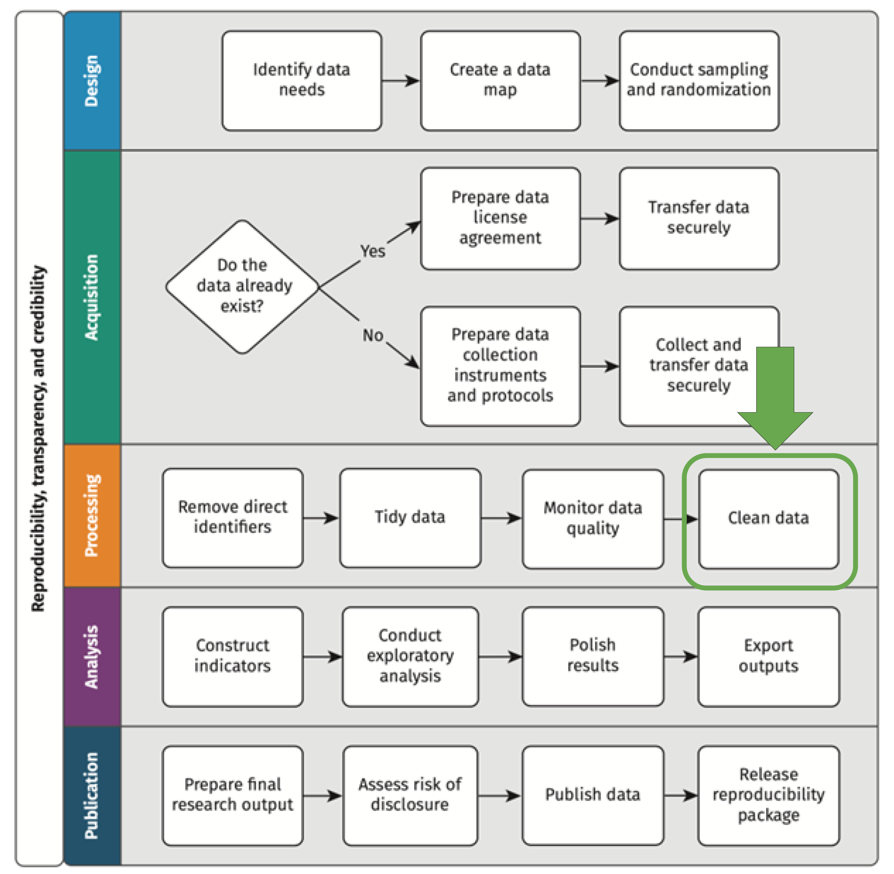
```

---

class: inverse, center, middle
name: tidy-data

# Tidy data

<html><div style='float:left'></div><hr color='#D38C28' size=1px width=1100px></html>

---

# Tidy data

## Data tables

- Data can be acquired in multiple formats, but in development research it is most commonly acquired as one or more **data tables**

.exercise[
<font size="6"><b>Data table:</b><br>A data format where data is organized into rows and columns</br></font>
]

- It's also called *tabular data* or *rectangular data*

---

# Tidy data

## Data tables

```{r echo = FALSE, out.width="100%"}
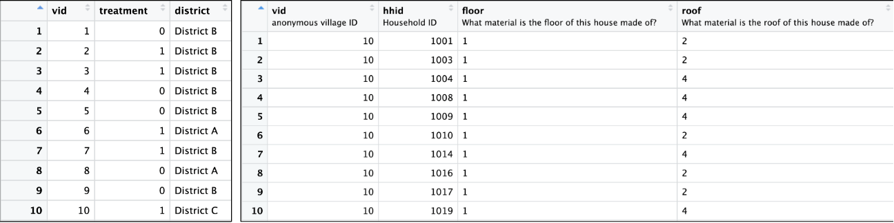
```

---

# Tidy data

- A data table is **tidy** when:

.exercise[

1. Each column corresponds to **one variable**

2. Each row corresponds to **one observation**

3. All variables in the data table have the **same unit** of observation

]

- Every other format is untidy

- Data you might obtain from field work or a government counterpart is rarely tidy

---

# Tidy data

## Some definitions

In some statistical software, columns are usually called *variables* and rows are called *observations*. However, these are not necessarily the same. From now on:

- A **variable** is a collection of values that measure the same attribute across different units

- An **observation** is a collection of all values measured on the same unit across attributes

- A **data point** represents one variable for one observation. Data points are also called *values*

- A **dataset** is a collection of data points

---

# Tidy data

## Definitions in practice

.pull-left[
- Unit of observation: **village**

- Attributes measured (variables):
  + Village ID
  + District
  + Treatment assignment

- Level of the attributes: **village**

]
.pull-right[
```{r echo = FALSE, out.width="50%"}
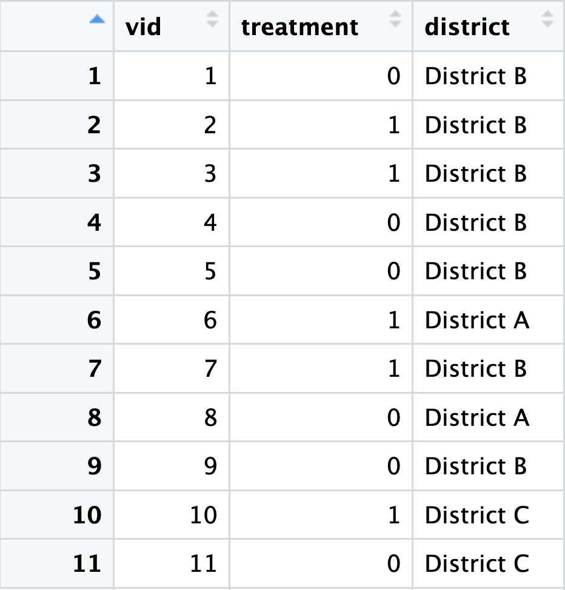
```
]
---
# Tidy data

## In R
R has different packages for reading in different types of data. Today we'll work with the following:

1. `haven` : a package from tidyverse for reading and writing different data fromats from other statistical programming softwares. Eg. __.dta__ data files from stata

2. `readxl` : a package for reading in excel files into R

```{r echo = FALSE, out.width="70%"}

```

---
# Tidy data

## In R

R has multiple packages and tools for data tidying and cleaning. Today we'll work with the following:

1. `dplyr`: a package from the tidyverse for dataframe manipulation (data wrangling)

2. `janitor`: a package for data cleaning operations, arguably best known for its function `clean_names()`

3. `labelled`: a package to handle and generate dataframe metadata

```{r echo = FALSE, out.width="60%"}

```

---

# Tidy data

## Exercise 1: Install and load packages for data tidying and cleaning
.pull-left[
1. Install all the packages we'll use: (but omit the ones you know you already installed before)
  + `install.packages("tidyr")`
  + `install.packages("janitor")`
  + `install.packages("labelled")`
  + `install.packages("dplyr")`
  + `install.packages("readxl")`
  + `install.packages("stringr)`
]

.pull-right[
2\. Load all the packages we'll use:
  + `library(tidyr)`
  + `library(dplyr)`
  + `library(janitor)`
  + `library(labelled)`
  + `library(readxl)`
  + `library(haven)`
  + `library(here)`
  + `library(stringr)`
  
```{r, eval=TRUE, echo=FALSE, message=FALSE, warning=FALSE}
library(tidyr)
library(dplyr)
library(janitor)
library(labelled)
library(readxl)
library(haven)
library(here)
library(ggplot2)
```
]  
---
# Tidy data

## Exercise 2: Read the datasets we will use for the session

- We'll load two dataframes for the rest of the exercises:

  1. Data at the household level about an impact evaluation of a community-based conditional cash transfer program in Tanzania
  
  2. Administrative data about treatment administered at the village level
  
- Use the following code to load the data

```{r, eval=FALSE}

df_village <- read_xlsx(here("DataWork", "Data", "Raw", "treat_status.xlsx")) %>%
  clean_names()

df_hh      <- read_dta(here("DataWork", "Data", "Raw", "TZA_CCT_baseline.dta")) %>% 
  clean_names()

```

```{r, echo=FALSE}

df_village <- read_xlsx(here("Data", "treat_status.xlsx")) %>%
  clean_names()

df_hh      <- read_dta(here("Data", "TZA_CCT_baseline.dta")) %>% 
  clean_names()

```

---
# Tidy data

There are three components that are crucial to successfully managing a
set of tidy tables:

1. You should remove duplicates before tidying the dataset

1. Each observation of each data table must be uniquely and fully identified by
one or a set of ID variables

1. You must be able to use these ID variables to link all data tables to each other if needed

We'll do this in the next exercises.

---

class: inverse, center, middle
name: duplicates

# Identifying and Fixing Duplicates

<html><div style='float:left'></div><hr color='#D38C28' size=1px width=1100px></html>

---
# Identifying duplicates
## Exercise 3: Check for duplicates on the loaded HH wide dataset

1. Count the number of rows in the dataframe with `nrow(df_hh)`. Remember this number

1. Count the number of distinct observation in the dataframe with `n_distinct(df_hh)`. Are the two numbers the same?

---
# Identifying duplicates
```{r}
nrow(df_hh)
```

This means that there are `r nrow(df_hh)` observations in `df_hh`.

```{r}
df_hh %>% n_distinct()
```

This means that there are `r df_hh %>% n_distinct()` unique observations in `df_hh`.

**Since these numbers are the same, this means that we __don't__ have duplicates in the data.** 

The next step before tidying is to check if the ID variables uniquely identify the observations.

---
# Identifying duplicates
## Exercise 4: Check the identifying variables

1. Inspect the dataframe with `View(df_hh)` and take note of the identifying variables.

1. Count the number of rows with `nrow(df_hh)` and the **number of distinct combinations in the identifying variables** with :

```{r eval=FALSE}

df_hh %>% select(vid, hhid) %>% n_distinct()

```

Are the two numbers the same? if so, then the identifying variables uniquely identify the observations.

Also, note the following in this code:

- `select()` is a function from `dplyr`, it subsets columns from a dataframe

- `n_distinct()` is now counting the number of unique combinations in the subset dataframe resulting from `select()` (as opposed to counting the unique observations in `df_hh_dedup`, which is what we did in exercise 3)

---

# Fixing duplicates
## Exercise 5: Remove duplicates
- The conclusion of the previous exercise is that there are 2 duplicates based on the identifying variables

- Use the following code to remove duplicates from the data
```{r}
df_hh_dedup <- df_hh %>% distinct(vid, hhid, .keep_all = TRUE)

```

---
# Fixing duplicates
## Exercise 6: Remove duplicates
- By the way, checking for the duplicates could have also been checked with the following code. Let's verify that we have removed the duplicates using the code.

```{r}
nrow(df_hh_dedup) == df_hh_dedup %>% select(vid, hhid) %>% n_distinct()
```

- If the condition is `TRUE`then we have successfully removed the duplicates

- Now our dataframe is deduplicated and we have verified that the ID variables uniquely identify the observations

- We can now proceed with data cleaning and variable construction section

---

class: inverse, center, middle
name: merging

# Merging

<html><div style='float:left'></div><hr color='#D38C28' size=1px width=1100px></html>

---

# Merging

- We're going to see how to link tidy data tables between themselves into a single data table

- This operation is called **merging**

.exercise[
**Merging**: Linking two data tables by one or more common variables into a single data table
]

---

# Merging

```{r echo = FALSE, out.width="80%"}
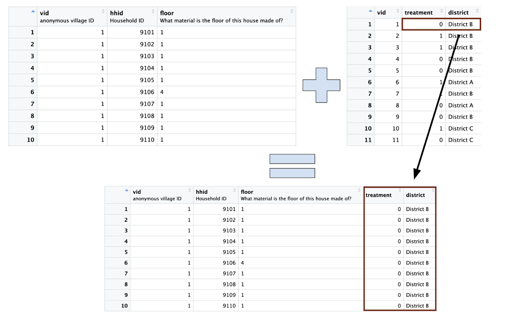
```

---

# Merging

## Exercise 7: Merge two dataframes

1. Inspect `df_hh_dedup` and `df_village` with `View(df_hh_dedup)` and `View(df_village)` and identify the column they have in common

2. Use this column with the function `left_join()` to merge the two dataframes, as in the code below:

```{r eval=TRUE}
 df_hh_dedup <- df_hh_dedup %>%
   left_join(df_village,
             by = c("vid"))
```

---

# Merging

When two tidy data tables with different units of observations merge (villages and households), the resulting data table will have the most disagregated unit (households)

```{r echo = FALSE, out.width="80%"}
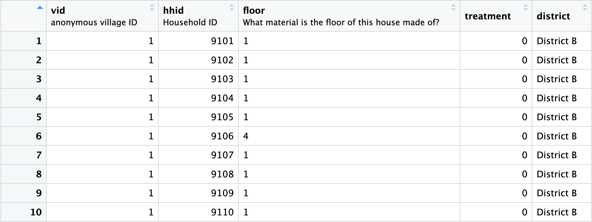
```


---

class: inverse, center, middle
name: collapsing

# Collapsing

<html><div style='float:left'></div><hr color='#D38C28' size=1px width=1100px></html>

---

# Collapsing

- Tidying a dataframe sometimes involves operations different than reshaping

- One if such cases is **collapsing**

- Imagine you are approached with the following request:

*We would like to know how many households we surveyed in each village to have a sense of how many we might have missed in the data collection. Can you estimate these numbers?*

---

# Collapsing

.pull-left2[
*We would like to know how many households we surveyed in each village...*

- We can use the tidy dataframe `df_hh_dedup` for this

- We would have to:

  1. Change the units of observations from household to village
  
  2. Count the observations for each village that are currently in `df_hh_dedup`
  
]
.pull-right2[
```{r echo = FALSE, out.width="130%"}
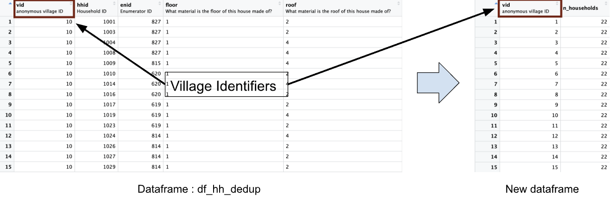
```
]

---

# Collapsing

.pull-left2[
This will require **collapsing**.

.exercise[
**Collapsing:** Transformation of data table in which the unit of observation changes from a lower-level unit (household) to an aggregated unit (village)
]

]
.pull-right2[
```{r echo = FALSE, out.width="130%"}

```
]

---

# Collapsing

## Exercise 8: Collapse `df_hh` to the village level

.pull-left2[
- Use the functions `group_by()` and `summarize()` to collapse as in the code below.

```{r eval=FALSE}
df_hh_village <- df_hh_dedup %>%
  group_by(vid) %>%
  summarise(n_households = n())
```
]
.pull-right2[
```{r echo = FALSE, out.width="95%"}

```
]

---

# Collapsing

Notice the functions and arguments we used to collapse:

```{r eval=FALSE}
df_hh_village <- df_hh_dedup %>%
  group_by(village) %>%
  summarize(n_households = n())
```

- Both `group_by()` and `summarize()` are functions from `dplyr`

- `group_by()` takes as arguments the columns you collapse by (village identifiers)

- `summarize()` creates aggregated indicators for the collapsed dataframe

  + `n_households = n()` means that we'll create a new column named `n_households` that counts the number of observations for each value we group by (villages)
  
  + Other possible aggregations are `mean()`, `max()`, `min()`, `sum()`

---

# Collapsing

.pull-left[
- The dataframe `df_hh_village` is tidy at the village level

- The ID variable is `village`
]
.pull-right[
```{r echo = FALSE, out.width="65%"}
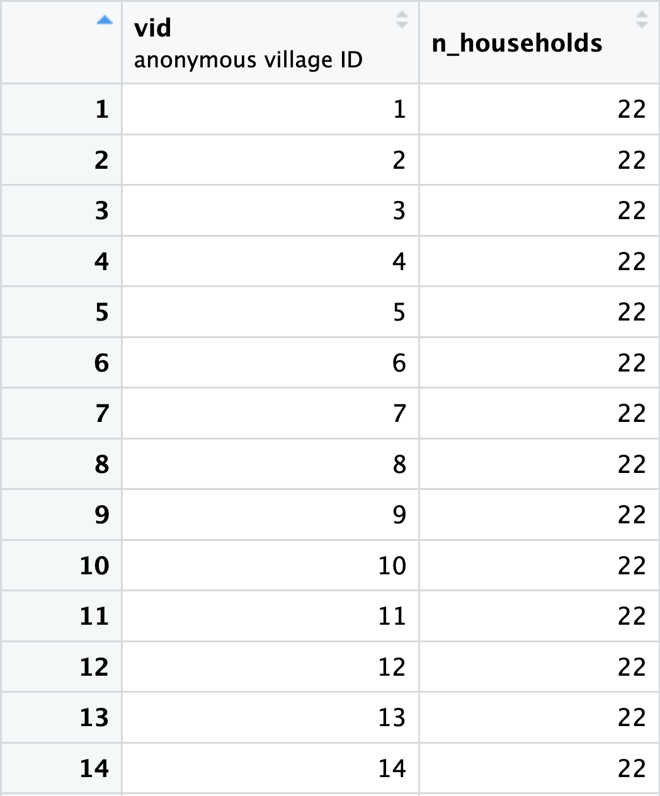
```
]

---


class: inverse, center, middle
name: data-cleaning

# Data cleaning

<html><div style='float:left'></div><hr color='#D38C28' size=1px width=1100px></html>

---

# Data cleaning

- Data cleaning is the process of fixing or removing incorrect, incomplete or incorrectly formatted data in a dataset

- It has two main purposes:

  1. To correct incorrect data points obtained from field activities
  
  2. To get data ready for indicator construction and data analysis
  
---

class: inverse, center, middle
name: getting-data-ready

# Getting data ready for analysis and construction

<html><div style='float:left'></div><hr color='#D38C28' size=1px width=1100px></html>

---

# Getting data ready for analysis and construction

Other than fixing information collected or received, data cleaning also gets data ready for indicator construction and analysis. This part of the cleaning includes:

- Change column data types so that they can be handled more easily

- Recoding data which is essential for re-categorizing variables

- Add columns that will be useful for analysis

- Add or correct variables labels and value labels

- Identifying erroneous data points

---

# Getting data ready for analysis and construction

## Variable types

- Columns in dataframes can have different types, each representing different kinds of attributes

- For example:

  + **Numeric columns** represent quantitative attributes such as age, income, or number of families. They have two sub-types: *integer* for columns with integer values and *double* for columns with decimal values
  
  + **Character columns** usually represent open-ended responses, such as questions to clarify "other" categories in questionnaires
  
  + **Factor columns** represent categorical attributes where each possible answer is associated to pre-defined category, for example crops, provinces, or income source
  
---

# Getting data ready for analysis and construction

## Variable types

- Using the correct column types for each attribute is a condition for data analysis

- For example, if the data points of a column are characters but the correct type is integer, R will not be able to perform mathematical operations such as estimating the mean or standard deviation of the column

---

# Getting data ready for analysis and construction

## Variable types

- R has several options to check a column's type

- One of the easiest is the function `class()`

```{r}
class(df_hh_dedup$duration)
```

---

# Getting data ready for analysis and construction

## Variable types

- You can change column types with three basic functions

  + `as.numeric()` to convert a column to a numeric (double) type
  
  + `as.character()` to convert to character
  
  + `factor()` to convert to factor

- The input of these functions are columns and the outputs are also columns

- They can be used inside the function `mutate()` to change columns in a dataframe

---

# Getting data ready for analysis and construction

## Variable types

```{r eval=FALSE}
# General use of mutate with column type functions
new_df <- old_df %>%
  mutate(
    col1 = as.numeric(col1),    # double type
    col2 = as.character(col2),  # character type
    col3 = factor(col3),        # factor type
    ...
  )
```

---

# Getting data ready for analysis and construction

## Exercise 9: Convert a numeric variable saved as string variable to numeric

- Convert the variable `duration` to numeric with the following code:

```{r}
df_hh_dedup <- df_hh_dedup %>%
  mutate(duration = as.numeric(duration))

class(df_hh_dedup$duration)
```

---

# Getting data ready for analysis and construction
## Convert a text variable saved as string to numeric

- Convert the variable `ar_farm_unit` to numeric. 

- Note that the variable contains __text__ responses hence we can't directly use `as.numeric` function as before. 

- We need to use conditional functions to convert the responses to numeric

---
# Getting data ready for analysis and construction
## You can also convert a string to numeric

```{r echo = FALSE, out.width="65%"}
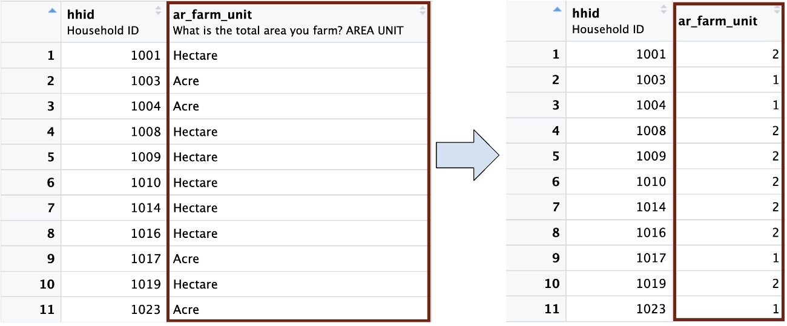
```
---
# Getting data ready for analysis and construction
## Exercise 10: Convert "ar_farm_unit" column to numeric

- `case_when()` is an auxiliary function that is normally used inside `mutate()` to replace column values based on conditions

  + each argument of `case_when()` is a condition followed by a tilde (`~`) that represents the value for cases when the condition is true
  
  + the conditions have an order hierarchy, meaning that subsequent conditions are only applied for cases where all previous conditions were false

```{r}

df_hh_dedup <- df_hh_dedup %>%
  mutate(ar_farm_unit = case_when(ar_farm_unit=="Acre" ~ 1,
                                  ar_farm_unit=="Hectare" ~ 2,
                                    .default = NA))

class(df_hh_dedup$duration)
```

---
# Getting data ready for analysis and construction
## Recoding variables

- Sometimes we may want to replace given values of a column

- This is useful for survey data when non-response categories such as "don't know" are usually assigned specific values such as `-88`, `-99`

- In this case, these are not actual observations and including them in the analysis may bias the results hence we need to change them to missing
```{r echo = FALSE, out.width="65%"}
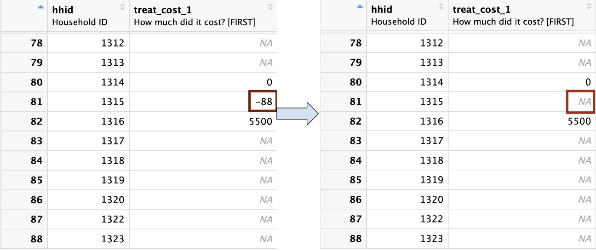
```

---

# Getting data ready for analysis and construction
## Recoding variables


- If we want to recode the values -88 to missing(NA) 

- We can make use of the function `na_if` from `dplyr` package

```{r eval=FALSE}
# General example:
new_df <- old_df %>%
  mutate(x = 
           na_if(x, y)
         )

# x - The vector/variable to modify

# y - Values in vector `x` that will be replaced with NA
```

---

# Getting data ready for analysis and construction
## Recoding variables
- We can recode one variable(treat_cost_1) using the following code: 
```{r eval=FALSE}
df_hh_dedup <- df_hh_dedup %>%
  mutate(treat_cost_1 =
           na_if(treat_cost_1, -88))

```

---
# Getting data ready for analysis and construction
## Recoding variables
- We can also recode multiple variables
```{r eval=FALSE}

df_hh_dedup <- df_hh_dedup %>%
  mutate(across(c(treat_cost_1, treat_cost_2), na_if, -88))

```

---
# Getting data ready for analysis and construction
## Working with strings in R

- Text data is part of the data collected on surveys for open ended text responses hence understanding how to manipulate strings is important

- Open ended text responses are usually "dirty" and responses that may be the same may be noted down differently. For eg. __"Coconut"__ vs __"Coconut."__

- While the responses above mean the same, R interprets them as different texts due to the full stop(.) in the second text

- `stringr` package offers useful functions for text manipulation in R

---
# Getting data ready for analysis and construction
## Working with strings in R
```{r echo = FALSE, out.width="65%"}
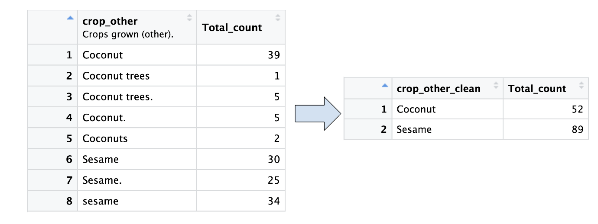
```

---
# Getting data ready for analysis and construction
## Exercise 11: Clean "crop_other" string variable

- Use `str_replace_all()` function

- We will manually define the text to be replaced in the function

```{r eval=FALSE}
df_hh_dedup <- df_hh_dedup %>%
  mutate(crop_other_clean = 
           str_replace_all(crop_other, 
                           c("Coconut trees" ="Coconut",
                             "Coconut trees." = "Coconut",
                             "Coconut." = "Coconut", 
                             "Coconuts"="Coconut",
                             "sesame"="Sesame", 
                             "Sesame."="Sesame")))

```

- As observed above, defining all the instances manually can be inefficient. There are more advanced ways of achieving the same results using `regular expressions` which do require explicit definition rather we can use special characters to denote the same thing


---
# Getting data ready for analysis and construction
## Creating new columns

- Data cleaning also involves generating new columns that don't involve indicator construction

- For example:

  + Adding a year column
  
  + Adding a data collection stage column
  
- We also use `mutate()` for these cases:

```{r eval=FALSE}
# General example:
new_df <- old_df %>%
  mutate(
    new_col1 = value1,
    new_col2 = value2,
    ...
  )
```

---

# Getting data ready for analysis and construction

## Exercise 12: Create new columns

- Use `mutate()` to generate two new columns in `df_hh_dedup`

  + One column for `Year`, equal to 2017
  
  + One column for `collection_stage`, equal to "baseline"

- Name your result `df_hh_new_cols`

- Recall the general use of `mutate()` to know how to implement this function:

```{r eval=FALSE}
# General example:
new_df <- old_df %>%
  mutate(
    new_col1 = value1,
    new_col2 = value2,
    ...
  )
```

---

# Getting data ready for analysis and construction

```{r}
 df_hh_new_cols <- df_hh_dedup %>%
  mutate(
     year = 2017,
     collection_stage = "baseline"
   )
```

```{r echo = FALSE, out.width="50%"}
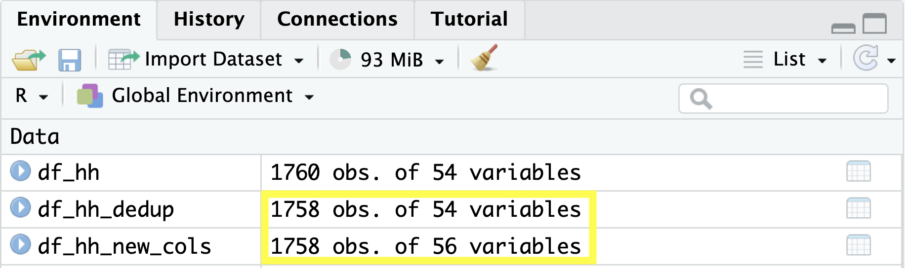
```

---
# Getting data ready for analysis and construction
## Creating variables based on conditions

- Create a variable on area of farm in hectares
```{r echo = FALSE, out.width="70%"}
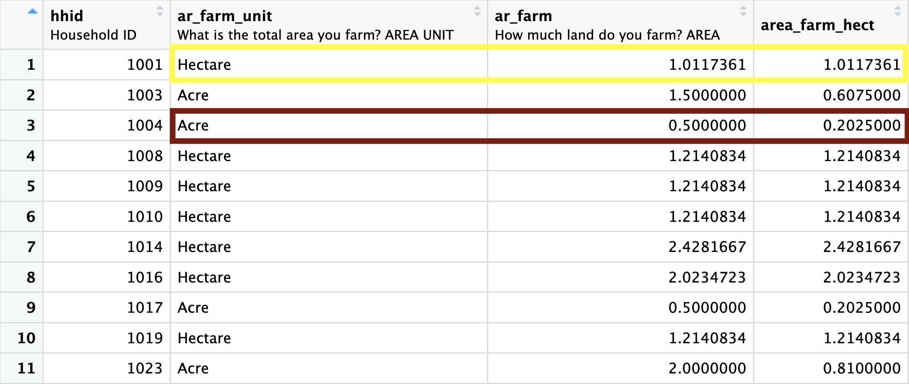
```

---
# Getting data ready for analysis and construction
## Exercise 13: Create a variable on area of farm in hectares

- We'll use the functions `mutate()` and `case_when()` for this, both from `dplyr`

  
```{r}
# Using the conversion rate value of 1 acre = 0.405 hectare

df_hh_dedup <- df_hh_dedup %>%
  mutate(area_farm_hect = 
           case_when(ar_farm_unit=="Acre" ~ ar_farm * 0.405,
                     .default = ar_farm))

```

---
# Getting data ready for analysis and construction
## Create a variable that identifies whether any member can read and write
```{r echo = FALSE, out.width="90%"}
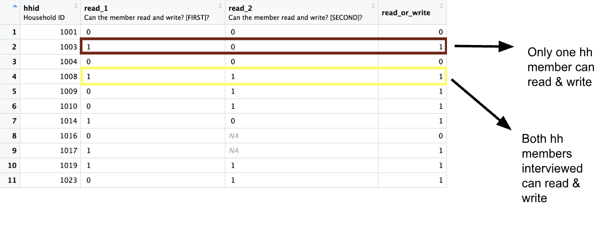
```
---
# Getting data ready for analysis and construction
## Exercise 14: Creating variables based on conditions
- We'll use the functions `mutate()` and `case_when()` for this, both from `dplyr`

- Note we use `|` which represents the OR operator in R

- It's used when evaluating conditions. Only __one__ of the conditions needs to be TRUE for the whole operation to return TRUE

```{r}
df_hh_dedup <- df_hh_dedup %>%
  mutate(read_or_write = case_when(read_1==1 | read_2==1 ~ 1,
                                   .default = 0))

```

---
# Getting data ready for analysis and construction
## Creating variables based on conditions

Exercise: Create a variable that identifies if any member was sick
```{r echo = FALSE, out.width="90%"}
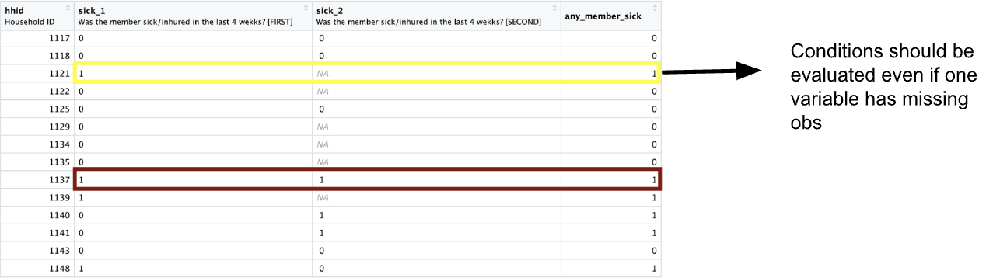
```

---
# Getting data ready for analysis and construction
## Exercise 15: Create a variable that identifies if any member was sick

- We'll use the functions `mutate()` and `case_when()` for this, both from `dplyr`

- We'll also use the `|` operator

- We use the variables `sick_1` and `sick_2` that identifies sick family members
```{r}
df_hh_dedup <- df_hh_dedup %>%
  mutate(any_member_sick = case_when(sick_1==1 | sick_2==1 ~ 1,
                                   .default = 0))

```

---
# Getting data ready for analysis and construction
## Calculating rowwise arithmetic operations

- We will calculate the sum of two members per household

- This means that we have to use __row wise__ calculations, given that each row represents a household

---

# Getting data ready for analysis and construction
## Exercise 16: Create a variable calculating the total cost of treatment across two members 

- We will use the `+` operator to sum `treat_cost_1` and `treat_cost_2`. 

- You will note that on instances where there is a missing value in either columns, the sum is not calculated

```{r}
df_hh_dedup <- df_hh_dedup %>%
  mutate(total_treat_cost = treat_cost_1 + treat_cost_2) 

```

---
# Getting data ready for analysis and construction
## Exercise 17: Create a variable calculating the total cost of treatment across two members

- We will use the `sum` function to calculate the sum

```{r}
df_hh_dedup <- df_hh_dedup %>%
  rowwise() %>%
  mutate(total_treat_cost = sum(treat_cost_1, treat_cost_2, na.rm = T))

```


---
# Getting data ready for analysis and construction
## Adding value labels

.pull-left2[
- Columns `read_or_write` and `any_member_sick` represent categorical attributes

- The columns however, show numeric values but they don't show information on the categories each number represents

]
.pull-right2[
```{r echo = FALSE, out.width="65%"}
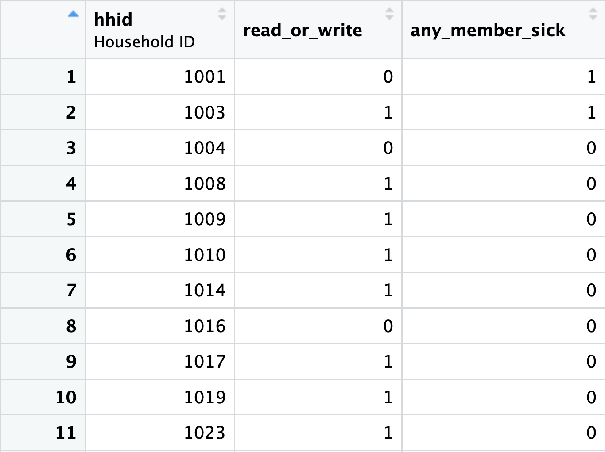
```
]

---
# Getting data ready for analysis and construction
## Adding value labels

.pull-left2[
- To add the labels, we convert the variable type to a factor

- Factors sometimes require more arguments to convert column types

- They require that you define the values and respective labels
]
.pull-right2[
```{r echo = FALSE, out.width="65%"}
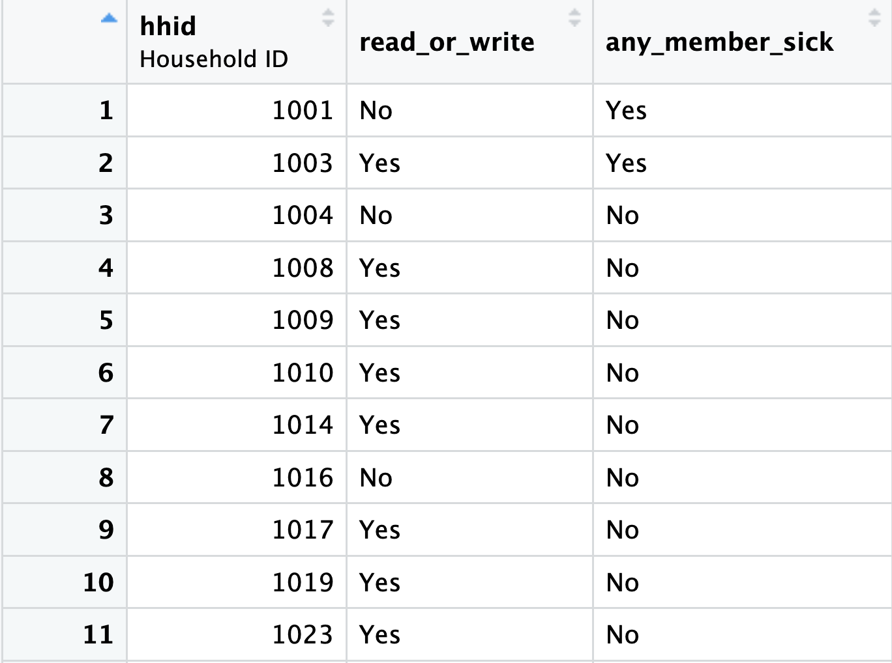
```
]


---
# Getting data ready for analysis and construction
## Exercise 18: Add value labels to categorical data

- Convert `read_or_write` and `any_member_sick` to factors with the following code:

.smaller-r-code[
```{r}
values_var <- c(1,0)
labels_var <- c(
  "Yes",
  "No"
)

df_hh_dedup <- df_hh_dedup %>%
  mutate(
    read_or_write = factor(read_or_write,
                           levels=values_var,
                           labels=labels_var),
    any_member_sick = factor(any_member_sick,
                           levels = values_var,
                           labels = labels_var
    )
  )
```
]
---

# Getting data ready for analysis and construction
## Variable labels

- Variable labels provide additional information that describes the attribute contained in the variable

- They allow to have more context about a variable other than what normally fits in the variable name

- In data collected from the field through questionnaires, it's a good practice to leave variable names equal to a question code or number in the original questionnaire

- Labels give more information about the variable, for example by using the actual question that was asked for collecting the data

---

# Getting data ready for analysis and construction
## Variable labels

- Using R through RStudio allows us to visualize variable labels when inspecting dataframes with `View()`

- Try `View(df_hh_dedup)` to visualize the labels of that dataframe

```{r echo = FALSE, out.width="55%"}
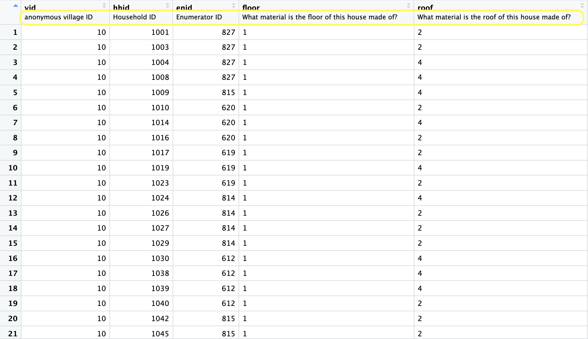
```

---

# Getting data ready for analysis and construction
## Variable labels

- R offer several options to create and work with variable labels, one of the simplest is through the package `labelled`

- The package contains the function `set_variable_labels()` to create or modify variable labels

  + The first argument (usually given through pipes) is the input dataframe
  
  + All the following arguments set the labels for each value, as in the example below
  
  + The result is a new dataframe with the variable labels
  
```{r eval=FALSE}
new_df <- old_df %>%
  set_variable_labels(
    var1 = "label for var 1",
    var2 = "label for var 2",
    ...
  )
```

---

# Getting data ready for analysis and construction
## Exercise 19: Assign variable labels

1. Use `View()` to inspect `df_hh_dedup` and take note of the missing labels for the newly constructed variables

2. Using the `set_variable_labels` function, assign the labels to the variables:
 * read_or_write
 * any_member_sick
 * total_treat_cost
 * area_farm_hect

```{r eval=FALSE}
# Remember the general use of set_variable_labels()
new_df <- old_df %>%
  set_variable_labels(
    var1 = "label for var 1",
    var2 = "label for var 2",
    ...
  )
```

---

# Getting data ready for analysis and construction
## Variable labels
```{r, echo = FALSE}
# Village dataframe
df_hh_dedup <- df_hh_dedup %>%
  set_variable_labels(
    area_farm_hect  = "Area of farm in hectares",
    read_or_write   = "Can any member read or write?",
    any_member_sick = "Is any member sick?"#,
    #total_treat_cost= "Total cost of treatment"
  )
```

.pull-left4[
```{r, eval = FALSE}
# Village dataframe
df_hh_dedup  <- df_hh_dedup %>%
  set_variable_labels(
    area_farm_hect  = "Area of farm in hectares",
    read_or_write   = "Can any member read or write?",
    any_member_sick = "Is any member sick?",
    total_treat_cost= "Total cost of treatment"
  )

View(df_village_labelled)
```
]
.pull-right4[
```{r echo = FALSE, out.width="99%"}
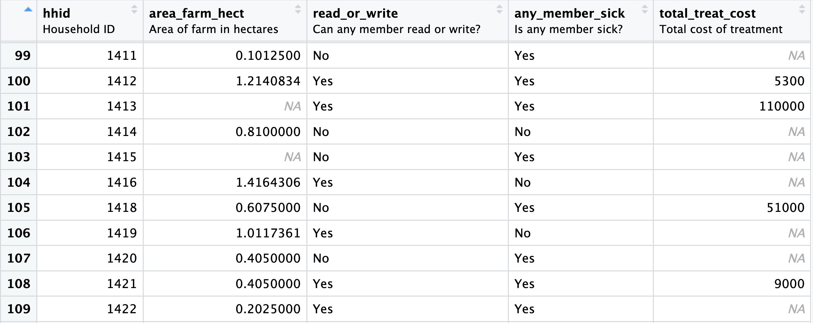
```
]

---
# Getting data ready for analysis and construction
## Outlier detection and correction

- An outlier is a data point that significantly deviates from other observations which as a result may evoke suspicion

- Outliers may be as a result of:

  + __Data entry errors :__ Wrong entry during data collection

  + __Data processing errors:__ Errors may be introduced while processing the data

  + __"Novel" data point :__ Data point is not an error and is the correct observation


---
# Getting data ready for analysis and construction
## How to detect outliers?
.pull-left4[
- __Visual inspection:__ is a fast way to get a sense of the data. This can be done by generating distribution plots such as histograms, boxplots and scatterplots 

]

.pull-right4[
```{r echo = FALSE, out.width="90%"}
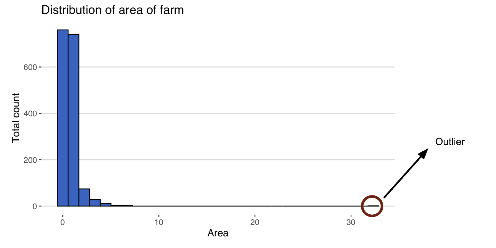
```
]

---
# Getting data ready for analysis and construction
## How to detect outliers?

.pull-left4[
- __Statistical methods:__ These techniques measure how far a observation deviates from the mean/median

- Usually, you have to define a threshold for determining whether a data point is an outlier

- One way could be to use the z-score method

- A common threshold used is when an observation is __2.5 to 3.5__ times far from from the mean of the distribution
]

.pull-right4[

```{r echo = FALSE, out.width="90%"}
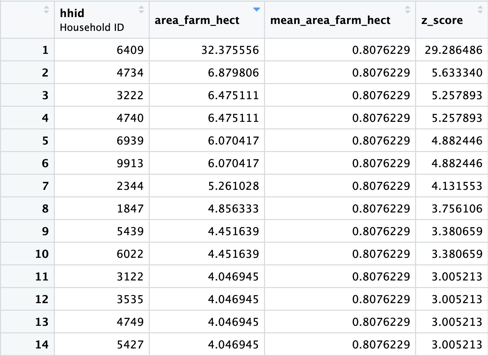
```
]

---
# Getting data ready for analysis and construction
## How do we deal with outliers?

- There are multiple approached to dealing with outliers but the ultimate decision belongs to the research team

- Some of the possible approaches could be:
  + Trimming the points from the dataset
  
  + Modification of outliers
  
  + Maintiaining the observations

---
# Getting data ready for analysis and construction
## How do we deal with outliers?

- __Trimming the points from the dataset:__ This could involve completely excluding the data points from your data analysis. 

- Note that this will reduce your sample, depending on the number outliers that may be present in your data. You may decide on another course of action

- You may decide to only keep observations within a given threshold


```{r, echo = TRUE, eval=FALSE}

df_hh_dedup_trim <- df_hh_dedup %>%
  mutate(trim_area_farm_hect = case_when(z_score>2.5 ~ NA,
                                    .default = area_farm_hect)) %>%
  select(hhid,area_farm_hect,trim_area_farm_hect, z_score)

```

---

# Getting data ready for analysis and construction
## How do we deal with outliers?
- __Modification of the outliers:__ This process involves assigning outliers new values eg. Imputing or winsorizing data

---
# Getting data ready for analysis and construction
## How do we deal with outliers?

- __Maintaining the observations:__ Once you have ascertained that it's not a data entry error and if you do not want to lose any data point, another alternative is to leave them and use more robust methods during analysis that may be less sensitive to outliers.

- For example, you could use __median__ instead of the __mean__; which can be more sensitive to outliers

---

# Getting data ready for analysis and construction
## Exercise 20: Identify outliers for the variable "area_farm_hect"

- First generate z scores for the variable measuring the area of farm in hectares(area_farm_hect) and filter observations that are greater than 2.5 standard deviations from the mean

```{r, echo = TRUE, eval=FALSE}
df_hh_dedup <- df_hh_dedup %>%
  mutate(mean_area_farm_hect = mean(area_farm_hect, na.rm = T),
         sd_area_farm_hect = sd(area_farm_hect, na.rm=T)) %>%
  # Calculate the z score
  mutate(z_score = (abs(area_farm_hect-mean_area_farm_hect)/sd_area_farm_hect)) 

df_outliers <- df_hh_dedup %>%
  # Filter all observations with z-scores> 2.5
  filter(z_score>2.5) %>%
  select(hhid, area_farm_hect, mean_area_farm_hect, z_score)

```

---

class: inverse, center, middle
name: saving-results

# Saving the results

<html><div style='float:left'></div><hr color='#D38C28' size=1px width=1100px></html>

---

# Saving the results

## A note on storing objects

- Throughout the session, we saved each new result in the existing de-duplicated survey

- We have been overwriting dataframes with `<-`

```{r eval=FALSE}
# Example for mutate. Note that the input
# and the stored dataframes are the same
old_df <- old_df %>%
  mutate(
    col1 = ...,
    col2 = ...,
    col3 = ...
  )
```

---

# Saving the results

- You now save the resulting clean dataframe:

  + Household level: `df_hh_dedup`
  + Village level: `df_village`

---

# Saving the results


## Exercise : Save your work

1. Save your script in `DataWork/code` by clicking in the floppy disk icon of the script panel
1. Save your clean dataframes with `saveRDS()` in `DataWork/data/intermediate/clean`

```{r eval=FALSE}
# Output folder
output_folder <- here("DataWork", "Data", "Clean")

# Saving hh level data
saveRDS(
  df_hh_dedup,
  here(output_folder, "TZA_CCT_baseline-YOUR_INITIALS.Rds")
)

# Saving village level data
saveRDS(
  df_village,
  here(output_folder, "TZA_CCT_Village-YOUR_INITIALS.Rds")
)
```

---

class: inverse, center, middle

# Thanks! // Gracias! //  Asante!

<html><div style='float:left'></div><hr color='#D38C28' size=1px width=1100px></html>

---

exclude: true

```{R, include = FALSE, eval = FALSE}
pagedown::chrome_print("Presentations/2-tidy_clean.html", output = "Presentations/2-tidy_clean.pdf")
```