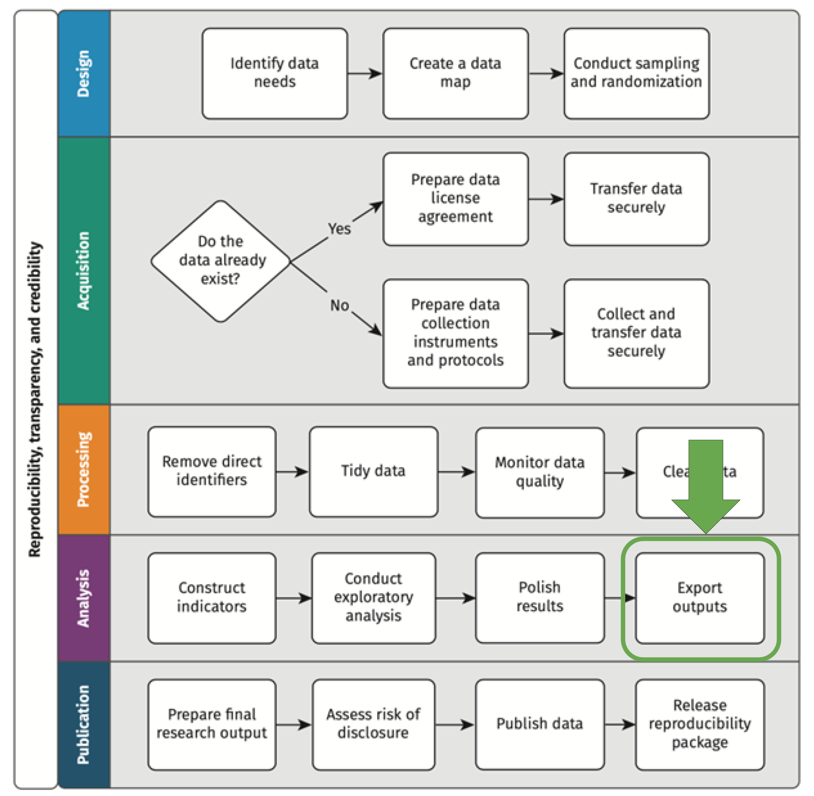
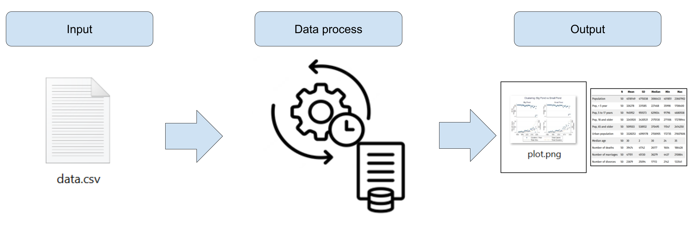
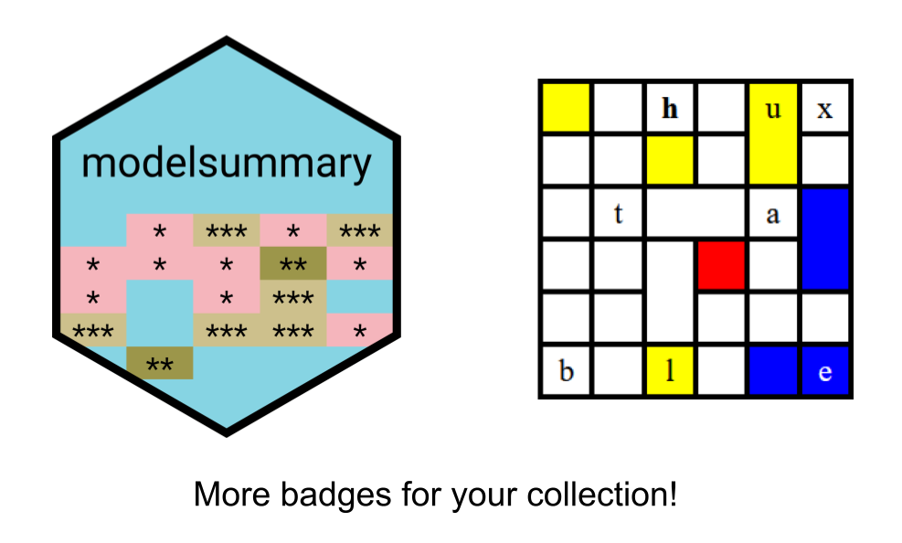
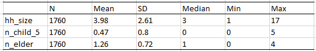
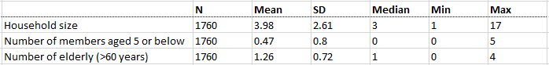
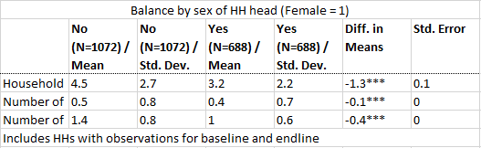
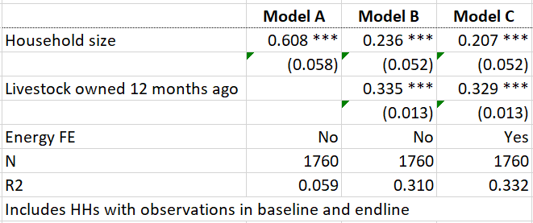

```{r setup, include = FALSE}
# Load packages
library(knitr)
library(xaringanExtra)
library(here)
library(haven)
library(dplyr)
library(janitor)
library(modelsummary)
library(huxtable)
library(ggplot2)
library(fontawesome)
library(hrbrthemes)
library(flair)
here::i_am("Presentations/3-descriptive-tables.Rmd")
options(htmltools.dir.version = FALSE)
opts_chunk$set(
  fig.align = "center",
  fig.height = 4,
  dpi = 300,
  cache = T
  )
xaringanExtra::use_panelset()
xaringanExtra::use_webcam()
xaringanExtra::use_clipboard()
xaringanExtra::use_editable(expires = 1)
htmltools::tagList(
  xaringanExtra::use_clipboard(
    success_text = "<i class=\"fa fa-check\" style=\"color: #90BE6D\"></i>",
    error_text = "<i class=\"fa fa-times-circle\" style=\"color: #F94144\"></i>"
  ),
  rmarkdown::html_dependency_font_awesome()
)
xaringanExtra::use_logo(
  image_url = here("Presentations",
                   "img",
                   "lightbulb.png"),
  exclude_class = c("inverse", 
                    "hide_logo"),
  width = "40px"
)
```

```{css, echo = F, eval = T}
@media print {
  .has-continuation {
    display: block !important;
  }
}
```

# Before we begin

<font size="7">Go to <a href="http://bit.ly/msfr24_materials">http://bit.ly/msfr24_materials</a> and download <b>3-descriptive-tables.pdf</b></font>

---

# Table of contents

1. [About the session](#about-this-session)

1. [Creating outputs](#creating-outputs)

1. [Data exploration](#data-exploration)

1. [Descriptive tables](#descriptive-tables)

1. [Balance tables](#balance-tables)

1. [Regression tables](#regression-tables)

---

class: inverse, center, middle
name: about-this-session

# About this session

<html><div style='float:left'></div><hr color='#D38C28' size=1px width=1100px></html>

---

# About this session

```{r echo = FALSE, out.width="45%"}

```

---

class: inverse, center, middle
name: creating-outputs

# Creating outputs

<html><div style='float:left'></div><hr color='#D38C28' size=1px width=1100px></html>

---

# Creating outputs

- Until now, we've seen how to produce dataframes or data table file outputs (`.Rds` and `.csv` files)

- Today we'll see how to produce file outputs with more finalized results, namely descriptive statistics, balance, and regression tables

- The objective of this is that the concept of reproducibility can also be also be applied not only in your data work but in your reports as well <font size="3">(though reports is something we're not covering in this course)</font>

```{r echo = FALSE, out.width="90%"}

```

---

# Creating outputs

## .red[Not reproducible]

Anything that requires
`r fa("paste", fill = "#ac142a")` Copy-pasting
`r fa("paintbrush", fill = "#ac142a")` Manual formatting after exported

--

## .green[Reproducible]

`r fa("r-project", fill = "#046307")` R Markdown: dynamic document containing code and text that is exported directly from R into PDF, HTML, Word, Power Point and other formats 
`r fa("file-lines", fill= "#046307")` LaTeX: typesetting system used for scientific publications that automatically reloads tables and figures every time the document is rendered 

---

# Creating outputs

As usual, there are several options for exporting tables in R. Today we'll use:

- **modelsummary:** a package for creating descriptive statistics and regression tables

- **huxtable:** a package for creating HTML, Latex, and Excel tables from R

```{r echo = FALSE, out.width="50%"}

```

---

# Creating outputs

## Exercise 1: Install and load packages for generating outputs

- Install `modelsummary` and `huxtable` with:

```{r eval=FALSE}
install.packages("modelsummary")
install.packages("huxtable")
install.packages("openxlsx") # this is a dependency for huxtable to export results to Excel
```

- Load all the libraries we'll use with:

```{r eval=FALSE}
library(here)
library(haven)
library(dplyr)
library(janitor)
library(modelsummary)
library(huxtable)
```

---

# Creating outputs

## Exercise 2: Read the data

1\. Use `here()` and `read_stata()` to read the file in `DataWork/Data/Raw/LWH-households-clean.Rds`. Apply `as_factor()` on the result to transform labeled values into factors.

```{r eval=FALSE}
path  <- here("DataWork", "Data", "Raw")
df_hh <- read_stata(here(path, "TZA_CCT_baseline.dta")) %>% as_factor()
```

2\. Inspect the dataframe with `View()`

```{r echo=FALSE}
path  <- here("Data")
df_hh <- read_stata(here(path, "TZA_CCT_baseline.dta")) %>% as_factor()
```

---

class: inverse, center, middle
name: #data-exploration

# Data exploration

<html><div style='float:left'></div><hr color='#D38C28' size=1px width=1100px></html>

---

# Data exploration

## Knowing your data better

- Before starting to produce outputs, it's useful to explore your data so you will know what to export

- You already know `View()`, `nrow()`, and `colnames()`. Some other functions are:

  + `glimpse()`: prints a dataframe in the console (from `dplyr`)
  
  + `head()`: prints the first six observations of a dataframe
  
  + `tail()`: prints the last six observations of a datafrma
  
  + `dim()`: returns a size-two vector with the number of rows and columns in a dataframe

---

# Data exploration

## Exercise 3: Exploration with dataframe and column summaries

- Print the summary of `df_hh`

```{r, eval = FALSE}
summary(df_hh)
```

- Print the summary of the column `hh_size` of `df_hh` (use the `$` operator)

```{r, eval = FALSE}
summary(df_hh$hh_size)
```

---

# Data exploration

```{r}
# Summary of a dataframe
summary(df_hh)
```

---

# Data exploration

```{r}
# Summary of a dataframe column
summary(df_hh$hh_size)
```

---

# Data exploration

## Tabulations

- `summary()` is useful to explore quantitative variables

- However, it's not great for character or factor variables

- We'll use `tabyl()` in these cases, from the package `janitor`

- `tabyl()` generates frequency tables from dataframe columns

---

# Data exploration

## Exercise 4: Exploration with tabulations

- Tabulate the variable `energy` (main source of energy for lightning) of `df_hh` with:

```{r eval=FALSE}
df_hh %>% tabyl(energy)
```

- Cross-tabulate the variables `energy` and `floor` with:

```{r eval=FALSE}
df_hh %>% tabyl(energy, floor)
```

---

# Data exploration

```{r eval=FALSE}
# Tabulating district
df_hh %>% tabyl(energy)
```

```{r echo=FALSE, warning=FALSE, message=FALSE}
# Tabulating district
df_hh %>% tabyl(energy) %>% knitr::kable()
```

---

# Data exploration

```{r eval=FALSE}
# Cross-tabulating sector and district
df_hh %>% tabyl(energy, water)
```

.small[
```{r echo=FALSE, warning=FALSE, message=FALSE}
# Cross-tabulating sector and district
df_hh %>% tabyl(energy, water) %>% knitr::kable()
```
]

---

class: inverse, center, middle
name: descriptive-tables

# Descriptive tables

<html><div style='float:left'></div><hr color='#D38C28' size=1px width=1100px></html>

---

# Descriptive tables

## What if you want to...

- ...export the summary statistics to another software?

- ...customize which statistics to display?

--

## Well, then you will need a few more packages

- There are many packages that can be used both for displaying and exporting summary statistics

- Today we will show you a combination of two packages: `modelsummary` and `huxtable`

- We chose this combination because together, they can perform all the tasks we are interested in

- In fact, `modelsummary` can perform most of them by itself -- with the exception of exporting formatted tables to Excel

---

# Descriptive tables

`modelsummary` contains a family of functions called *datasummary* which can be used to create different types of summary statistics tables. These include:

- `datasummary_skim()`, to create descriptive statistics tables

- `datasummary_balance()`, to create balance tables

- `datasummary_correlation()`, to create a correlation table

- `datasummary_crosstab()`, to create a twoway tabulation

- `datasummary()`, to create customized descriptive statistics tables

---

# Descriptive tables

- `datasummary_skim()` produces a quick summary table of numerical or categorical variables

```{r, eval = F}
datasummary_skim(
  data,
  type = "numeric",
  output = "default",
  ...
)
```

- It uses the following arguments:

  + `data`: the data set to be summarized, the only required argument
  + `type =`: type of variables in the dataframe to be described
  + `output =`: the type of output desired
  + `...`: additional options allow for formatting customization, such as including notes and titles

- Its most basic use is `datasummary_skim(df_name)` to describe numeric variables

---

# Descriptive tables

## Exercise 5: Producing a basic descriptive table

- Use `datasummary_skim()` to create a descriptive statistics table for `df_hh`

---

# Descriptive tables

```{r, eval=FALSE}
df_hh %>% datasummary_skim()
```

---

# Descriptive tables

- `datasummary_skim()` summarizes only numeric variables by default

- To summarize categorical variables, use the argument `type = "categorical"`

```{r, eval=FALSE, warning=FALSE}
# Selecting only one variables so table fits
df_hh %>% select(energy) %>% datasummary_skim(type = "categorical")
```

---

# Descriptive tables

- Other than `datasummary_skim()`, we can use `datasummary()` to customize the variables and statistics to include using a formula

```{r eval = F}
datasummary(
  var1 + var2 + var3 ~ stat1 + stat2 + stat3 + stat4,
  data = data,
  ...
)
```

- The arguments of `datasummary()` are:

  + `formula`: a two-sided formula to describe the table: rows ~ columns
  
  + `data=`: the data set to be summarized
  
  + `...`: additional options allow for formatting customization

---

# Descriptive tables

## Exercise 6: Producing a table with more information

- Create a table showing the number of observations, mean, standard deviation, minimum, maximum, and median value for the variables `hh_size`, `n_child_5`, and `n_elder` in `df_hh` with the code below

```{r eval=FALSE}
datasummary(
  hh_size + n_child_5 + n_elder ~ N + Mean + SD + Median + Min + Max,
  data = df_hh
)
```

---

# Descriptive tables

```{r, eval=FALSE, warning=FALSE}
datasummary(
  hh_size + n_child_5 + n_elder ~ N + Mean + SD + Median + Min + Max,
  data = df_hh
)
```

---

# Descriptive tables

- The package `modelsummary` doesn't offer an option to export tables to Excel

- To do that, we will first store the result of `datasummary()` into an object of type "huxtable"

- This will allow us to use the function `quick_xlsx()` from the package `huxtable` to export the table

---

# Descriptive tables

## Exercise 7: Exporting descriptive tables to Excel

1. Save the last table you created to and object called `descriptives_HH_members` and add the argument `output = "huxtable"`

2. Export this object to Excel with `quick_xlsx()`

```{r eval=FALSE}
# Storing summary table into a huxtable object
descriptives_income <-
  datasummary(
    hh_size + n_child_5 + n_elder ~ N + Mean + SD + Median + Min + Max,
    data = df_hh,
    output = "huxtable"
  )

# Exporting
quick_xlsx(
  descriptives_income,
  file = here("DataWork", "Outputs", "descriptives_HH_members.xlsx")
)
```

```{r echo=FALSE}
# Storing summary table into a huxtable object
desc_income <-
  datasummary(
    hh_size + n_child_5 + n_elder ~ N + Mean + SD + Median + Min + Max,
    data = df_hh,
    output = "huxtable"
  )

# Exporting
quick_xlsx(
  desc_income,
  file = here("Data", "DataWork", "outputs", "descriptives_HH_members.xlsx")
)
```

---

# Descriptive tables

The result in Excel will look like this:

```{r echo = FALSE, out.width="75%"}

```

--

This might be okay. But if we want to add further customizations to make it truly look like a finalized output, at least two things are missing:

1. Variable labels
2. Some table formatting

We'll add these in the next exercise

---

# Descriptive tables

## Exercise 8: Exporting a formatted table to Excel

1\. Create a new dataframe changing the variable names of `hh_size`, `n_child_5`, and `n_elder` with the following code:

```{r, eval=FALSE}
df_table <- df_hh %>%
  select(
    `Household size`                    = hh_size,
    `Number of members aged 5 or below` = n_child_5,
    `Number of elderly (>60 years)`     = n_elder
  )
```

Note that the "labels" are enclosed in backticks. For R, they are not variable labels but the actual variables names of `df_table`. Variable names in R **can have space characters**. Whent they do, you enclose them in  backticks so R understands where the variable name starts and ends.

---

# Descriptive tables

## Exercise 8: Exporting a formatted table to Excel

2\. Use this new dataframe to produce a datasummary and add `theme_basic()` on top of it

```{r, eval=FALSE}
desc_income <-
  datasummary(
    All(df_table) ~ N + Mean + SD + Median + Min + Max,
    data = df_table,
    output = "huxtable"
  ) %>%
  theme_basic()
```

3\. Export the result with `quick_xlsx()`

```{r, eval=FALSE}
quick_xlsx(
  desc_income,
  file = here("DataWork", "Outputs", "descriptives_HH_members_formatted.xlsx")
)

```

```{r echo=FALSE}
df_table <- df_hh %>%
  select(
    `Household size`                    = hh_size,
    `Number of members aged 5 or below` = n_child_5,
    `Number of elderly (>60 years)`     = n_elder
  )

desc_income <-
  datasummary(
    All(df_table) ~ N + Mean + SD + Median + Min + Max,
    data = df_table,
    output = "huxtable"
  ) %>%
  theme_basic()

quick_xlsx(
  desc_income,
  file = here("Data", "DataWork", "outputs", "descriptives_HH_members_formatted.xlsx")
)
```

---

# Descriptive tables

Now the result will look like this:

```{r echo = FALSE, out.width="75%"}

```

--

- We used the theme function `theme_basic()` for this table.

- `datasummary()` allows to apply multiple customization and themes to the results. You can explore them [here](https://modelsummary.com/). You can also manually apply changes directly to the Excel output.

---

class: inverse, center, middle
name: balance-tables

# Balance tables

<html><div style='float:left'></div><hr color='#D38C28' size=1px width=1100px></html>

---

# Balance tables

- The library `modelsummary` has a function for easily exporting balance tables: `datasummary_balance()`

```{r eval = F}
datasummary_balance(
  ~ balance_variable,
  data  = data
  stars = FALSE,
  title = "Table title",
  note  = "Table footnote",
  ...
)
```

- The basic arguments of `datasummary()` are:

  + `balance_variable`: name of the variable defining groups (i.e.: treatment variable)
  
  + `data=`: the data set to be summarized

---

# Balance tables

```{r eval = F}
datasummary_balance(
  ~ balance_variable,
  data  = data
  stars = FALSE,
  title = "Table title",
  note  = "Table footnote",
  ...
)
```

- Additional options:

  + `stars=` Logical value (`TRUE`, `FALSE`) for the inclusion of statistical significance stars
  
  + `title=` String with table title
  
  + `note=` String with table footnote
  
  + `...`: additional options allow for formatting customization

---

# Balance tables

## Exercise 9: Export a formatted balance table to Excel

1\. Create a new dataframe keeping only HHs with "Yes" or "No" for `female_head` and changing the variable names of `hh_size`, `n_child_5`, and `n_elder` with the following code:

```{r, eval=FALSE}
df_balance <- df_hh %>%
  mutate(female_head = droplevels(female_head)) %>% # removes unused levels of factor variable
  select(
    female_head,
    `Household size`                    = hh_size,
    `Number of members aged 5 or below` = n_child_5,
    `Number of elderly (>60 years)`     = n_elder
  )
```

---

# Balance tables

## Exercise 9: Export a formatted balance table to Excel

2\. Generate a formatted balance table with `datasummary_balance()`:

```{r, eval=FALSE}
balance_table <-
  datasummary_balance(
    ~ female_head,
    data   = df_balance,
    stars  = TRUE,
    title  = "Balance by sex of HH head",
    note   = "Includes HHs with observations for baseline and endline",
    output = "huxtable"
  ) %>%
  theme_basic()
```

---

# Balance tables

## Exercise 9: Export a formatted balance table to Excel

3\. Export the result with `quick_xlsx()`:

```{r, eval=FALSE}
quick_xlsx(
  balance_table,
  file = here("DataWork", "Outputs", "balance_table.xlsx")
)
```

```{r, echo=FALSE}
df_balance <- df_hh %>%
  mutate(female_head = droplevels(female_head)) %>%
  select(
    female_head,
    `Household size`                    = hh_size,
    `Number of members aged 5 or below` = n_child_5,
    `Number of elderly (>60 years)`     = n_elder
  )

balance_table <-
  datasummary_balance(
    ~ female_head,
    data   = df_balance,
    stars  = TRUE,
    title  = "Balance by sex of HH head (Female = 1)",
    note   = "Includes HHs with observations for baseline and endline",
    output = "huxtable"
  ) %>%
  theme_basic()

quick_xlsx(
  balance_table,
  file = here("Data", "DataWork", "Outputs", "balance_table.xlsx")
)
```

---

# Balance tables

```{r echo = FALSE, out.width="75%"}

```

---

class: inverse, center, middle
name: regression-tables

# Regression tables

<html><div style='float:left'></div><hr color='#D38C28' size=1px width=1100px></html>

---

# Regression tables

- `modelsummary` has a function called `modelsummary()` for exporting regression tables

- However, we'll use `huxreg()` from `huxtable` as it involves using only one package and it's a complete solution

- That said, there are several other R packages that export regression tables. We recommend checking `stargarzer`, though it should be noted that it only exports tables in text, HTML, and LaTeX formats (no Excel)

---

# Regression tables

Exporting regression tables also involves a two-step process, similar to how we first (1) generated a balance table with `datasummary_balance()` and (2) exported it with `quick_xlsx()`.

1\. First, estimate your regressions. You can use R's base command `lm()` (short for *linear model*) or functions from regression estimation libraries.

```{r, eval=FALSE}
model1 <- lm(y ~ x1,           data = df)
model2 <- lm(y ~ x1 + x2,      data = df)
model3 <- lm(y ~ x1 + x2 + x3, data = df)
```

2\. Then, export the regression results into a table with `huxreg()`

```{r, eval = FALSE}
huxreg(model1, model2, model3) %>%
  quick_xlsx(file = "my-regresion.xlsx")
```

---

# Regression tables

Regressions using `lm()` follow this syntax

```{r eval = F}
lm(
  formula,
  data,
  ...
)
```

- `formula` specifies the regressed variable and covariates. It follow the structure: `y ~ x1 + x2`

  + `y`: regressed variable
  
  + `x1`, `x2`: covariates (separated by a `+`)
  
  + if one of the covariates is a factor, then R interprets it's a fixed effects variable

- `data`: dataframe to use

- `...`: additional options such as weights, how to treat NAs, and others

---

# Regression tables

## Exercise 10: Estimate regression models

1\. Estimate three regressions of `livestock_now` on (1) `hh_size` only; (2) `hh_size` and `livestock_before`; (3) `hh_size`, `livestock_before`, and `energy` (note that this last variable is a factor). Let's not focus on the correctness of proposing these models for now.

```{r}
m1 <- lm(livestock_now ~ hh_size,                             data = df_hh)
m2 <- lm(livestock_now ~ hh_size + livestock_before,          data = df_hh)
m3 <- lm(livestock_now ~ hh_size + livestock_before + energy, data = df_hh)

```

2\. Check the results of `m3` using `summary()`.

```{r, eval=FALSE}
summary(m3)
```

---

# Regression tables

.small[
```{r}
summary(m3)
```
]

---

# Regression tables

- Now the last step is to export the results with `huxreg()` and `quick_xlsx()`

- `huxreg()` takes the models as the first arguments and then uses named arguments for regression table customization

- Some of its most useful named arguments are:

  + `coefs`: labels for covariates
  
  + `omit_coefs`: covariates to omit
  
  + `stars`: levels for significance stars
  
  + `statistics`: which statistics to show at the bottom of the table
  
  + `add_rows`: adds rows with additional information

---

# Regression tables

## Exercise 11: Export a formatted regression table to Excel

Use the following code to export `m1`, `m2`, and `m3` to a regression table in Excel.

.small[
```{r, eval = FALSE}
models <- list("Model A" = m1, "Model B" = m2, "Model C" = m3)

huxreg(
  models,
  omit_coefs = c("Intercept", "energy"),
  coefs = c(
    "Household size" = "hh_size",
    "Livestock owned 12 months ago" = "livestock_before"
  ),
  statistics = c(
    "N"  = "nobs",
    "R2" = "r.squared"),
  stars = c(`***` = 0.01, `**` = 0.05, `*` = 0.1),
  note = "Includes HHs with observations in baseline and endline"
) %>%
  add_rows(
    c("Energy FE", "No", "No", "Yes"),
    after = 5
) %>%
  theme_basic() %>%
  quick_xlsx(
    file = here("Datawork", "Outputs", "regression_table.xlsx")
)
```
]

```{r, echo=FALSE, warning=FALSE}
models <- list(
  "Model A" = m1,
  "Model B" = m2,
  "Model C" = m3
  )

huxreg(
  models,
  omit_coefs = c(
    "Intercept",
    "energy"
  ),
  coefs = c(
    "Household size" = "hh_size",
    "Livestock owned 12 months ago" = "livestock_before"
  ),
  statistics = c(
    "N"  = "nobs",
    "R2" = "r.squared"),
  stars = c(`***` = 0.01, `**` = 0.05, `*` = 0.1),
  note = "Includes HHs with observations in baseline and endline"
) %>%
  add_rows(
    c("Energy FE", "No", "No", "Yes"),
    after = 5
) %>%
  theme_basic() %>%
  quick_xlsx(
    file = here("Data", "Datawork", "outputs", "regression_table.xlsx")
  )
```

---

# Regression tables

```{r echo = FALSE, out.width="75%"}

```


---

class: inverse, center, middle

# Thanks! Gracias! Asante!

<html><div style='float:left'></div><hr color='#D38C28' size=1px width=1100px></html>

---

exclude: true

```{R, include = FALSE, eval = FALSE}
pagedown::chrome_print("Presentations/3-descriptive-tables.html", output = "Presentations/3-descriptive-tables.pdf")
```