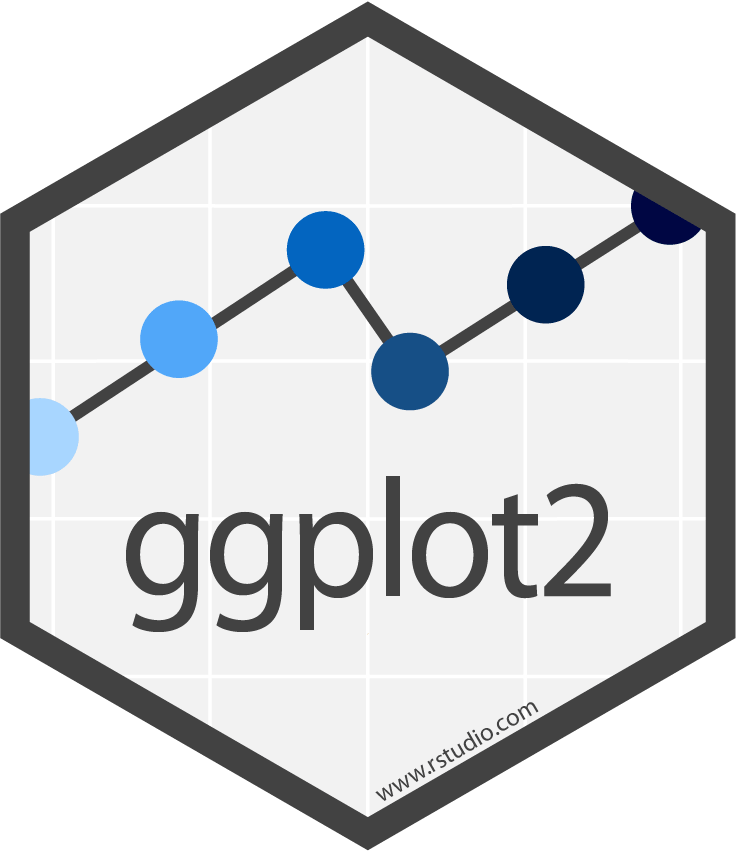

```{r setup, include = FALSE}
# Load packages
library(knitr)
library(xaringanExtra)
library(here)
library(dplyr)
library(janitor)
library(haven)
library(ggplot2)
library(fontawesome)
library(hrbrthemes)
library(flair)
here::i_am("Presentations/4-data-vis.Rmd")
options(htmltools.dir.version = FALSE)
opts_chunk$set(
  fig.align = "center",
  fig.height = 4,
  dpi = 300,
  cache = T
  )
xaringanExtra::use_panelset()
xaringanExtra::use_webcam()
xaringanExtra::use_clipboard()
xaringanExtra::use_editable(expires = 1)
htmltools::tagList(
  xaringanExtra::use_clipboard(
    success_text = "<i class=\"fa fa-check\" style=\"color: #90BE6D\"></i>",
    error_text = "<i class=\"fa fa-times-circle\" style=\"color: #F94144\"></i>"
  ),
  rmarkdown::html_dependency_font_awesome()
)
xaringanExtra::use_logo(
  image_url = here("Presentations",
                   "img",
                   "lightbulb.png"),
  exclude_class = c("inverse", 
                    "hide_logo"),
  width = "40px"
)
```

```{css, echo = F, eval = T}
@media print {
  .has-continuation {
    display: block !important;
  }
}
```

# Before we begin

<font size="7">Go to <a href="http://bit.ly/msfr25_materials">http://bit.ly/msfr25-materials</a> and download <b>4-data-vis.pdf</b></font>

---

# Table of contents

1. [About the session](#about-this-session)

1. [Data visualization](#data-visualization)

1. [Basic plot](#basic-plots)

1. [Customization](#customization)

1. [Other geometries](#other-geometries)

1. [Saving your plot](#saving)

---

class: inverse, center, middle
name: about-this-session

# About this session

<html><div style='float:left'></div><hr color='#D38C28' size=1px width=1100px></html>

---

# About this session

```{r echo = FALSE, out.width="45%"}
knitr::include_graphics("img/4-data-vis/data-work-outputs.png")
```

---

# About this session

## Presenting results

.pull-left[
- Regression tables are useful to present detailed results

- However:

  + They require specialized knowledge to be interpreted
  
  + they take time to review
]

.pull-right[
```{r echo = FALSE, out.width="95%"}

```
]

---

# About this session

## Presenting results

- Data visualizations, on the other hand, can easily show key messages and highlight important information

```{r echo = FALSE, out.width="65%"}

```

---

# About this session

## Presenting results

.pull-left[
**When to use tables?**

- To present information-dense data in an organized format 
- To compare data with different units of measurements across multiple categories
- To analyze data to understand causes, outcomes, and specifics.
- Examples: Summary tables, balance tables, Regression tables

```{r echo = FALSE, out.width="40%"}

```

]

.pull-right[
**When to use plots?**

- To simplify complex data to highlight important results  in an easy-to-digest format
- To visualize patterns and trends in data, or to find or show relationships between key variables
- Examples: Distribution curves, bar graphs, scatter plots, line graphs

```{r echo = FALSE, out.width="65%"}

```

]

---

# About this session

```{r echo = FALSE, out.width="90%"}

```

---

# About this session

## .red[Remember: Not reproducible]

Anything that requires
`r fa("paste", fill = "#ac142a")` Copy-pasting
`r fa("paintbrush", fill = "#ac142a")` Manual formatting after exported

--

## .green[Reproducible]

`r fa("r-project", fill = "#046307")` R Markdown/Quarto: dynamic documents containing code and text that is exported directly from R into PDF, HTML, Word, Power Point and other formats 
`r fa("file-lines", fill= "#046307")` LaTeX: typesetting system used for scientific publications that automatically reloads tables and figures every time the document is rendered 

---

class: inverse, center, middle
name: data-visualization

# Data visualization

<html><div style='float:left'></div><hr color='#D38C28' size=1px width=1100px></html>

---

# Data visualization

## In R

For this session we'll use another package: `ggplot2`. This library is the absolute benchmark for data visualization in R, based on grammar of graphics syntax.

```{r echo = FALSE, out.width="27%"}

```

---
class: inverse, center, top
name: ea

# ggplot

```{r, echo = FALSE, out.width="80%"}
knitr::include_graphics("img/session4/ggplot2_dib.png")
```

---

# Data visualization

## Exercise 1: Install and load `ggplot2`

1\. Open RStudio through the training project or go to `Session` >> `New session` if you have it already open

2\. In the console, install `ggplot2` with:

```{r, eval=FALSE}
install.packages("ggplot2")
```

3\. In a new script, load `ggplot2` with:

```{r, warning=FALSE}
library(ggplot2)
library(dplyr)   # we'll also need dplyr
library(forcats) # we'll also need forcats for re-categorizing factors easily later
```

---

# Data visualization

## Exercise 2: Read the data

1\. Use `here()` and `read_stata()` to read the file in `DataWork/data/intermediate/clean/LWH-households-clean.Rds`. Apply `as_factor()` on the result to transform labeled values into factors.

```{r, eval=FALSE}
path  <- here("DataWork", "Data")
df_hh <- read_stata(here(path, "TZA_CCT_baseline.dta")) %>% as_factor()
```

```{r, echo=FALSE}
path  <- here("Data")
df_hh <- read_stata(here(path, "TZA_CCT_baseline.dta")) %>% as_factor()
```

---

# Data visualization

## The beauty of `ggplot2`

1. Consistency with the [**Grammar of Graphics**](https://www.springer.com/gp/book/9780387245447)

  * This book is the foundation of several other data visualization applications: `ggplot2`, `polaris-tableau`, `vega-lite`

2. Flexibility

3. Layering and theme customization

4. Community

It is a powerful and easy to use tool (once you understand its logic) that produces complex and multifaceted plots.

---

# The grammar of graphics

## The Structure of ggplot2  

Creating a plot with ggplot2 requires **three basic components**:  

1. **Data**: The dataset you want to visualize.  
2. **Aesthetics (aes)**: How you map your data to visual elements (e.g., x-axis, y-axis, color).  
3. **Geometry (geom)**: The type of plot you want (e.g., bar graph, scatter plot).  

(and many more, we will see some examples at the end of the presentation)

---

# Data visualization

## Basic structure

The basic ggplot structure is:

```{r ggplot-template, eval=FALSE}
ggplot(data = DATA) +
  GEOM_FUNCTION(mapping = aes(AESTHETIC MAPPINGS))
```

Mapping data to aesthetics

.box-7.medium[Mapping data to aesthetics: think about colors, sizes, x and y references]

--

We'll see how we connect our data to the components of a ggplot

---

# Data visualization

## The grammar of graphics

.pull-left[
```
ggplot(data = <DATA>) +
  <GEOM_FUNCTION>(
     mapping = aes(<MAPPINGS>),
     stat = <STAT>,
     position = <POSITION>
  ) +z
  <COORDINATE_FUNCTION> +
  <FACET_FUNCTION> +
  <SCALE_FUNTION> +
  <THEME_FUNCTION>
```
]

.pull-right[

1. `Data`: The data that you want to visualize
2. `Layers`: geom\_ and stat\_ → The geometric shapes and statistical summaries representing the data
3. `Aesthetics`: aes() → Aesthetic mappings of the geometric and statistical objects
4. `Scales`: scale_ → Maps between the data and the aesthetic dimensions
5. `Coordinate system`: coord_ → Maps data into the plane of the data rectangle
6. `Facets`: facet_ → The arrangement of the data into a grid of plots
7. `Visual themes`: theme() and theme_ → The overall visual defaults of a plot
]

---

# Data visualization

## The grammar of graphics

```{r echo = FALSE, out.width="90%"}
knitr::include_graphics("img/4-data-vis/basic-plot.png")
```

---

# Data visualization

## The grammar of graphics

```{r echo = FALSE, out.width="90%"}

```

---

# Data visualization

## The grammar of graphics

```{r echo = FALSE, out.width="90%"}

```

---

# Data visualization

## The grammar of graphics

```{r echo = FALSE, out.width="90%"}

```

---

# Data visualization

## The grammar of graphics

```{r echo = FALSE, out.width="90%"}

```

---

# Data visualization

## The grammar of graphics

```{r echo = FALSE, out.width="90%"}

```

---

class: inverse, center, middle
name: basic-plots

# Basic plots

<html><div style='float:left'></div><hr color='#D38C28' size=1px width=1100px></html>

---

# Basic plot

## Exercise 3: Produce a basic scatterplot

Create a scatter plot (with the encoding `geom_point()`) with the x-axis set to `food_cons` and the y-axis to `hh_size`.

```{r eval=FALSE}
ggplot(
  data = df_hh,
  aes(
    x = food_cons,
    y = nonfood_cons
  )
) +
  geom_point()
```

---

# Basic plot

.pull-left[
```{r eval = FALSE}
# With pipes:
df_hh %>%
  ggplot(
    aes(
      x = food_cons,
      y = nonfood_cons)
  ) +
  geom_point()
```
]


.pull-right[
```{r out.width = "100%", echo = FALSE}
# With pipes:
df_hh %>%
  ggplot(
    aes(
      x = food_cons,
      y = nonfood_cons)
  ) +
  geom_point()
```
]

---

# Basic plot

This last exercise used bar geometric encoding to represent the data. The most common geometric encodings (called `geoms` in `ggplot2`) are:

* `geom_bar()`, `geom_col()`: bar charts.

* `geom_boxplot()`: box and whiskers plots.

* `geom_density()`: density estimates.

* `geom_jitter()`: jittered points.

* `geom_line()`: line plots.

* `geom_point()`: scatter plots.

If you want to know more about layers, you can refer to [this source](https://ggplot2.tidyverse.org/reference/).

---

# Basic plot

In summary, our basic plots should have the following:

.pull-left[

```{r eval = FALSE}
whr_panel %>% #<<
  ggplot(
    aes(
      x = food_cons,
      y = nonfood_cons
    )
  ) +
  geom_point()
```

]

.pull-right[

1: The data we want to plot.
]

---

# Basic plot

In summary, our basic plots should have the following:

.pull-left[

```{r eval = FALSE}
whr_panel %>%
  ggplot(
    aes( #<<
      x = food_cons, #<<
      y = nonfood_cons #<<
    ) #<<
  ) +
  geom_point()
```

]

.pull-right[

2: Columns (variables) to use for `x` and `y`
]

---

# Basic plot

In summary, our basic plots should have the following:

.pull-left[

```{r eval = FALSE}
whr_panel %>%
  ggplot(
    aes(
      x = food_cons,
      y = nonfood_cons
    )
  ) +
  geom_point() #<<
```

]

.pull-right[

3: How the plot is going to be drawn.
]

---

# Basic plot

We can also **map** colors.

.pull-left[

```{r eval = FALSE}
df_hh %>%
ggplot(
  aes(
    x = food_cons,
    y = nonfood_cons,
    color = energy #<<
  )
) + 
  geom_point() 
```

]

.pull-right[

```{r, out.width = "100%", echo = FALSE}
df_hh %>%
ggplot(
  aes(
    x = food_cons,
    y = nonfood_cons,
    color = energy #<<
  )
) + 
  geom_point() 
```

]

---

# Basic plot

In `ggplot2`, these settings are called **aesthetics**.

> "Aesthetics of the geometric and statistical objects".
We can set up:

* **Position**:  `x`, `y`, `xmin`, `xmax`, `ymin`, `ymax`
* **Colors**: `color` and `fill`
* **Transparency**: `alpha`
* **Sizes**: `size` and `width`
* **Shapes**: `shape` and `linetype`


Notice that it is important to know where we are setting our aesthetics. For example:

* `geom_point(aes(color = region))` to color points based on the variable `region`
* `geom_point(color = "red")` to color all points in the same color.

---

class: inverse, center, middle
name: customization

# Customization

<html><div style='float:left'></div><hr color='#D38C28' size=1px width=1100px></html>

---

# Customization

Now, let's try to modify our plots. In the next exercise, we are going to:

.pull-left[
1\. **Add a blue navy color to the points**

.smaller-r-code[
```{r, eval=FALSE}
df_hh %>%
ggplot(
  aes(
    x = food_cons,
    y = nonfood_cons
  )
) + 
  geom_point(color = "navy") + #<<
  labs(
    title = "Household food and non-food consumption value",
    x = "Annual food consumption",
    y = "Annual non-food consumption"
  ) +
  scale_x_continuous(labels = scales::label_comma(),
                     limits = c(0, 5100000)) +
  scale_y_continuous(labels = scales::label_comma()) +
  theme_minimal()
```
]
]

.pull-right[
```{r, echo=FALSE}
df_hh %>%
ggplot(
  aes(
    x = food_cons,
    y = nonfood_cons
  )
) + 
  geom_point(color = "navy") + #<<
  labs(
    title = "Household food and non-food consumption value",
    x = "Annual food consumption",
    y = "Annual non-food consumption"
  ) +
  scale_x_continuous(labels = scales::label_comma(),
                     limits = c(0, 5100000)) +
  scale_y_continuous(labels = scales::label_comma()) +
  theme_minimal()
```
]

---

# Customization

Now, let's try to modify our plots. In the next exercise, we are going to:

.pull-left[
2\. **Add a title and axis labels**

.smaller-r-code[
```{r, eval=FALSE}
df_hh %>%
ggplot(
  aes(
    x = food_cons,
    y = nonfood_cons
  )
) + 
  geom_point(color = "navy") +
  labs( #<<
    title = "Household food and non-food consumption value", #<<
    x = "Annual food consumption", #<<
    y = "Annual non-food consumption" #<<
  ) + #<<
  scale_x_continuous(labels = scales::label_comma(),
                     limits = c(0, 5100000)) +
  scale_y_continuous(labels = scales::label_comma()) +
  theme_minimal()
```
]
]

.pull-right[
```{r, echo=FALSE}
df_hh %>%
ggplot(
  aes(
    x = food_cons,
    y = nonfood_cons
  )
) + 
  geom_point(color = "navy") + #<<
  labs(
    title = "Household food and non-food consumption value",
    x = "Annual food consumption",
    y = "Annual non-food consumption"
  ) +
  scale_x_continuous(labels = scales::label_comma(),
                     limits = c(0, 5100000)) +
  scale_y_continuous(labels = scales::label_comma()) +
  theme_minimal()
```
]

---

# Customization

Now, let's try to modify our plots. In the next exercise, we are going to:

.pull-left[
3\. **Remove scientific notation for the axes and increase the maximum limit of the x-axis**

.smaller-r-code[
```{r, eval=FALSE}
df_hh %>%
ggplot(
  aes(
    x = food_cons,
    y = nonfood_cons
  )
) + 
  geom_point(color = "navy") +
  labs(
    title = "Household food and non-food consumption value",
    x = "Annual food consumption",
    y = "Annual non-food consumption"
  ) +
  scale_x_continuous(labels = scales::label_comma(), #<<
                     limits = c(0, 5100000)) + #<<
  scale_y_continuous(labels = scales::label_comma()) + #<<
  theme_minimal()
```
]
]

.pull-right[
```{r, echo=FALSE}
df_hh %>%
ggplot(
  aes(
    x = food_cons,
    y = nonfood_cons
  )
) + 
  geom_point(color = "navy") +
  labs(
    title = "Household food and non-food consumption value",
    x = "Annual food consumption",
    y = "Annual non-food consumption"
  ) +
  scale_x_continuous(labels = scales::label_comma(),
                     limits = c(0, 5100000)) +
  scale_y_continuous(labels = scales::label_comma()) +
  theme_minimal()
```
]

---

# Customization

Now, let's try to modify our plots. In the next exercise, we are going to:

.pull-left[
4\. **Add a theme**

.smaller-r-code[
```{r, eval=FALSE}
df_hh %>%
ggplot(
  aes(
    x = food_cons,
    y = nonfood_cons
  )
) + 
  geom_point(color = "navy") +
  labs(
    title = "Household food and non-food consumption value",
    x = "Annual food consumption",
    y = "Annual non-food consumption"
  ) +
  scale_x_continuous(labels = scales::label_comma(),
                     limits = c(0, 5100000)) +
  scale_y_continuous(labels = scales::label_comma()) +
  theme_minimal() #<<
```
]
]

.pull-right[
```{r, echo=FALSE}
df_hh %>%
ggplot(
  aes(
    x = food_cons,
    y = nonfood_cons
  )
) + 
  geom_point(color = "navy") +
  labs(
    title = "Household food and non-food consumption value",
    x = "Annual food consumption",
    y = "Annual non-food consumption"
  ) +
  scale_x_continuous(labels = scales::label_comma(),
                     limits = c(0, 5100000)) +
  scale_y_continuous(labels = scales::label_comma()) +
  theme_minimal()
```
]

---

# Customization

## Exercise 4: Customize your plot

Bring all the elements we saw in the last slides to the plot you produced in the last exercise.

.smaller-r-code[
```{r, eval=FALSE}
df_hh %>%
ggplot(
  aes(
    x = food_cons,
    y = nonfood_cons
  )
) + 
  geom_point(color = "navy") +
  labs(
    title = "Household food and non-food consumption value",
    x = "Annual food consumption",
    y = "Annual non-food consumption"
  ) +
  scale_x_continuous(labels = scales::label_comma(),
                     limits = c(0, 5100000)) +
  scale_y_continuous(labels = scales::label_comma()) +
  theme_minimal()
```
]

---

# Customization

```{r, echo=FALSE, out.width="70%"}
df_hh %>%
ggplot(
  aes(
    x = food_cons,
    y = nonfood_cons
  )
) + 
  geom_point(color = "navy") +
  labs(
    title = "Household food and non-food consumption value",
    x = "Annual food consumption",
    y = "Annual non-food consumption"
  ) +
  scale_x_continuous(labels = scales::label_comma(),
                     limits = c(0, 5100000)) +
  scale_y_continuous(labels = scales::label_comma()) +
  theme_minimal()
```

---

class: inverse, center, middle
name: other-geometries

# Other geometries

<html><div style='float:left'></div><hr color='#D38C28' size=1px width=1100px></html>

---

# Other geometries

- Now you know the basic elements to produce and customize a plot with `ggplot2`

- Working with `ggplot2` to produce any kind of data visualization uses the same approach:

  1. Define the data, aesthetics, and geometries
  
  2. Customize

- You'll practice some other geometries in the next exercises

---

# Other geometries

## Exercise 5: Create a bar plot

Create a bar plot of the number of households that use each type of energy source for lightning.

1\. Start by doing some data wrangling to collapse `df_hh` by energy:

```{r, warning=FALSE}
df_energy <- df_hh %>%
  group_by(energy) %>%
  summarize(N = n()) %>%
  ungroup() %>%
  mutate(energy = fct_recode(energy,
                             "Solar panels/\nprivate generator" =
                             "Solar panels/private generator"))
  # this last line adds a line break with "\n"
  # so that the label is better visualized in the plot
```

---

# Other geometries

## Exercise 5: Create a bar plot

Create a bar plot of the number of households that use each type of energy source for lightning.

2\. Produce the plot

.pull-left[
```{r, eval=FALSE}
ggplot(df_energy,
       aes(x = energy,
           y = N)) +
  geom_col(fill = "dark green") +
  geom_text(aes(label = N),
            vjust=-0.25) +
  labs(title = "Energy sources used for lightning",
       x = "Energy source",
       y = "Number of HHs") +
  theme_minimal() +
  theme(axis.text.x = element_text(size = 7.5))
```
]

.pull-right[
```{r, echo=FALSE}
ggplot(df_energy,
       aes(x = energy,
           y = N)) +
  geom_col(fill = "dark green") +
  geom_text(aes(label = N),
            vjust=-0.25) +
  labs(title = "Energy sources used for lightning",
       x = "Energy source",
       y = "Number of HHs") +
  theme_minimal() +
  theme(axis.text.x = element_text(size = 7.5))
```
]

---

# Other geometries

## Exercise 6: Create a distribution plot

1. Generate a histogram of `food_cons`:

.pull-left[
```{r, eval=FALSE, warning=FALSE}
ggplot(df_hh,
       aes(x = food_cons)) +
  geom_histogram(fill = "cyan2") +
  scale_x_continuous(labels = scales::label_comma()) +
  labs(title = "Distribution of HH Annual Food Consumption",
       x = "Food consumption",
       y = "Number of HHs") +
  theme_minimal()
```
]

.pull-right[
```{r, echo=FALSE, warning=FALSE, message=FALSE}
ggplot(df_hh,
       aes(x = food_cons)) +
  geom_histogram(fill = "cyan2") +
  scale_x_continuous(labels = scales::label_comma()) +
  labs(title = "Distribution of HH Annual Food Consumption",
       x = "Food consumption",
       y = "Number of HHs") +
  theme_minimal()
```
]

---

# Other geometries

## Exercise 7: Box plots

Produce a box plot with the distribution of survey duration by enumerator.

.pull-left[
```{r, eval=FALSE}
ggplot(df_hh,
       aes(x = factor(enid),
           y = as.numeric(duration))) +
  geom_boxplot(fill = "purple") +
  labs(title = "Distribution of Survey Duration by Enumerator",
       x = "Enumerator ID",
       y = "Minutes") +
  theme_minimal() +
  theme(plot.title = element_text(hjust = 0.5)) # to center title
```
]

.pull-right[
```{r, echo=FALSE}
ggplot(df_hh,
       aes(x = factor(enid),
           y = as.numeric(duration))) +
  geom_boxplot(fill = "purple") +
  labs(title = "Distribution of Survey Duration by Enumerator",
       x = "Enumerator ID",
       y = "Minutes") +
  theme_minimal() +
  theme(plot.title = element_text(hjust = 0.5)) # to center title
```
]

---

class: inverse, center, middle
name: saving

# Saving your plot

<html><div style='float:left'></div><hr color='#D38C28' size=1px width=1100px></html>

---

# Saving your plot

Remember that in R we can always assign our functions to an object. In this case, we can assign our `ggplot2` code to an object called fig as follows.

```{r}
fig <- ggplot(df_hh,
       aes(x = factor(enid),
           y = as.numeric(duration))) +
  geom_boxplot(fill = "purple") +
  labs(title = "Distribution of Survey Duration by Enumerator",
       x = "Enumerator ID",
       y = "Minutes") +
  theme_minimal() +
  theme(plot.title = element_text(hjust = 0.5))
```

Therefore, if you want to plot it again, you can just type `fig` in the console.

---

# Data visualization

## Exercise 8: Export your plot

1. Save your plot in `DataWork/outputs/boxplot-*YOUR INITIALS*.png`

  + Use the `ggsave()` function. You can either include the function after your plot or save the ggplot first as an object and then save the plot.

  + The syntax of `ggsave()` is `ggsave(PLOT_OBJECT, filename = FILEPATH, height = ..., width = ..., dpi = ...)`

```{r, eval=FALSE}
ggsave(
  fig,
  filename = here("DataWork", "Outputs", "boxplot-*YOUR INITIALS*.png"),
  dpi = 300,
  scale = 0.8,
  width = 12
)
```

```{r, echo=FALSE, message=FALSE, warning=FALSE}
ggsave(
  fig,
  filename = here("Data", "DataWork", "Outputs", "boxplot.png"),
  dpi = 300,
  scale = 0.8,
  width = 8,
  bg = "white"
)
```

---

# Data visualization

## Exercise 9: Export the rest of your plots

1. Go back to your code for exercises 4-6 and assign each of the plots you created to objects using the arrow operator (`<-`)

2. Save them with `ggsave()`. Remember the syntax:

```{r, eval=FALSE}
ggsave(
  my_figure,
  filename = here("DataWork", "Outputs", "figure_name.png"),
  dpi = 300,
  scale = 0.8,
  width = 8,
  bg = "white"
)
```

---

class: inverse, center, middle

# Before you go: feedback!

<html><div style='float:left'></div><hr color='#D38C28' size=1px width=1100px></html>

---

class: inverse, center, top

# Thanks! Gracias! Asante!

```{r, echo = FALSE, out.width="80%"}
knitr::include_graphics("img/session4/r_learners.png")
```

---

exclude: true

```{R, include = FALSE, eval = FALSE}
pagedown::chrome_print("Presentations/4-data-vis.html", output = "Presentations/4-data-vis.pdf")
```